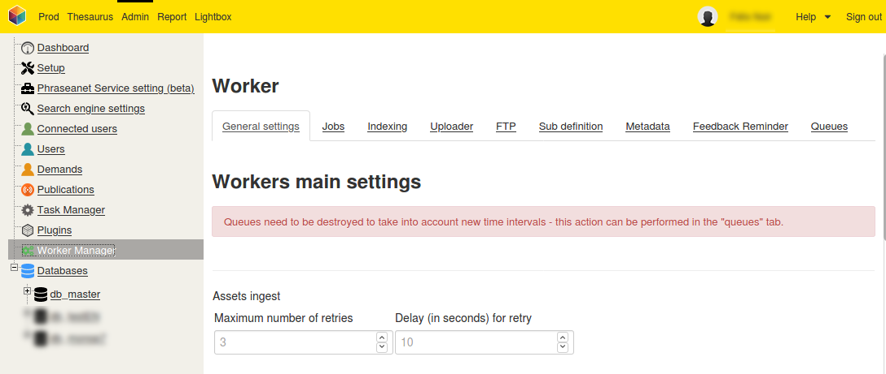

Worker Manager
==============

############
Introduction
############

Phraseanet integrates a worker manager in order to perform asynchronous work.
This manager will soon replace :doc:`Task Manager <TaskManager>`.

Each worker asynchronously is assigned for the following types of tasks:

* Databox indexing by ElasticSearch (populateIndex)
* Sub-definition creation (subdefCreation)
* Metadata Writing (writeMetadatas)
* Email notification of unfinished validations
* Indexing records edition
* Document injection (relayed by a phraseanet-service uploader)
* Records creation
* Record deletion
* Media export
* Video subtitling
* Webhooks sending
* Document export by FTP protocol
* Main Queue (for certain actions, a main message is posted in the "Main Queue" which will produce single messages, example "recordEdit")

Thus each type of task to be performed, we can assign one or more workers as needed.

Workers use `RabbitMQ`_, a message broker to operate.

#######
Console
#######

Worker-specific commands are integrated into the command line utility :doc:`Konsole Commander <Console>`:

.. code-block:: bash

 worker
  worker:execute                            Listen queues define on configuration, launch
                                            corresponding service for execution
  worker:run-service                        Execute a service
  worker:show-configuration                 Show queues configuration

Configuration examples
----------------------

* Launch 10 workers without specialties:

.. code-block:: bash

  bin/console worker:execute -m 10

* Launch 10 workers on queue **recordedit**:

.. code-block:: bash

  bin/console worker:execute --queue-name=recordedit -m 10

* Launch 10 workers on **recordedit** queue and **FTP** queue. Note: there is no priority between jobs.

.. code-block:: bash

  bin/console worker:execute --queue-name=recordedit --queue-name=ftp -m 10

* We assign here 3 workers for a set of queues:

.. code-block:: bash

  bin/console worker:execute --queue-name=assetsIngest --queue-name=createRecord
  --queue-name=deleteRecord --queue-name=exportMail --queue-name=exposeUpload
  --queue-name=ftp --queue-name=mainQueue --queue-name=populateIndex
  --queue-name=pullAssets --queue-name=subtitle --queue-name=validationReminder
  --queue-name=webhook -m 3

###############################
Access from graphical interface
###############################
To access the "Worker manager" panel:

* Connect to the application **with a Phraseanet Administrator account**
* Go to **Admin** interface
* Click on the *Worker Manager* item in the side menu

General settings tab
--------------------
This section allows you to define for each type of task the maximum number of attempts as well as the time between each attempt.

.. note::
    For certain tasks (example: "Subdef creation"), a third parameter is used to set the interval (in seconds) of attempted execution for deferred messages.

.. note::
    For any change of configuration on a queue, it will have to be destroyed via the **Queues** tab for the modifications to be taken into account.

Jobs tab
--------
This section is used to display the status of the jobs in the form of a list. Each job has four possible states:

* Running
* Finished
* In error
* Interrupted

.. warning::

    Les travaux en erreurs publiés dans les queues **dead-letter** dédiées aux erreurs (nommées "xxx_failed") sont automatiquement effacées de la file RabbitMQ au bout de 96 heures.
    Jobs in error published in the **dead-letter** error queues (named "xxx_failed") are automatically deleted from the RabbitMQ queue after 96 hours.

    See below **dead-letter** queues examples dedicated to errors (framed in red):

    .. image:: ../images/Administration-workerManager-queues.png
        :align: center

Indexing tab
------------
Allows you to manually restart indexing on one or more databases.

FTP tab
-------
This section allows the configuration of a server :term:`FTP` for the deposit of documents.

.. _RabbitMQ: https://www.rabbitmq.com/