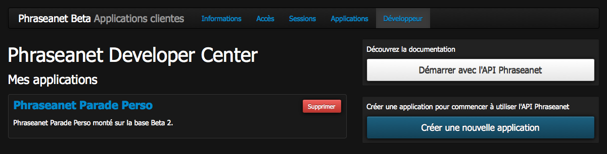
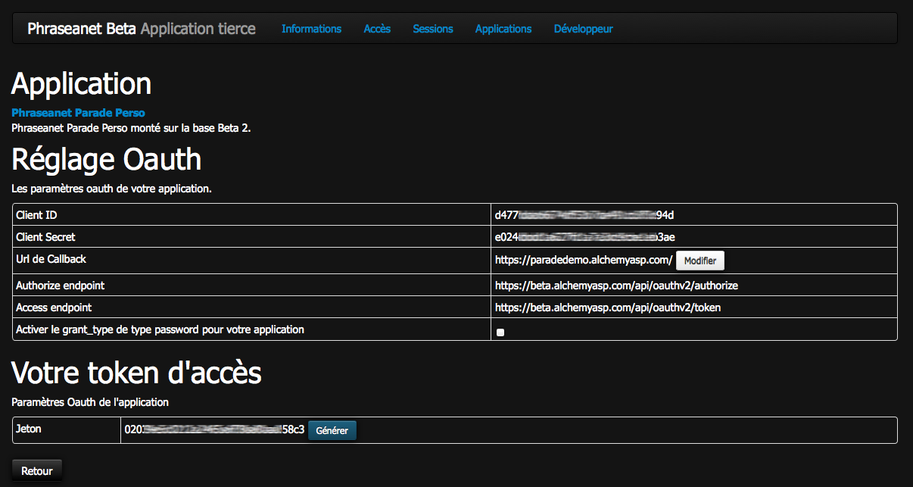

Create third-party applications using Phraseanet API
====================================================

Phraseanet has a public API, allowing developers to embed
documents (videos, photos, etc. ...) and features from Phraseanet
into a third-party application.

 * web site
 * mobile application
 * desktop application

Here are the steps to follow :

    * Read the :doc:`documentation de l'API <API>` receive assistance from the
      :doc:`Phraseanet developers team and the community <Forums>`.

    * To use the API features Phraseanet, you must register a new application
      and get your API credentials.

Register a new application with the Phraseanet API
--------------------------------------------------

Click on the login in the Phrseanet top :doc:`menu <../User/index>`.

In *Phraseanet my account*

Click on developer *déveloper* tab.

Click on *Create a new application*

.. image:: ../images/MonCompteDeveloppeurCreate.png
       :align: center

* Give a name to your application
* Complete the application's description, this information is
    for the user who will use your application, it will be
    displayed on the login page, be precise and briefly explain the purpose of
    your application
* Fill the website field, this field is mandatory.
    This link is presented to the user on the login page to your
    application
* Choose the type of the application *internet application* or
    *desktop application*
* If it is a web application, complete the field callback URL.
    Authenticated users will be automatically redirected to this URL
    after their authentication

Once the application is registered it appears in a dashboard

The dashboard lists all the applications created by the authenticated user

Application settings
--------------------

In the dashboard application developers click on the name of an application.
The settings page of the application is displayed.

**This page shows**

* The *Client ID* is a public unique identifier of the application
* The *Client Secret* is a private password of the application to identify
    the application owner, never disclose this information.
* The callback URL, it can be edited at any time by moving the mouse over.
* The API authentication endpoints
* Activation of the password grant_type enables your application to identify users
    through their Phraseanet identifiers .

.. warning:: Avoid this type of authentication, it is recommended to use it when
    the owner of the resource has a high degree of trust with the client,
    such as the operating system or device which is highly privileged with
    Phraseanet.

* The developer token is an access token that identifies the owner of the
    application to the Phraseanet API

.. note::  The developer token can be used during application development or
        to query the API by the intermediary of an automated process that
        does not require authentication..

.. seealso::    Phraseanet relies on the oAuth2.0 authentication protocol .
             To better understand the process of creation and authentication of
             third-party applications with the Phraseanet API,
             we invite developers to read the protocol RFC
            `http://tools.ietf.org/html/draft-ietf-oauth-v2 <http://tools.ietf.org/html/draft-ietf-oauth-v2>`_.