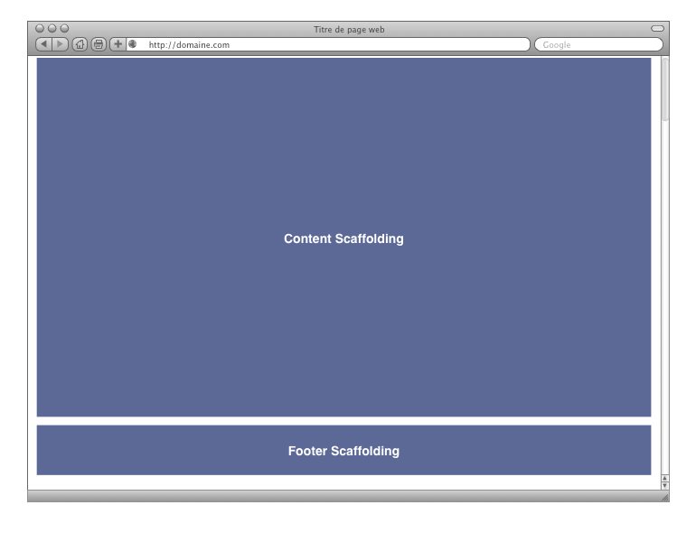
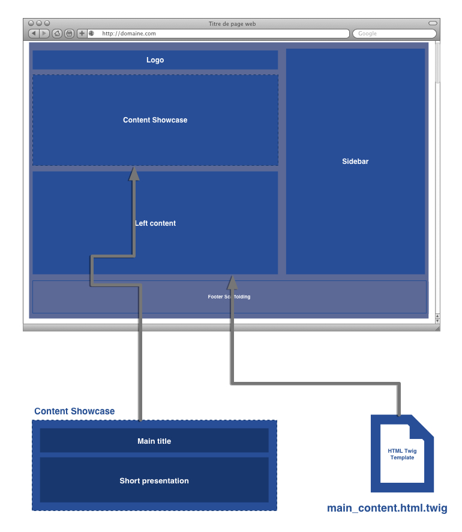
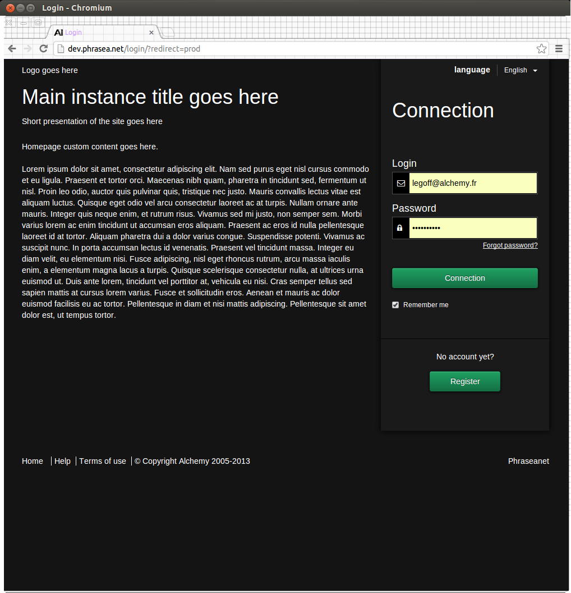
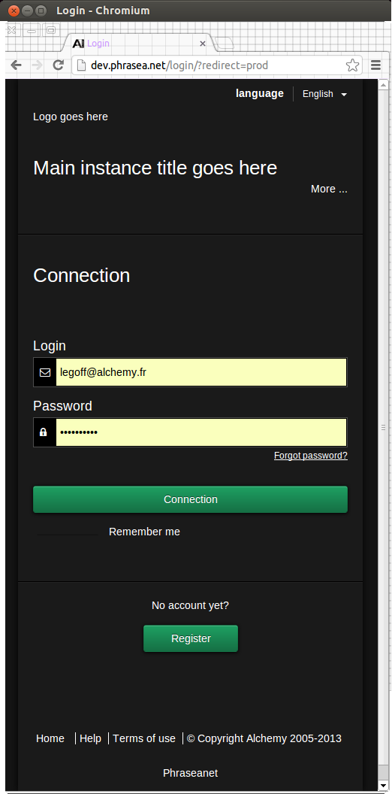
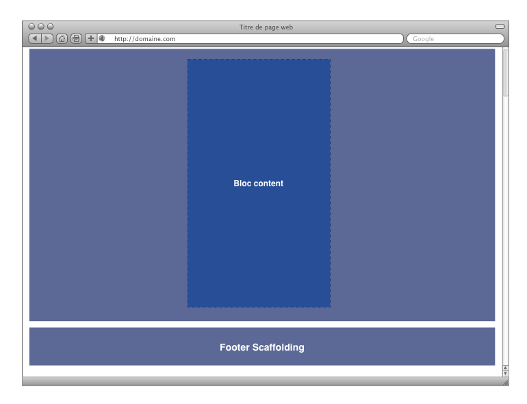
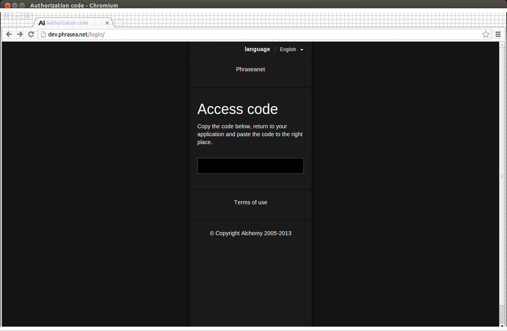
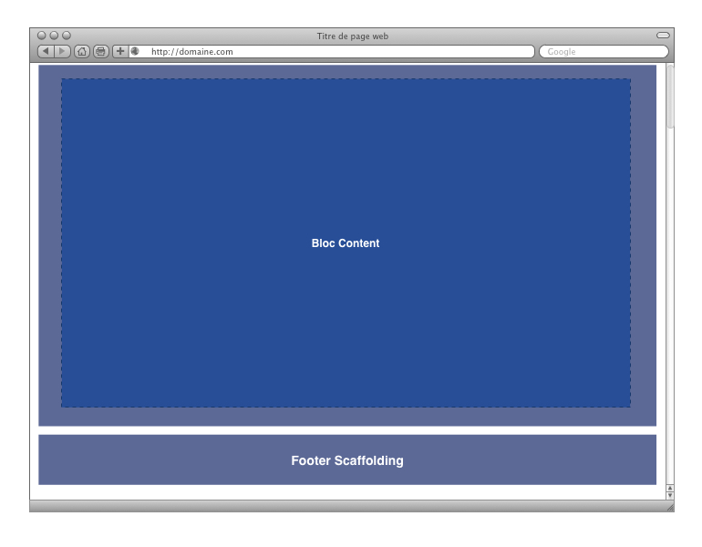
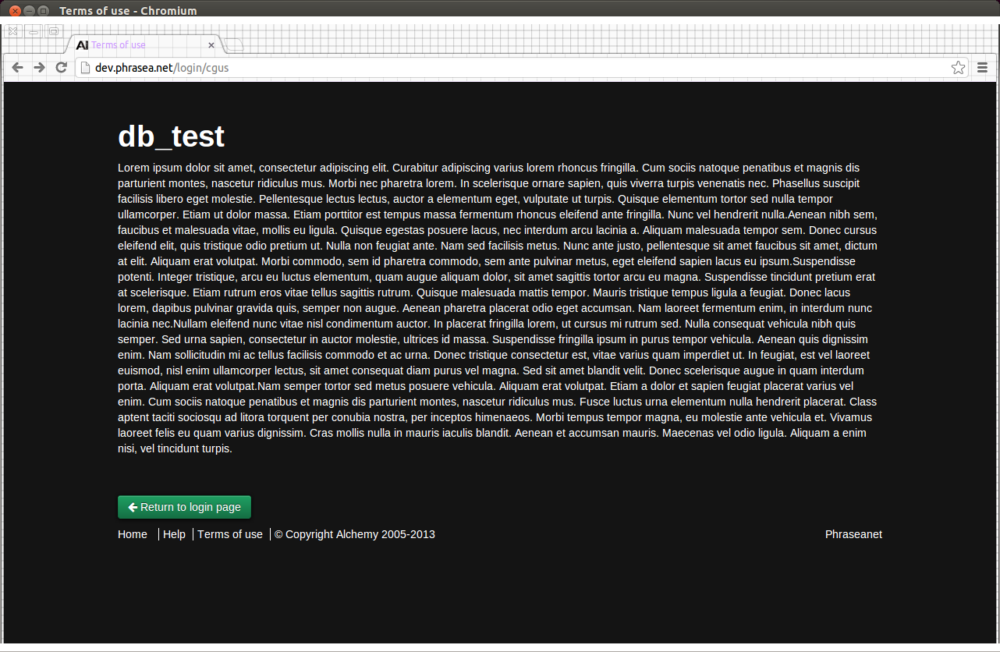

Customize your Phraseanet homepage
==================================

Phraseanet homepages are build uppon two technologies

- `Twig`_, a template engine for rendering html templates
- `Twitter Boostrap`_, a front end framework

Setup
-----

- Phraseanet templates are located under **/templates/web/login** directory
- Phraseanet CSS rules are located under **/www/skins/login/less** directory

Customize templates
-------------------

Phraseanet login templates are ship with a base skeleton builded with
`template inheritance`_ provided by `Twig`_ that allow you to defines blocks that
child templates can override.

This skeleton contains all the common elements in login templates and declares
a **base layout** and three common layouts that inherit from the base layout.
these templates are located under **/templates/web/login/layout** directory.

Template inheritance
~~~~~~~~~~~~~~~~~~~~

Reading this documentation `http://twig.sensiolabs.org/doc/tags/extends.html <http://twig.sensiolabs.org/doc/tags/extends.html>`_
shoud be very useful to understand template inheritance mechanism.

Base Layout
***********

This layout contains three blocks :

- Header block that contains every html code between **<head>** tag.
  The header also contains sub-blocks for :

    - The title tag
    - The favicon link
    - The RSS links
    - The CSS links
    - The Javascript sources

- Content Scaffholding block which contains the `Twitter Boostrap`_ HTML grid
  scaffholding

- Footer Scaffholding block which contains the `Twitter Boostrap`_ HTML grid
  scaffholding

Sidebar layout (two column page)
********************************

The sidebar layout is the most used template, it provides a high number of
customizable blocks on the left and a sidebar on the right.

The left content block include by default the
**/templates/web/login/include/main_content.html.twig** template which can be
useful to display content on the left side across all templates that extends
the sidebar layout

Responsive sidebar layout
+++++++++++++++++++++++++

The left content block disappear and the short presentation is hidden by default
and can be seen by clicking on the 'more' link.

Middle bar layout (one centered column page)
********************************************

The middle bar layout display a one column block in the middle of the page, it
is mostly used for OAuth2.0 authentication templates

Full content layout (one full width column page)
************************************************

The full content layout provides 1OO% wide column, it is used to display
the terms of use.

.. note::

    You should not modify the HTML scaffholding provided by the Phraseanet
    layouts except for very deep branding because it is optimized for responsive
    design and tested against all major browsers.

Replace original templates
~~~~~~~~~~~~~~~~~~~~~~~~~~

To replace a template by your personal custom templates you must put these
templates in the **/config/templates** directory with the same directory
structure of the original one located in **/templates** directory.

For example, to replace the **/templates/web/login/index.html.twig** template
you must declare your template as follow
**/config/templates/web/login/index.html.twig**

.. note::

    Twig will first lookup for templates located under **/config/templates**
    directory

Adding custom resources
~~~~~~~~~~~~~~~~~~~~~~~

Sometimes you will need to add additional resources
(images, javascript files etc ..) to your custom homepage.

To do so you must add these files in the **/config/custom_files** directory
and run the following command

.. code-block:: bash

    bin/setup system:upgrade

It will mirror the whole **/config/custom_files** directory in
**/www/custom** directory to be accessible under the web root directory.

Customize stylesheet
~~~~~~~~~~~~~~~~~~~~

To handle stylesheet Phraseanet use `LESS`_ a dynamic stylesheet language that
comes with `Twitter Boostrap`_ and allow us to extend CSS behavior with
variables, mixins and functions.

To brand your Phraseanet login pages, you can modify the following file
**/www/skins/login/less/variables.less** which contains all CSS variables to
decorate and customize your template.

When you modify a `LESS`_ file you must run the following command to recompile
`LESS`_ files.

.. code-block:: bash

    bin/setup less:compile

.. _Twig: http://twig.sensiolabs.org/
.. _Twitter Boostrap: http://twitter.github.io/bootstrap/
.. _Angular JS: http://twitter.github.io/bootstrap/
.. _LESS: http://lesscss.org
.. _template inheritance: http://twig.sensiolabs.org/doc/templates.html#template-inheritance

