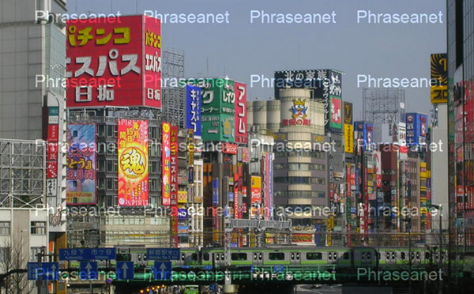

Customize watermarks
====================

A watermark is a logo which superimposes subviews. This device serves as a
deterrent to prevent the misuse of pictures.

By default, the watermark is a cross blocking the surface of an image with the
name of the collection.
It is possible to customize the watermarks applied on the pictures for each
collection.

Watermark file characteristics
------------------------------

The file must be a Gif or Png with transparency, preferably a square format,
containing as many pixels as the largest side of the *Preview* subview (or as
the largest side of the largest Preview class subview).

Upload the watermark file
-------------------------

The watermark is customizable for each Phraseanet collection. In Phraseanet
Admin, display the collection of the watermark to customize.
Upload the watermark file in section **Watermark**.

Applied to a picture, the watermark gives the following result.

Nota bene
---------

After updating a watermark file, and if there are already media in *Phraseanet*,
the cache files created by the application must be deleted.

Adapt and use the following command to clear existing watermarked files in
storage directories:

.. code-block:: bash

    find $storage_directory -type f -iname watermark_* -exec rm -rf {} \;
