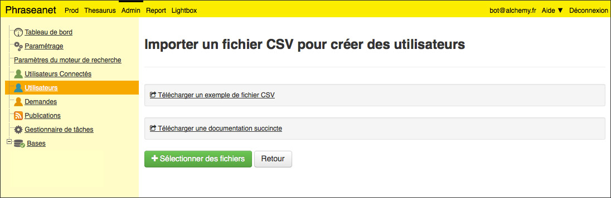

Mass users insert
=================

In some cases, it is not thinkable to register dozens or hundreds of users, one
by one using the standard account creation process in Phraseanet Admin.

In this case, the simplest process is a mass user import.

* Go in **Admin** then click on **Users** item
* Click on the **Import** link

The displayed interface gives examples of CSV files and a quick guide.

Prepare the CSV file as explained in the example, then import it using the
dedicate form.

The importation of users have been successfully tested with a file containing
10 000 users.

.. note::

	The import process is capable of detecting IDs duplication, so that this
	creation method can be used regularly.
