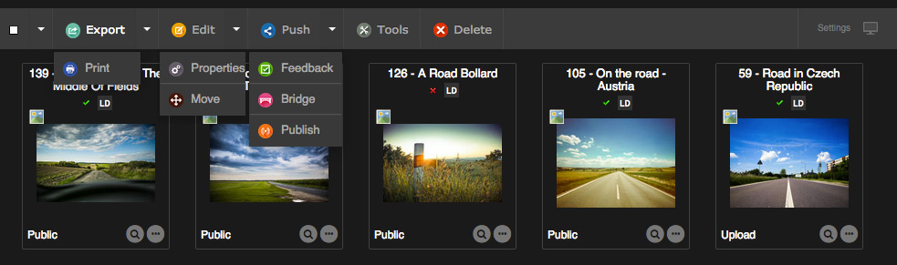

Actions on records
==================
.. toctree::
    :maxdepth: 3

.. topic:: The essential

    The actions on the records are made with commands of the actions palette.

    The :term:`main palette<Actions Palette>` under the search form allows to
    act on the selected documents in the display area.

    In the work area, the actions palette of the opened basket or story allows
    to act on the records it contains or that are selected.
    
    **The actions are accessible depending on the users rights**. Some of these
    actions are basic features while others are advanced features.

The basic features
------------------

Export and Print
****************

.. seealso::

    :doc:`Refer to the Export and Printing section in Phraseanet<Export>` in the
    fundamentals.

The advanced features
---------------------

The advanced features are accessible using the actions palette buttons or using
actions pop-up menus.

Edit
****

This function allows editing records in *Phraseanet* : media and baskets edition
Complete or modify the documentary descriptions of the *assets*, either one by
one or by batch.

.. seealso::

    :doc:`Refer to the Edit section <Edit>`.

In the main palette, the pop-up menu of the button regroups the functions
:ref:`Properties<Actions-Properties>` and :ref:`Move<Actions-Move>`.

.. _Actions-Properties:

Properties
**********

This action allows to modify : 

* the :term:`statuses<Status>` of the records
* the type of the selected documents

Modify the records status
^^^^^^^^^^^^^^^^^^^^^^^^^

The :term:`statuses<Status>` allows to categorize records. They bring
information on their statuses : progress in a *workflow*, alerts on expired
rights, restricts the access on a users range.

.. note::

    28 statuses are customizable in Phraseanet Admin. They can be implemented
    for *workflow* needs or for access restrictions on records by custom tasks.
    A status change is also directly available from the :doc:`Edit <Edit>`
    window.

To edit records statuses :
    
* Select one or more records in the display area or in the opened basket or
  story
* Click on the Properties button in the corresponding actions palette
* Use the radio-buttons to act on the statuses
* Click on Validate to save the changes

.. note::

    The statuses edition is also available in the Edit window.

    **The interfaces being asynchronous**, the statuses symbols are refreshed
    when the interface is refreshed.

Modify the documents type
^^^^^^^^^^^^^^^^^^^^^^^^^

This action allows to change the documents type that are automatically set when
importing in *Phraseanet*. It is useful when some documents were not correctly
interpreted when imported by the host platform of Phraseanet.

* Select one or more records in the display area or in an opened basket or story
* Click on the Properties button in the corresponding actions palette
* Select the tab Type of documents
* Choose the type of the documents. This action can either be unitary or by
  batch
* Click on Validate to save the changes

.. _Actions-Move:

Move
****

The move action allows to move media from one collection to an other, in one
same Phraseanet base.

* Select one or more records in the display area or in an opened basket or story
* Click on the **Move** button
* Select the collections where the documents shall be moved
* Click on Validate to save the changes

.. note::
    
    Asynchronous, the interface does not handle real time change of collections.
    Search again for the media to check if they were successfully moved.

Push, validation, bridge and publications
*****************************************

The Push button and its pop-up menu regroups the Validation function, the Bridge
function and the Publish action.
These functions allow to push and promote records towards recipients or
applications.

.. seealso::

    * Refer to the section dedicated to :doc:`Push and validation <Push>`
    * Refer to the section dedicated to the :ref:`Bridge<Publish-Bridge>`
    * Refer to the section dedicated to :ref:`publications<Publish-Publications>`

Tools
*****

Tools regroups the actions allowing to act on :

* **The thumbnails or preview images** (re-generation, substitution, rotation,
  preview thumbnail for videos)
* **The substitution of original documents or sub-definitions** if the feature
  is activated in the application's settings
* **To display all the metadatas** of a selected document

Select one or more records in the display area or in an opened basket or story
of the work area then click on the Tools button. Choose one of the suggested
tabs :

* **Regenerating the sub-definition** : to re-generate new thumbnails and
  sub-definitions for the selected records.
* **Video tools** : Available only if the selected media is a video, the tab
  shows the tools in order to choose a customized preview thumbnail.
* **Rotation** : Rotate the thumbnails and preview images for the selected media
* **Substitution** : Replace the original document by an other. A checkbox
  allows to choose if the thumbnail and the preview image have to be rebuilt.
* **Substitution of the sub-definitions** : Replace the thumbnail and preview
  image by an other file.
* **Metadatas** : Display all the metadatas informations read by the
  **Exiftool** tool in the original media of the selected document (this tab is
  available if only one document is selected)

Delete
******

**In the display area**, the Delete action allows to delete records (documents,
baskets or stories).

* Select one or more records in the display area or in an opened basket or story
* Click on the Delete button then confirm to delete the selected documents

**In the work area**, click on Delete in the actions palette of an opened basket
or story, a checkbox allows to choose if the documents of the story shall be
deleted.
