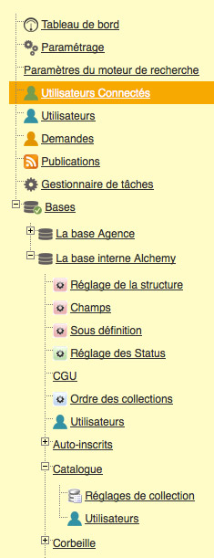

Administration
==============
.. toctree::
    :maxdepth: 3

.. topic:: The essential

    The interface *Phraseanet Admin* allows the administration and customization
    of Phraseanet.
    The screens and forms allow to manage and monitor the solution, sign up and
    set up the users rights, deploy and manage Phraseanet Bases and documentary
    collections.

The *Phraseanet Admin* interface has a frame on the top-left of the screen that
displays a menu listing the different administration sections.    

If a user does not see these sections, it is because its
:doc:`rights <AdministrationUsers>` do not allow it.

Some of these sections have sub-sections. Click on the **+** buttons to display
them and on the **-** buttons to hide them.

To access a section or a sub-section of Phraseanet Admin, click on its icon or
label.

In order to present the principal features of the Phraseanet Admin module, we
suggest that you follow this plan :

.. toctree::
    :maxdepth: 2
    :glob:

    AdministrationSolution
    AdministrationUsers
    AdministrationBasesCollections
