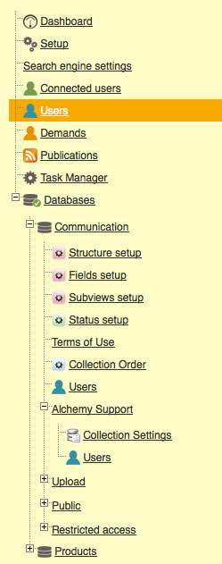

Administration
==============
.. toctree::
    :maxdepth: 3

.. topic:: The essential

    *Phraseanet Admin* allows the setting and the administration of Phraseanet.
    Screens and forms in Admin allow to:

    * manage and monitor the solution
    * Register and adjust users rights,
    * Deploy and manage :term:`Phraseanet Bases <Phraseanet Base>` and
      :term:`Collections <Collection>`

The *Phraseanet Admin* interface has a frame on the left of the screen that
displays a menu listing the different administration sections.

**If a user does not see these sections, it is because its**
:doc:`rights <AdministrationUsers>` **do not allow it.**

Some of these sections have sub-sections. Click on the **+** buttons to display
them and on the **-** buttons to hide them.

To access a section or a sub-section of Phraseanet Admin, click on its icon or
label.

In order to present main features of *Phraseanet Admin*, we follow this outline:

.. toctree::
    :maxdepth: 2
    :glob:

    AdministrationSolution
    AdministrationBasesCollections
    AdministrationUsers
