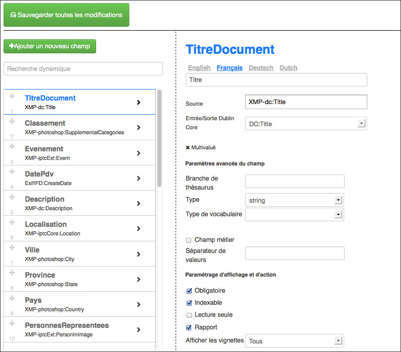

Phraseanet bases and collections administration
===============================================
.. toctree::
    :maxdepth: 3

.. topic:: The essential

    A Phraseanet application is organized in bases and collections.
    Each of the bases corresponds to a customizable documentary structure, the
    collections can be treated as base subsets.

.. Setting-Structure:
    
Customization per base
----------------------

Click on a base to display the status tab of a Phraseanet base.

This screen shows the indexation state of the base and allows the following
actions :

* Base re-indexation
* Collections creation in a base
* Logs deletion
* Records purge of a base
* Base deletion

Multi-base system, each base of a Phraseanet solution is finely customizable. To
do so, click on the **+** icon.

Setting the structure
*********************

This section displays the documentary structure of the selected base as a
writeable XML file.

It's unlikely to have to customize a base using this interface, the interfaces
`Fields`_ , `Sub-definition`_ or `Statuses settings`_ are more convenient to
use to change the settings.

Fields
******

The section **Fields** allows to define and edit the documentary structure of a 
Phraseanet base using forms in a graphical interface.

Each of these fields of the documentary structure is defined by customizable
properties :

* A unique name
* Text type, multivalued text or date
* Labels or localized labels depending on the interface languages
* A mandatory presence or not
* An optional data source
* An optional Dublin Core source
* An optional Business field property
* The order

.. note::

    **The field types are linked to the Phrasea engine**.
    :doc:`Refer to the fields type information of the FAQ <../../FAQ/Settings/Phrasea-field-types>`.

Sub-definition
**************

The section *Sub-Definition* allows to add and edit the media sub-definitions
for picture, videos, audio type integrated in Phraseanet.

.. image:: ../../images/Administration-sousdefinitions.jpg
    :align: center

The nature of the sub-definitions depends on the nature of the original
documents integrated in Phraseanet.
The table below lists some typical examples of sub-definitions created by the
application.

+---------------------------------------+-------------------------------------+
| Nature of the original Media          | Nature of the sub-definition        |
+=======================================+============+==========+=============+
| Jpeg, psd, gif, png... pictures       | Jpeg sub-definition                 |
+---------------------------------------+-------------------------------------+
| Mpeg, Avi, Mov... video               | Mpeg4 sub-definition or Jpeg        |
+---------------------------------------+-------------------------------------+
| Wav, Mp3... audio                     | Mp3 sub-definition or Jpeg          |
+---------------------------------------+-------------------------------------+
| Pdf, Word... office document          | Flash animation (Swf) of Jpeg       |
+---------------------------------------+-------------------------------------+

.. warning::

    The *thumbnail* and *preview* sub-definitions are essential.
    They are used in the Phraseanet interfaces to display the thumbnails and
    preview images of the media.

Statuses settings
*****************

The :term:`Statuses<Status>` allows to set states on documents and to restrict
the access to records to users regardless of the collection notions.
Linked to the documentary structure of a base, it is possible to integrate up to
28 statuses.

* To declare a status, click on the Page icon to edit a new status bit then fill
  the form.    
* To modify en existing status, click on the Pen icon.
* To delete a status, click on the Cross icon then confirm the deletion.

General terms and conditions of use
***********************************

The general terms and conditions of use are shown to the users when they sign-up

* Fill or copy / paste a text in the different proposed languages.
* Check the "The users...." box to make the existing users validate the updated
  conditions and terms.
* Click on **Update** to save the changes.

Collections order
*****************

By default, the collections are displayed in Phraseanet by creation date. It is
possible to modify this order.

* Click on the section **Collections order**
* Click on a collection
* Click on **Up**, or **Down** or on **Alphabetical order**
* Click on **Validate** to save the changes

The collections
---------------

The :term:`collections <Collection>` are subsets of a base they share the
settings with. The implementation answers to the segmentation needs of
documentary assets and/or the assignment of specific users rights.

Create a collection
*******************

To create a collection, click on the title of the base in which the collection
shall be created then click on **New collection**.

Specify the name of the collection to create in the name field then validate
the form.

.. note::

    When creating a collection, it is possible to apply (duplicate) users rights
    from an existing collection.

Display a collection
********************

Click on the title of the collection to display its information.

.. image:: ../../images/Administration-affichercollection.jpg
    :align: center

This screen shows the essential information on the collection.
It allows to rename it, deactivate it (see section :ref:`activate-collection`),
purge it or delete it.

Display the details of a collection
***********************************

Click on **Details** to display an inventory of the collection contents.

The table lists the objects composing the collection (records, documents,
sub-resolutions, thumbnails), the number of objects, the size in mega-bytes,
the size in giga-bytes.

To hide the details of a collection, click on **Back**.

.. _AdministrationBasesCollections-Managers:

Managing the order managers
***************************

An order manager is a user that has a response right on the download requests
on original documents sent by users who do no have the rights to download them.

.. note::

    The order managers receive download requests notifications in the Phraseanet
    interface and by email.

**To add an order manager**, on the displayed collection, type the user's name
or surname or login in the form to add a manager. Validate using the choice
suggested by the auto-completion system.

**To delete an order manager**, uncheck the box before his username then apply
using the **Validate** button.

Branding a collection
*********************

To brand documents published on other sites using Phraseanet, select one of the
three suggested options in the group of radio-buttons.

* Check the box **By default** to not brand,

Or

* Check the box **Watermark file** to apply the default watermark or use a
  pre-uploaded watermark file,

Or

* Check the box **Notification banner** to add a banner under the last pixels
  line of the files (this requires setting up the "fields" and "logo" 
  information to display on the banner).

Other actions on the collections
********************************

A form regroups other actions on the selected collection.

.. image:: ../../images/Administration-collectionautresactions.jpg
    :align: center

Set the labels
^^^^^^^^^^^^^^

The labels allows to give names to the collections in each interface language of
the application.
To define or modify the labels of a collection, fill the form then click on the
button **Define the labels**.
    
.. _activate-collection:

Activate or de-activate a collection
^^^^^^^^^^^^^^^^^^^^^^^^^^^^^^^^^^^^

By default, the collections are activated when created. This means that they are
published and that the users that can access them can browse their contents.

* To de-activate a collection and stop its publication, click on
  **De-activate the collection**.
* To activate a collection, click on **Activate the collection**.

Rename a collection
^^^^^^^^^^^^^^^^^^^

Enter a new name for the collection then click on Rename.

Empty a  collection
^^^^^^^^^^^^^^^^^^^

Emptying a collection deletes permanently all its records (documents, notes,
sub-definitions).

This action is permanent and applies to the sub-definitions and the notes.

Click on **Empty the collection** to delete all the records of the collection.

Delete a collection
^^^^^^^^^^^^^^^^^^^

Click on **Delete** to completely delete the collection from the base.

.. note::

    A collection must be empty to be deleted.

Customizing a collection
************************

A collection is customizable by a set of distinctive graphical elements.

Minilogo
^^^^^^^^

To add a logo representing the collection :

* Click on the **Browse** button to select the logo file (maximum recommended
  size : 30 pixels height).

Watermark
^^^^^^^^^

Use the proposed form to add a customized watermark in order to apply it to all
sub-definitions of the collection's documents.

.. note::

    A watermark is applied to the picture documents viewed by the users that
    have the "No watermark" right unchecked.

:doc:`Refer to the section dedicated to the Watermark in the FAQ.<../../FAQ/Customization/Watermark>`

Stamp
^^^^^

A stamp adds a banner containing a logo and some metadatas to the export of 
original image type documents.

The configuration of the stamp must be completed by editing the XML tags in the
collections preferences.

.. seealso::

    :doc:`Refer to the section dedicated to the Stamp Logo in the FAQ.<../../FAQ/Customization/Stamp-logo>`

.. _AdministrationBasesCollections-values:

Preferences : Suggested values
******************************

The suggested values are pull-down menus that appear in the :doc:`Edit <Edit>`
window to enable a rapid indexation. They are editable by collections and by
fields.

The edition of suggested values is possible using an edition form in graphical
mode or using the XML view mode.

* Select the fields in which you want to work
* Enter the values

In the graphical mode, it is possible to sort the values by clicking on a value
then "Up" or "Down" or to sort them by alphabetical order by clicking on
*Alpha sort*.

**To delete a value**, select it then click on **Delete**.
