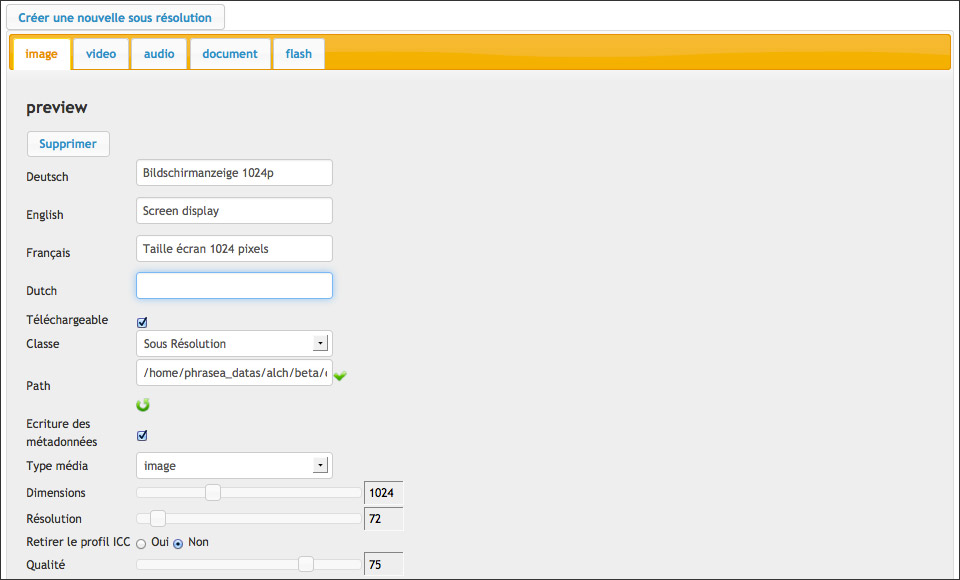

Phraseanet bases and collections administration
===============================================
.. toctree::
    :maxdepth: 3

.. topic:: The essential

    A Phraseanet application is organized in :term:`bases <Phraseanet Base>` and
    :term:`collections <Collection>`.
    Each bases corresponds to a customizable documentary structure, a
    collections can be considered as base subsets.

Databases start screen lists available databoxes on the application.

Two forms allow:

* **Creating additionnal databases**
* **Mounting existing databases**

.. Seealso::

  :doc:`Refer to FAQ about creating and mounting additionnal databases<../../FAQ/Media/Add-a-base>`.

Click on a database name to start it customization.

.. _Setting-Structure:

Customization per base
----------------------

A database start screen display its status.

.. image:: ../../images/Administration-base.jpg
    :align: center

The screen shows the indexation state of the base and allows the following
actions:

* Set labels language
* Create Collections
* Logs deletion
* Base removal
* Purge of records
* Base deletion
* Base re-indexation

As a multi-bases system, each base of a Phraseanet instance is finely
customizable. Click on the **+** icon in order to reveal its sub-menu.

Setting the structure
*********************

This section displays the documentary structure of the selected base as a
XML file.

.. image:: ../../images/Administration-structurexml.jpg
    :align: center

It's unlikely to have to customize a base using this interface, the interfaces
`Fields`_ , `Subviews`_ or `Status setup`_ are more convenient to change
settings.

Fields
******

The section **Fields** allows to define and edit the documentary structure of a
Phraseanet base using forms in a graphical interface.

.. image:: ../../images/Administration-structurechamps.jpg
    :align: center

Each of these fields of the documentary structure is defined by customizable
properties:

* A unique name
* A type, mono or multi valued for String and Text
* Labels depending on the interface languages
* A mandatory presence or not
* An optional data source
* An optional :term:`Dublin Core` source
* An optional :term:`business field <Business field>` property
* The order

.. note::

    **The field types are linked to the Phrasea engine**.

    :doc:`Refer to the fields type information of the FAQ <../../FAQ/Settings/Phrasea-field-types>`.

Subviews
********

The *Subviews* section allows to add and edit the media subviews files
for picture, videos, audio, office other multimedia documents type integrated
in Phraseanet.

The nature of the sub-definitions depends on the nature of the original
documents integrated in Phraseanet.
The table below lists some typical examples of subviews generated by Phraseanet.

+---------------------------------------+-------------------------------------+
| Nature of the original Media          | Nature of the sub-definition        |
+=======================================+============+==========+=============+
| Jpeg, psd, gif, png... pictures       | Jpeg sub-definition                 |
+---------------------------------------+-------------------------------------+
| Mpeg, Avi, Mov... video               | Mpeg4 sub-definition, Jpeg or Gif   |
+---------------------------------------+-------------------------------------+
| Wav, Mp3... audio                     | Mp3 sub-definition or Jpeg          |
+---------------------------------------+-------------------------------------+
| Pdf, Word... office document          | Flash animation (Swf) of Jpeg       |
+---------------------------------------+-------------------------------------+

.. warning::

    The *thumbnail* and *preview* subviews are mandatory.
    They are used in the Phraseanet interfaces to display thumbnails and
    preview images of media. Don't delete them. Use label to change their
    names if needed.

Status setup
************

:term:`Statuses<Status>` allows to set states on documents and restrictive
access to records for users regardless of collection notions.
It is possible to integrate up to 28 statuses.

* To declare a status, click on the Page icon to edit a new status then
  fill the form.
* To modify an existing status, click on the Pencil icon.
* To delete a status, click on the Cross icon then confirm deletion.

Terms of use
************

.. image:: ../../images/Administration-cgu.jpg
    :align: center

Terms and conditions of use are shown to the users when they sign-up.

* Fill or copy / paste a text in the different proposed languages.
* Check the "The users...." box to make the existing users validate the updated
  conditions and terms.
* Click on **Update** to save the changes.

Collections order
*****************

.. image:: ../../images/Administration-ordrecollections.jpg
    :align: center

By default, the collections are displayed in Phraseanet by creation date. It is
possible to modify this order.

* Click on the **Collections order** item
* Click on a collection
* Click on **Up**, or **Down** or on **Alphabetical order**
* Click on **Validate** to save the changes

The collections
---------------

The :term:`collections <Collection>` are subsets of a base they share the
settings with. The implementation answers to the segmentation needs of
documentary assets and/or the assignment of specific users rights.

Create a collection
*******************

To create a collection, click on the name/label of the base in which the
collection shall be created then click on **Create collection**.

Specify the name of the collection to create in the name field then validate
the form.

.. note::

    When creating a collection, it is possible to apply (duplicate) users rights
    from an existing collection.

Display a collection
********************

Click on the title of the collection to display its information.

This screen shows the essential information on the collection.
It allows to rename it, deactivate it (see section :ref:`activate-collection`),
purge it or delete it.

Display details of a collection
*******************************

Click on **Details** to display an inventory of the collection contents.

.. image:: ../../images/Administration-afficherdetail.jpg
    :align: center

The table lists the objects composing the collection (records, documents,
subviews, the number of objects, the size in megabytes,
the size in gigabytes.

To hide the details of a collection, click on **Back**.

.. _Collections-Order-Managers:

Order managers setting
**********************

An order manager is a user that can validate download requests on original
documents made by users.

.. note::

    The order managers receive download requests notifications in the Phraseanet
    interface and by email.

**To add an order manager**, type the user's name, firstname or login in the
form then validate using the suggested choice by the auto-completion system.

**To delete an order manager**, uncheck the box before his username then apply
using the **Validate** button.

Branding a collection
*********************

To brand documents published on other sites using Phraseanet, select one of the
three suggested options in the group of radio-buttons.

.. image:: ../../images/Administration-marquagecollection.jpg
    :align: center

* Choose **By default** to not brand,

Or

* Choose **Watermark file** to apply the default watermark or a pre-uploaded
  watermark file,

Or

* Choose `Stamp`_ to add a banner under the last pixels line of the files

Other actions on the collections
********************************

A form regroups other actions on the selected collection.

.. image:: ../../images/Administration-collectionautresactions.jpg
    :align: center

Set the labels
^^^^^^^^^^^^^^

The labels allows to give names to the collections in each interface language.
To define or modify the labels of a collection, fill the form then click on the
**Set labels** button.

.. _activate-collection:

Activate or de-activate a collection
^^^^^^^^^^^^^^^^^^^^^^^^^^^^^^^^^^^^

By default, the collections are activated when created. This means that they are
published and that the users that can access them and can browse their contents.

* To de-activate a collection and stop its publication, click on the
  **Disable collection** button.

* To activate a collection:

    * Click on the database name then
    * Click **Activate a collection**
    * Select the collection to activate
    * Refresh display

Rename a collection
^^^^^^^^^^^^^^^^^^^

Enter a new name for the collection then click on Rename.

Empty a  collection
^^^^^^^^^^^^^^^^^^^

Emptying a collection deletes permanently all its records (documents, notes,
subviews, stories).

This action is permanent and applies to the sub-definitions and the notes.

Click on **Empty the collection** to delete all the records of the collection.

Delete a collection
^^^^^^^^^^^^^^^^^^^

Click on **Delete** to completely delete the collection from the base.

.. note::

    A collection must be empty to be deleted.

Customizing a collection
************************

A collection is customizable by a set of distinctive graphical elements.

Minilogo
^^^^^^^^

To add a logo representing the collection :

* Click on the **Browse** button to select the logo file (maximum recommended
  size : 30 pixels height).

Watermark
^^^^^^^^^

Use the proposed form to add a customized watermark in order to apply it to all
sub-definitions of the collection's documents.

.. note::

    A watermark is applied to the subviews viewed by the users that have the
    "No watermark" right unchecked.

    :doc:`Refer to the section dedicated to the Watermark in the FAQ.<../../FAQ/Customization/Watermark>`

Stamp
^^^^^

A stamp adds a banner containing a logo and some metadatas to the export of
original image type documents.

The configuration of the stamp must be completed by editing the XML tags in the
collections preferences.

.. seealso::

    :doc:`Refer to the section dedicated to the Stamp Logo in the FAQ.<../../FAQ/Customization/Stamp-logo>`

.. _AdministrationBasesCollections-values:

Collection Settings
*******************

Suggested values
^^^^^^^^^^^^^^^^

The suggested values are drop down menus that appear in the :doc:`Edit <Edit>`
window to enable a rapid capturing. They are editable by collections and by
fields.

The edition of suggested values is possible in a graphical for or using the XML
input view mode.

* Select the fields in which you want to edit suggested values
* Enter the values

In the graphical mode, it is possible to sort the values by clicking on a value
then "Up" or "Down" or to sort them by alphabetical order by clicking on
*Alpha sort*.

**To delete a value**, select it then click on **Delete**.

Other advanced settings
^^^^^^^^^^^^^^^^^^^^^^^

The XML input view mode is useful for advanced settings such as:

* Registration options
* Stamp logo displayed caption infos

Some examples in the :doc:`FAQ section manual <../../FAQ/index>` refer to this
XML input view mode.
