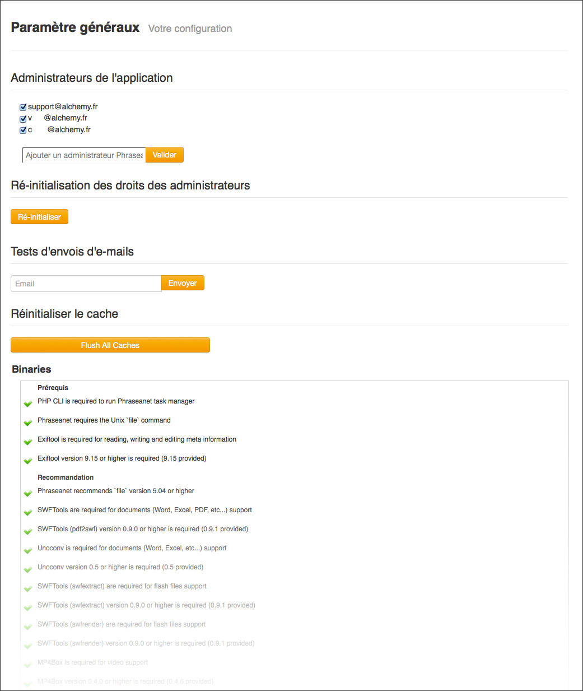
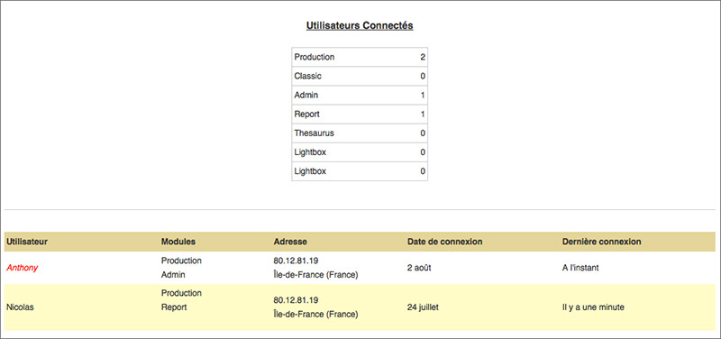
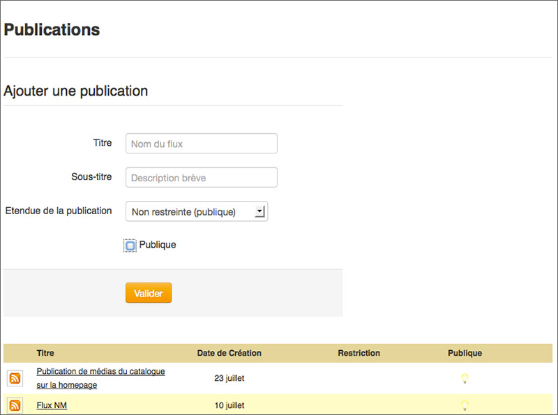
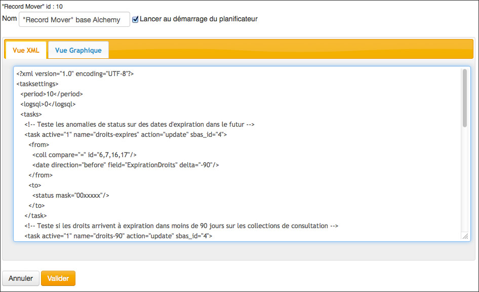
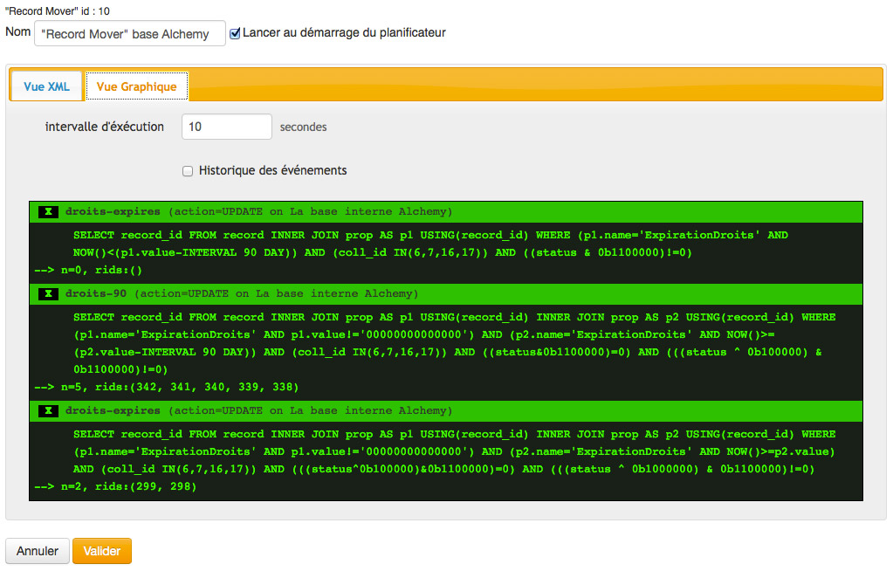

Application's Administration
============================
.. toctree::
    :maxdepth: 3

.. topic:: The essential

    The administration of the application consists in monitoring the solution's
    operations and changing settings if necessary.

Dashboard
---------

**Accessible only by Phraseanet administrators**, the dashboard allows to add
or remove Phraseanet administrators.

Phraseanet administrators are users that have the rights to manage and maintain
the application.

The dashboard displays an overview of the configuration state of the file
system, executables, extensions, cache servers and web servers involved in the
implementation of *Phraseanet* solution.

.. _Application-setting:

Settings
--------

**Accessible only by Phraseanet administrators**, the *Settings* screen have
a graphical interface that allows to modify the installation and configuration
settings of the Phraseanet instance.

Setup have a set of forms allowing to :

* Modify the addresses and the paths of the application or components that
  allow its implementation.
* Put the application in maintenance mode
* Activate or deactivate connections to web services and to to social networks
  implemented with the :ref:`Bridge<Publish-Bridge>`.
* Activate or deactivate features and options of the application

.. image:: ../../images/Administration-setup.jpg
    :align: center

.. warning::

    "Setup" allows to deeply modify the installation settings of the
    application. The administrator must pay attention to modifications brought
    in the proposed forms.

Search engine settings
----------------------

Only for the system administrators in charge of the Phraseanet deployment, this
section allows to configure the search engine used by the instance using a
graphical interface.

.. seealso::

    :doc:`Refer to the page dedicated to the engines configuration in the Administrator documentation<../../Admin/SearchEngine>`.

Phrasea engine configuration
****************************

The Phrasea engine, which is the default engine, has few configuration options.

The interface offers to :

* Activate or deactivate the :term:`stemming option <Stemm>`
* Choose the display order of the records.

Sphinx engine configuration
***************************

The form allows to write the configuration of the Sphinx search engine in use.

Connected users
---------------

This screen lists the active users sessions on the system.
It tells which Phraseanet application is used, the IP address, and also the date
and time of connection to the system.

Publications
------------

Accessible by users who have the publications management rights, the
publications section allows to manage mediaRSS feeds broadcast from the
Phraseanet application.

The screen displays the list of the available media feeds and allows to
create, modify or remove some media feeds.

.. _Create-a-publication-feed:

Create a publication feed
*************************

Fill the feed creation form by entering the necessary information.
The publication extent restricts the publication to users accessing a
collection.
**Check the Public box** to remove the access restrictions.

.. note::

  The public publications media are approved in the suggested default animations
  on the login page.

Modify or delete a feed
***********************

* Click on the title of a feed to modify it
* To delete a feed, click on the button **Delete**

Task manager
------------

**Accessible only by Phraseanet administrators**, this screen allows to manage
tasks that help in operating the application.
The tasks are listed in a table that indicates the task identifier, its name,
and if it is active or not.

Right click on the pop-up menu of the task to :

* Start or stop a task
* Edit the settings of a task (It has to be stopped first)

New task
********

The task settings in Phraseanet allows to set up treatments automatisms.
The standard version of the solution is delivered with a set usable of tasks :

* Indexation task
* Creation of sub-definitions
* Writing metadatas

Administrators can add others :

* Select one of the task templates available in the drop-down menu **New Task**
* Edit the taks settings in the XML view or graphical form

* Click on **Validate** to save the changes

In some cases, the graphical view simulates the task's execution.

* Start the task.

.. seealso::

    :doc:`Refer to the page dedicated to the tasks engine<../../Admin/TaskManager>`.
