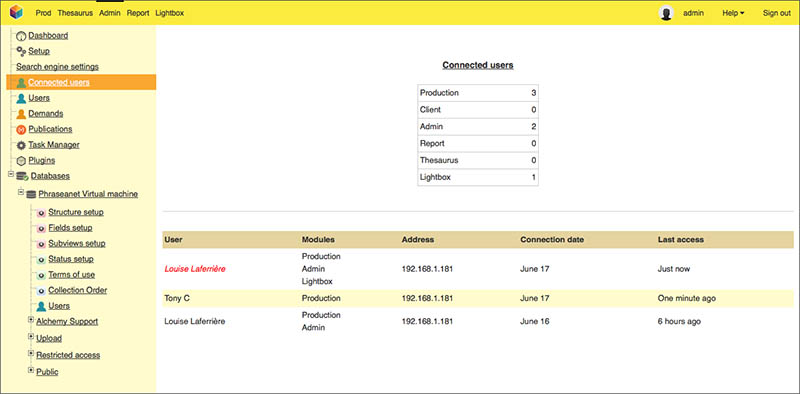

Users Management
================

.. toctree::
    :maxdepth: 3

.. topic:: The essential

    Available for users who have the users management rights, the users section
    allows to manage the subscription, the rights and information on the users.

Click on the Users section to go to the users management interface.

Concepts related to users and their rights
------------------------------------------

In Phraseanet, if a user does not see a function or section, it is certainly
because he does not have the required access rights.
Also, it is not possible for a user to give more rights than he has himself when
he is validating a subscription or modifying rights.

.. note::

    A user who have no allocated rights is a ghost user.
    He is recognizable by a ghost icon in the users list.

    .. image:: ../../images/Administration-utilisateurfantome.jpg
        :align: center

Create, modify, remove a user
-----------------------------

Create a new user
*****************

* Click on the button  **New user**.
* Enter the e-mail of the new user and click on  **Create a user**.
* Grant rights to the created user

.. seealso::

    :ref:`Refer to the Rights edition section<User-Rights>`.

* To edit information relating to the user's details, click on the tab
  **Information** then edit the proposed form.
* Apply the changes by clicking on the **Validate** button.

.. note::

    If some users are created by the users management interface, the e-mail 
    address is used as the identifier.

Modify the user's rights
************************

* Double click on the username in the list
* Edit then validate the form

Delete a user
*************

* Select a user in the list
* Click on Delete

Sort existing users
-------------------

It is possible to sort the users list by criteria such as the identifier,
the family name/first name, email, country or the company.

Users templates
---------------

The users templates allows to apply the same rights on one or several users.
In the users list, a template is marked with an **M** icon.

.. image:: ../../images/Administration-modeleutilisateur.jpg
    :align: center

Users templates creation
************************

* Click on **New template**
* Enter a name for the template then validate the form
* Edit the rights of the new template then validate the form
    
.. note::

    Templates belong to users who created them. They will not be visible by the 
    other administrators.

Apply templates to users
************************

It is possible to apply templates to one or more users.

* Select the users
* Choose the template to apply in the templates view
* Click on Apply

.. image:: ../../images/Administration-appliquermodele.jpg
    :align: center
    
An alert window allows to choose an application option for the template : 

* **Apply the template** : the rights of the template are added to the existing
  rights
* **Reset and apply the template** : the rights are reset then applied to the
  user

The guest access
----------------

The guest access can be set up in Phraseanet, if desired. It allows to give 
access to the media assets to persons not registered in the system.

To set up the guest access :

* Click on the link **Guest access settings**.

.. image:: ../../images/Administration-Barre-invite.jpg
    :align: center

* Edit the rights of the guest account then validate the form

As a right is activated, the Guest access link is on the home page of the
application.

.. _User-Rights:

Edition Rights
--------------

The rights edition concerns the users as well as the templates.
To display the rights edition form of a user or a template, double click on the
user's name or on the template's name in the users list.

The rights form allows to give viewing, exploitation or managing rights per
Phraseanet base and collection. The rights are granted when the corresponding
boxes are checked.

The form also gives access to the user's information. Click on the tab Sheet to
display them.

.. note::

    The modification of the user's rights access can be created in batches by
    selecting several users.

When editing by batch, a grayed box indicates that the right is at least granted
to one of the selected users.
A user cannot give more rights than he has himself : a red dot indicates that it
is impossible to give rights.

The sign **i** indicates a secondary form. Click on the icon to display it.

The headers on the columns are clickable. They allow to check or un-check the
boxes on all the collections of a base.

Viewing rights
**************

The first part and leftmost of the rights window : 

* **Access** to allow access to a Phraseanet Base or to the collection
* **Active** to activate the user account. Unchecking the box allows to 
  disable the user without loosing the settings.
* **Baskets** to allow baskets creation.
* **Sub-definition** allows to view and download the sub-definitions of the
  class *Sub-definitions*
* **No Watermark** acts on the watarmarks applied on the sub-definitions of the
  image type documents. Check the box to delete the applied watermark.
* Documents authorize the download of the original document
* Order allows to order documents

Other restrictive options exist :

Limitation by Quotas
^^^^^^^^^^^^^^^^^^^^

Quota allows to define the download limits per base or per collection. Click on
the Quotas icon to set these limits.

* Check **Restriction** to activate the download restrictions
* Enter the number of authorized downloads per month for this collection.
* Click on the "Validate" button to save the setting and close the window.

Limitation in time
^^^^^^^^^^^^^^^^^^

Limit Time allows to set a time limit for a user's access to a Phraseanet base
or collection.

* Check **Activate** to activate the system
* Fill the validity dates of the access then submit the form

Limitation through Status
^^^^^^^^^^^^^^^^^^^^^^^^^

Limitation through status allows to hide records from the user according to
the state of one or several status.

.. note::
    Refer to the settings of the base for the creation and the management of the 
    status bits.

Click on the statuses icon to set the access restrictions to the records.

* Check or uncheck the statuses restricting the visibility on records and submit
  the form

Exploitation and management rights
**********************************

The left part of the rights form regroups the exploitation rights of documents
and the managing rights of Phrasesanet bases and collections.

Rights on the documents
^^^^^^^^^^^^^^^^^^^^^^^

* Add authorizes to add documents and stories in the collection
* Edit authorizes to edit the description of the records
* Change status authorizes to edit records statuses
* Delete authorizes records deletion in the collection
* Image tools gives access to the Tools button actions
* Users management gives access to the users management
* View Reports gives access to Report
* Push authorizes the documents broadcasting by Push and Validation

Rights on Phraseanet bases and collections management
^^^^^^^^^^^^^^^^^^^^^^^^^^^^^^^^^^^^^^^^^^^^^^^^^^^^^

The managing rights are built upon each other to the setting access on
Phraseanet bases and collections.

* Coll. management reveals menus giving access to the base settings in Admin.
  These rights must be completed by at least one of the following rights.
* Manage suggested values allows to edit the suggested values by field and by
  collection on a base.
* Publication allows to publish with Bridge and the available RSS Streams
* Mod. Thesaurus allows to edit the thesaurus
* Base Management gives access to functions to manage the base including the
  creation, the deletion or purge of bases
* Base structure gives access to the setting of a base structure

"Access Requests"
-----------------

The **Requests** section lists the subscription requests made through available
forms.

.. image:: ../../images/Administration-demande.jpg
    :align: center

The subscriptions are on collections and there are as many lines than access
requests.

A rollover on the name allows to display the information related to the
applicant.

Select the rights to allocate per collections by checking the boxes.

The possible choices are :

* Deny the access to the requested collection.
* Give access to the requested collection, to the documents in sub-definitions.
* Give access to the requested collection, with documents in high definition.
* Give access to the requested collection, without documents in high definition.

Click on **Validate** to apply the selected choices.

The other option top accept a subscription request consists in applying a user
template.
