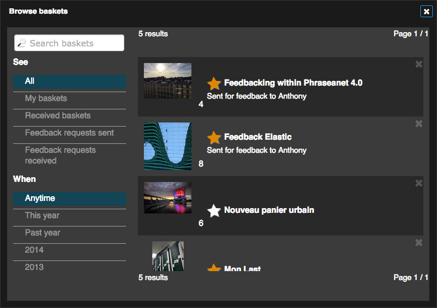

Baskets and Stories
===================
.. toctree::
    :maxdepth: 3

Baskets and stories are located in the work area on the same tab.
They are recognizable by their colours :

* *Grey* for the baskets
* *Golden* for the received baskets but not opened yet.
* *Blue* for the stories

The Baskets
-----------

.. topic:: The essential

    A :term:`Basket<Basket>` allows to set aside media selections in order to
    work on them. A basket in not "searchable" like documents or stories and
    belongs to the user who created it. A basket can be transmitted to other
    users using the :doc:`Push and Validation<Push>` to make available a set of
    media.

Generalities on baskets
***********************

The basic functions and selection in baskets
^^^^^^^^^^^^^^^^^^^^^^^^^^^^^^^^^^^^^^^^^^^^

The baskets and their functions are presented in the page dedicated to the
results display.

.. seealso::

    * :ref:`The creation<Display-Basket-Create>`
    * :ref:`Adding a selection<Display-Basket-Add>`
    * :ref:`Opening and closing baskets<Display-Basket-Open>`
    * :ref:`Display in the detailed view<Display-Basket-Detail>`
    * :ref:`Delete media from a basket<Display-Basket-Delete1>`
    * :ref:`Delete a basket<Display-Basket-Delete2>`

The documents selection in a basket is made the same way as in the display area.

.. seealso::

    :ref:`See the section on Selections<Display-Selections>` in the page
    dedicated to the display.

Symbols displayed
^^^^^^^^^^^^^^^^^

The baskets are identified by names given at the creation and used in the title
bar.
The icons displayed in the title bar can give supplementary information :

* **The Push symbol** indicates a received basket
* **The blue tooltip** indicates a basket received as validation request
* **The red tooltip** indicates that the validation request was transmitted by
  the user.

The baskets pop-up menu
***********************

Each basket has a pop-up menu on the right of the title allowing to do the
following actions :

* Export to download the basket content
* Lightbox to display the basket's content in :doc:`Lightbox interface<Lightbox>`
* :ref:`Rename<Basket-Rename>` to rename the basket
* :ref:`Order<Basket-Order>`, to change the display order of documents in the
  basket
* :ref:`Archive<Basket-Archive>` to move away the basket from the work area
* Delete to delete the basket without deleting its content from the base

Click on one of those sections of the menu to act on the basket or its content.

.. _Basket-Rename:

Rename a basket
^^^^^^^^^^^^^^^

* Click on *Rename* to display the form allowing to rename a basket
* Enter the new name then click on validate

.. _Basket-Order:

Change the order of a basket
^^^^^^^^^^^^^^^^^^^^^^^^^^^^

* Click on **Order** to re-order the media of a basket.

The interface allows to :

* Sort automatically
* Drag and drop thumbnails to move them
* Invert the display order

Click on **Validate** to accept the new display order.

.. _Basket-Archive:

Archive and un-archive a basket
^^^^^^^^^^^^^^^^^^^^^^^^^^^^^^^

Archiving baskets allows to keep the baskets while detaching them from the work
area.

**To archive a basket**, open the pop-up menu of the basket and click on
**Archive**. It disappears from the work area.

**To find an archived basket**, browse the baskets history by clicking on the
**Browse baskets** section in the menu of the Baskets and Stories tab.

The left side of the window allows to filter the baskets :

* By title
* By source (received baskets, validations sent, validations received)
* By period or year

The other part of the window lists the baskets with for each one of them, the
given title, the number of pictures. **Click on the basket's title to reveal its
content**.

**In the baskets list, the star indicates the status of the basket** :

* **Yellow** means that the basket is displayed in the work area. Click on the
  star to archive the basket.
* **White** means that a basket is archived. Click on the star to un-archive the
  basket and display it in the work area.

Advanced features
*****************

Move or duplicate documents between several baskets
***************************************************

**To move one or several documents** from a basket to another :

* Select the documents to move
* Drag and drop the documents in the bar title of the destination basket

**To duplicate one or several documents from a basket to another** :

* Keep the key "ctrl" pressed on PC or the key "cmd" on a Macintosh
* Select the documents to move
* Drag and drop the documents in the title bar of the destination basket

Actions on the baskets or their content
***************************************

Actions on the baskets work the same way as the actions on the documents from
the results window.

.. seealso::

    Refer to the dedicated section to the :doc:`Actions palette <Actions>`.

The stories
-----------

.. topic:: The essential

    The story is a record in a collection that includes other records, located
    or not in the same collection. The descriptive note of a story is identical
    to a document's.

    Unlike a basket, **a story can be searched** by every user than can access
    its collection.

.. note::

    Most of the available functions on the *Baskets* are also available on the
    Stories. Only the functions peculiar to the stories are documented.

Create a story
**************

* Click on the pop-up menu in the *Baskets* tab
* Click on **New story**

Fill the form by indicating :

* The collection of publication in the available collections list
* The title given to the story

Check the box to include the active selection as content of the story.

Click on **Validate** to create the story. It appears as opened in the work
area.

Add, delete documents from a story
**********************************

The documents are added and deleted the same way as a basket.

.. seealso::

    See :ref:`the paragraphs dedicated to baskets<Display-Basket-Add>`.

Attach or detach a story from the work area
*******************************************

In order not to crowd the work area, the stories can be detached. To do so,
click on the **Detach** section of the story's pop-up menu.

**To attach a story** to the work area, edit its contents...

* Research in the story mode and select one or several stories to attach to
  the work area.
* Drag ad drop the stories from the displayed results area to the work area.

Delete a story
**************

To delete a story click on the **Delete** action on the action menu of the story

When a story is deleted, the system asks is the deletion also concerns the media
contained in the story. If so, check the box.
