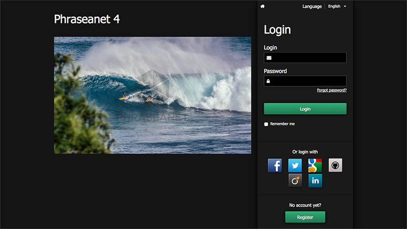

Connection to Phraseanet
========================

Even if is possible to view a *Phraseanet* asset as a guest user, a user can
have to create an account and authenticate to access some multimedia assets.

Authentication
--------------

* Connect to Phraseanet homepage using a web browser
* Adjust if needed the language of the interface using the drop down menu
  *Language*.
* Type the username and the password
* Click on **Connection**

If the password is forgotten, follow the lost password procedure by clicking
on the link :ref:`Password forgotten <Connection-password-forgotten>`.

When connecting to Phraseanet, the last used application is launched, or, by
default, :doc:`Production <Display>`.
  
Authenticating using third party application
--------------------------------------------

*Phraseanet* allows to delegate the user authentication to a third party
application, including the following web applications :

* Facebook
* Twitter
* Gmail
* GitHub
* Viadeo
* Linkedin

Other identity suppliers can be added.

.. note::

    To set the list of authentication providers, see the 
    :doc:`settings section <../../Admin/Configuration>`.

Subscription
------------

Depending on the system settings, a button allowing to sign up as a new user can
exist in the connection page of *Phraseanet*.

* Click on **Sign up** button to access the subscription form

If the third party authentication is activated, there are two options :

* Click on the **Create manually an account** button then fill and send the form

**Or**

* Connect using a third party authentication by selecting the service provider
* Fill and submit the form.

.. note::

    Even with an identity provider, a password must be given during the
    signing up process. This password is for the local *Phraseanet* account. It
    can be different from the one used with the identity provider.

When the form is sent, a message appears on the connection page. It informs the
user that his subscription request was received. Notified, an administrator can
validate the subscription in the Administration module.

.. _Connection-Password-Forgotten:

Password forgotten ?
--------------------

* Click on the **Password forgotten ?** link.
* Fill and submit the form using the email address linked to the Phraseanet
  account.

Once the form is completed and submitted, an email is sent. It contains a
secured link to the interface used to reset the password.

.. warning::

    The link is only valid for a limited time.
    If the email is not received, check the Spam folder of the mail application.

Click on the link in the email to reach the interface to reset the password.
Follow the instructions then validate the form to reset the password.

Follow the suggested steps then validate the form.

.. warning::
    
    The passwords are case sensitive.

After resetting the password, connect using the homepage form of Phraseanet.

The guest account
-----------------

The guest account is an account like any other *Phraseanet* account. It allows
to view one or more collections without authentication.

.. note::

    The guest account is just like other Phraseanet accounts. It allows to view
    one or more collections without authentication.

Refer to
:doc:`this section <../../FAQ/Customization/Setting-guest-account>`
to set the guest account.
