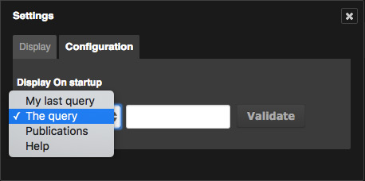
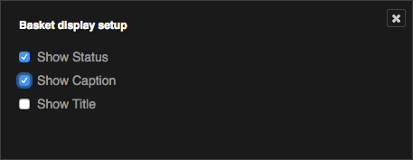

Customize Production
====================

.. topic:: The essential

    The interface Production can be tailored by the user depending on his needs.

Adjust the display area size
----------------------------

Resize the work zone
********************

* Click on the tab between the work zone and the results.
* Move the cursor to the left or to the right to resize the display area.

.. image:: ../../images/Onglet-Taille.jpg
    :align: center

Hide or display a work zone
***************************

The working area can be minimized:

* Click on the icon on the right side of the screen to minimize the working
  area and maximize the display area.
* When minimized, click on any part of the working area banner to deploy it.

.. _Customize-Display-Settings:

Display settings
----------------

Preferences for results display
*******************************

Click on the **Preferences** button on the bottom of the results display area.

An overlay window regroups the display and configuration settings.

In the **Display** tab, the user can:

* Change the display mode from *Thumbnails* to *List*
* Modify the colour set of the interface (Dark theme by default).
* Change the information displayed when mousing-over thumbnails by checking
  the Iconograph or Graphist mode
* Choose to display the documents technical information in the Display area or
  in the detailed view
* Display icons depending on the documents types
* Modify the number of results per page
* Change the display size of thumbnails
* Choose the records selection colour in the interface

.. _Customize-Initial-Question:

The **Configuration** tab allows users to configure the question asked by
default when login in to *Phraseanet Production* and *Classic* interfaces.

Click on the cross to quit the *Settings* window. The modified settings
are committed during the next display refresh.

Sorting and displaying settings for baskets and stories
*******************************************************

To access the sort and display preferences of the baskets and stories, click on
the baskets pop-up menu.

The menu allows two headings to alter the display by :
* Alphabetical order
* Creation date

Click on the section **Preferences** of the baskets pop-up menu to modify other
display settings.

A checkboxes set allows to act on the information displayed in baskets and
stories.
Check or un-check the boxes to display or hide :

* The :term:`statuses <Status>`
* The noted on rollover
* The documents titles

Notifications setting
*********************

Displayed notifications in interface are completed by emails sent at the
user's address.

.. seealso::

    Refer to the :ref:`Info tab <PhraseanetMenu-Information>` on the user
    account settings to interact on email notifications.
