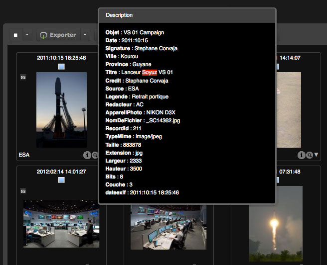
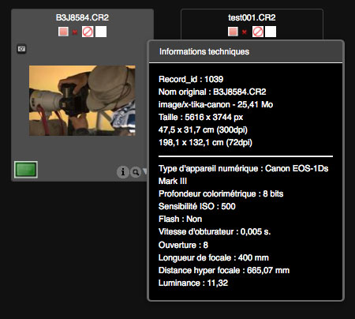
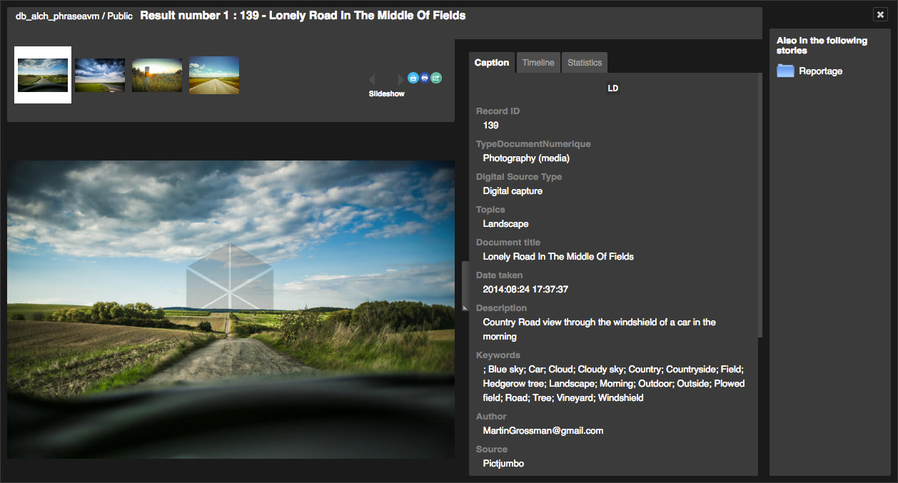
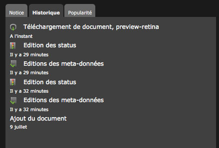
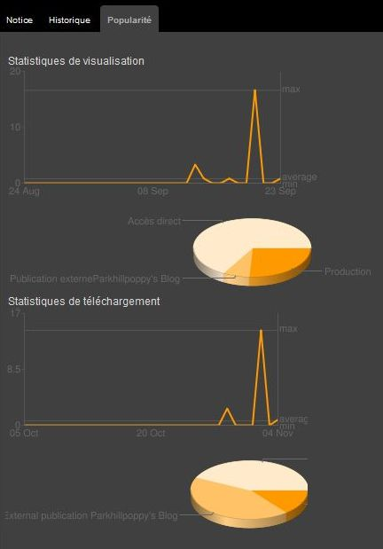
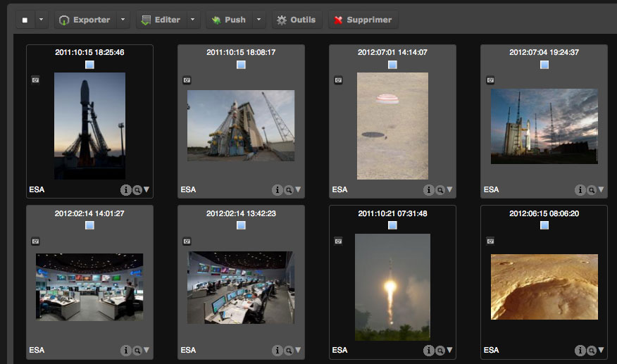
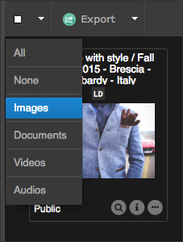

Results display
===============
.. toctree::
    :maxdepth: 3

.. topic:: The essential

    The interfaces *Phraseanet Production* or *Classic* allows to consult and
    browse through media assets in *Phraseanet*.

    *Production* is an interface dedicated to viewing, searching, managing and
    editing documents, depending on the user rights. It as the default interface
    when connection for the first time.
    
    *Classic* is only for searching and viewing documents with older browsers.
    The specifics of this interface are not covered in this guide.

Production Interface
--------------------

Work area
*********

The work area of Production is divided in 4 parts :

.. figure:: ../../images/Production-zones.jpg
    :align: center

* **1. The search form** allows to search media and stories
* **2. The display area** displays the results of a search
* **3. The work area** regroups the baskets and stories tab, the suggestions tab
  and the Thesaurus tab. It is minimizable.
* **4. The Actions palette** allows to act on records. Refer to the dedicated
  page in :doc:`Actions Palette<Actions>`.
    
The lower banner allows access to the **Display preferences**, informs on the
results number and displays a pagination of the results. This index allows to
move through the results.

.. note::

    Do not use the back and forward buttons of the web browser.

To access a specific page, modify the page number then validate by pressing the
**Enter** key of the keyboard.

Search results presentation
***************************

The search results are presented as a grid or a list, depending on the
:doc:`users preferences<Customize>`.
The thumbnails have a presentation title customizable by the Administrators.

.. note::

    To customize the documents title displayed under the thumbnails, refer to
    :doc:`the Administration section <AdministrationBasesCollections>`. 

**The name of the document's collection is displayed in the bottom left corner:**
of the thumbnail. It can be replaces by a mini logo.

.. image:: ../../images/Affichage-nomcoll.jpg
    :align: center

**Mouse-over the thumbnail to display the document's description.**
This description is made of non blank documentary fields filled by the assets
manager.
The terms used as search criteria are highlighted.

**The "Magnifying Glass" allows to preview media**. These previews are linked to
the nature of the *preview* sub-definitions defined in the settings of the bases
that contains the displayed media.

By default, it is :

* a picture for image type documents
* a video extract for video type documents
* an audio extract for audio type documents
* a flash animation for some type of office documents
* a generic icon if the system does not recognize the file type or if it can't
  generate sub-definitions.

**The "i" icon gives technical information on the original document** : width 
and height in pixels, type, weight, printing size...
The information displayed depends on the media type.

Double click on the thumbnail of a displayed media for the detailed view.

The detailed view
-----------------

A detailed view displays a page's documents list as browsable thumbnails :

* The upper part of the window displays the thumbnails feed which is browsable
  (using the mouse or the keyboard) from right to left.
* The preview image of the selected media is at the center.
* On the right side, three tabs display the description, the history and the
  statistics on the displayed media.
* If the document belongs to baskets or stories, the information is displayed
  on the right side of the window.

Click on the preview image to display the media information or use the "left"
and "right" arrows of the keyboard to browse.

Note tab
********

The Note tab displays information from the filled documentary fields
and technical information of the media depending on the settings.

.. note::

    If a Thesaurus is linked to the base, some terms of the note can be
    clickable. They allow to bounce on other searches.

.. _Display-History:
    
History tab
***********

This tab lists the history of all transactions made by the document's users
since it was added to the Phraseanet base.

.. _Display-Popularity:
    
Popularity tab
**************

The Popularity tab displays statistics of the displayed media :

* Number of views
* Access source
* Download statictics.

.. note::

    For detailed statistics on a Phraseanet base, refer to the page dedicated to
    :doc:`statistics <Stats>`.

Click on "Close" or the "Escape" key of the keyboard to close the window.

.. _Display-Selections:
    
Records selection
-----------------

Simple selection
****************

Select a thumbnail in the results area, in the baskets or in the stories by
clicking on its frame. The background of the thumbnail changes.

.. image:: ../../images/Affichage-selection1.jpg
    :align: center

This selection colour can be modified by each user in the 
`Display Preferences<CustomizeInterface>`.

Multiple selection
******************

**To select a continuous set of documents**

* Click on the first thumbnail of the series
* Press and maintain the Shift key of the keyboard
* Click on the last thumbnail of the series of records to select

All the thumbnails between these two thumbnails are selected.

**To select several thumbnails in batch**

* Press on the "Alt" key of the keyboard
* Click consecutively on the thumbnails to select.

.. image:: ../../images/Affichage-selection3.jpg
    :align: center

**To select several thumbnails on several results pages**

* Select the thumbnails on the first page
* Click on the next page while pressing the "Alt" key of the keyboard
* Select thumbnails on the new results page
* Repeat the operation on other pages is necessary

The number of selected documents is displayed on the bottom left of the
interface.

.. note::

    The number of selected records is limited to 400.

    
Selection by media type
***********************

To select all the documents of a search depending on their type, click on the
menu of the selection action (arrow on the right of the white square) then click
on the type of document to select.

Selection basket
----------------

A selection basket is intended to regroup media in order to refer to them
subsequently.
A default basket exists. Others can be created.
Simple selections and multiple selections can be made on the documents of an 
opened basket.

.. _Display-Basket-Create:

Create a basket
***************

* Click on the pop-up menu of the Basket / Story tab in the work area
* Click on **New basket**

An overlay window displays a basket creation form.

* Enter a name for the new basket and a description (optional).
* Check the box **Add to my current selection** to add preselected documents in
  the results.
* Click on the **Create** button

.. _Display-Basket-Open:

Open or close a basket
**********************

To open and show the contents of a basket, click on its name. **The basket is
then active**. Repeat the operation to close it.

.. image:: ../../images/Affichage-Panier2.jpg
    :align: center

To show the contents of a closed basket, without opening it, place the cursor on
the basket name. Its content is displayed in an overlay window.

.. _Display-Basket-Add:

Add media to a basket
*********************

From a selection in the display area
^^^^^^^^^^^^^^^^^^^^^^^^^^^^^^^^^^^^

Using the mouse, drag-drop the selection of documents in the chosen basket of
the work area.

It is not necessary to drag a selection on an opened basket for it to be added
to a basket. This action can also be made on closed baskets.

From the detailed view
^^^^^^^^^^^^^^^^^^^^^^

Click on the "Basket" icon to add a displayed document to the active basket.

.. _Display-Basket-Detail:

Display the content of a basket in the detailed view
****************************************************

To display the content of a basket in the detailed view, double click on one of
the thumbnails of an active basket. The detailed view presents the content of
the active basket.

.. _Display-Basket-Delete1:

Delete media from a basket
**************************

In an opened basket, click on the cross under the thumbnail of the document to
delete from the basket.

.. _Display-Basket-Delete2:

Delete a basket
***************

To delete a basket, click on the Delete section of the basket's pop-up menu then
confirm the deletion in the confirmation window.

.. seealso::

    For more features, refer to the section dedicated to 
    :doc:`Baskets and Stories<BasketStories>`.
