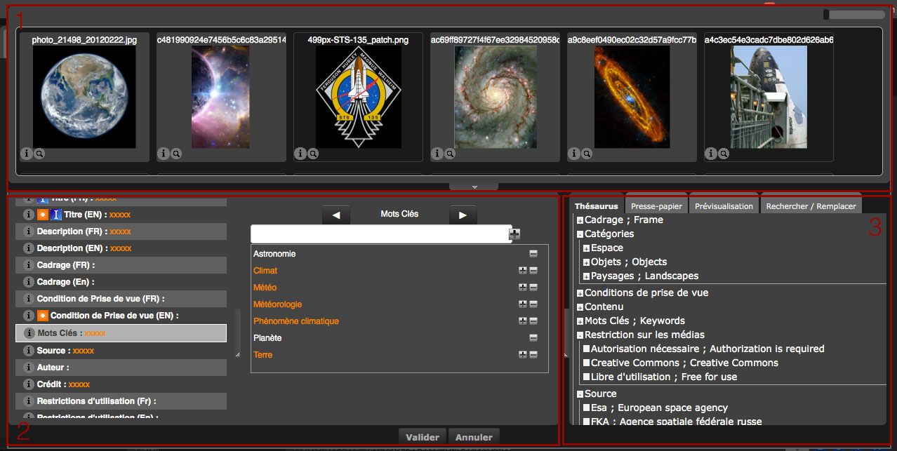
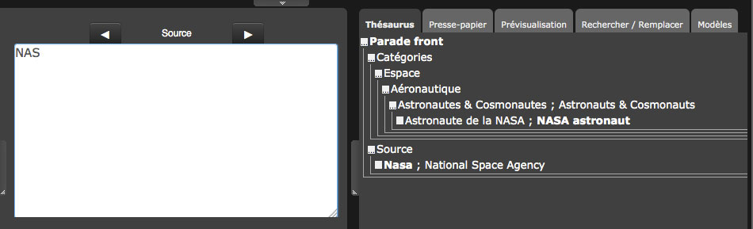
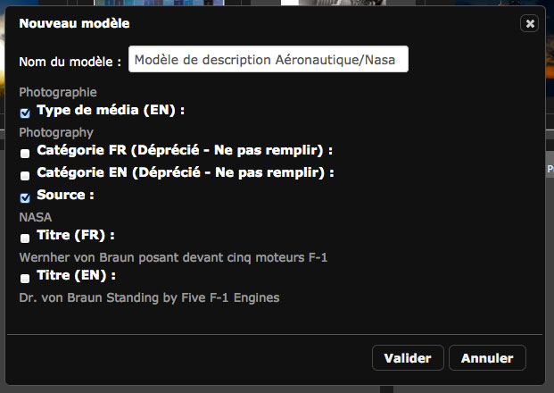

Edit the documentary notes
==========================
.. toctree::
   :maxdepth: 3

.. topic:: The essential

    The action **Edit** allows to edit the documentary notes of documents and
    stories.
    The Edit form is aimed to write, complete or modify the documentary
    description fields of records.

    It is possible to edit these descriptions either one by one or by batch
    from records.

Edit records
------------

Select one or more records in the display area or in an opened basket or story
in the work zone then click on one of the **Edit** buttons to open the edit
form.

Edition generalities
********************

The window has three parts :

* **1. The scroll bar** displays the selected records. Its size is modifiable as
  the thumbnail size by adjusting handles and cursors.
* **2. The form area** shows the list of descriptive fields, the status list,
  and reserves some space to display the contents of the active field.
* **3. The input help tabs area** regroup tools for text-entry.

**By default, all the records are selected.**

The fields that have the same contents for the selected documents appear in
bright.

The fields that have different contents appear with orange xxxxx.

It's possible to select or deselect the records in the scroll bar in the same
way as in the display area.

.. seealso::

    Refer to :ref:`the section dedicated to selections <Display-Selections>`
    in the display area.

Batch selections allows to write common informations for media to be more
productive.

To go from one field to an other, **use the Tab key of the keyboard**.

**No modification or insert is committed as long as the user do not click on the
Validate **button**.

**To discard the ongoing modifications**, click on **Cancel** or press the
Esc key to quit the edition form.

Edit text fields
****************

* Select the record(s) to modify
* Click on the field to modify
* Enter the information in text inputs

.. image:: ../../images/Prod-Editer-texte.jpg
    :align: center

If the field already have different data, choose if the entered information must
replace or be added to the field.

Edit multi-valued text fields
*****************************

* Select the record(s) to modify.
* Click on a multi-valued field
* Enter the term or expression in the form field then click on the "+" button or
  validate with the Enter key on keyboard to add the term to the
  multi-valued field.

The information contained in the notes of each selected records is displayed
in this field. The common terms that are in all the notes are **in white**,
the term that are at least in one note are **in orange**.

To add or remove a descriptive term of the terms list used in other selected
records notes :

* Click on one of the terms of the list of used descriptors
* Click on the "+" symbol to add a term to the records notes selected in the
  scroll bar
* Click on the "-" symbol to delete a term from the records notes selected in
  the scroll bar

Edit date type fields
*********************

A date field has a normalized format, it is mandatory to follow input rules.

Select the document(s) that the date have to be modified or added.

* Manually enter the date **using the format yyyy/mm/dd**,

**or**

* Use the calendar's tooltip.

Edit a field linked to data sources
***********************************

The documentary fields linked to data sources have a auto-completion system.
The auto-completion allows to select values from a list of authorized values.
This system is however opened : the entry of term that are not in the
vocabulary source is still possible.

Placed cursor on a field linked to a data source:

* Enter at least three characters to initialize the system
* The system suggests a list of values containing the entered string
* Select the value using the keyboard or the mouse

Edit from thesaurus
*******************

If a thesaurus is installed on the Phraseanet base containing the records, a
Thesaurus tab allows to capture using terms contained in it.
The entry is assisted for the fields linked to a thesaurus branch.

* Click on the thesaurus tab
* Select a text field linked to the thesaurus
* Start typing a term
* The Thesaurus tab display is refreshed and the terms starting with the typed
  characters are shown.

* Double click on a term to add to the tab Thesaurus
* The term is immediately added to the selected documents.

.. note::

    It is also possible to deploy the thesaurus *tree* to search and select
    terms for capture. Click on the "+" of nodes in front of these terms.

Edit from suggested values
**************************

Suggested values lists ​​appear as a popup menu list in the left side of fields.

.. Seealso::

    Refer to the section dedicated
    :ref:`setting suggested values<AdministrationBasesCollections-values>`
    in the Admin interface

* Click on the pop-up menu list
* Double click on the suggested value to add to the field's contents.

.. note::

    To select multiple values, select values in the list while pressing the
    "Ctrl" key of the keyboard.

Edit the statuses
*****************

Click on the Status section in the fields list to edit the statuses of the
selected records.

* Modify the statuses using the radio-buttons

Use the input help tabs
-----------------------

Up to four input help tabs are displayed on the right side of the interface.

Thesaurus
*********

The Thesaurus tab display thesaurus if used.

Clipboard
*********

This tab allows to copy and paste terms, expressions or sentences to use while
capturing notes.

Find/Replace
************

This tab allows to search and replace terms or expressions contained in the
records' notes being edited.

* Click on the Find/Replace tab

.. image:: ../../images/Prod-Editer-chercherremplacer.jpg
    :align: center

* Limit, if necessary, the function to a particular field using the menu list
  or, by default, to all fields
* Type the term to find in the current document(s) notes
* Type the replacing terms
* Apply options if necessary
* Click on Validate

New terms replaces previous one in records notes.

Caption templates
*****************

This tab allows to create and apply caption templates to records notes.

Create a caption template
^^^^^^^^^^^^^^^^^^^^^^^^^

A template is created from a note being edited:

* Click on the Models tab
* Select a note by clicking on the thumbnail

.. note::

    If more than one document are selected, the template will only take the
    common data of these fields.

* Click on Add

* Enter a title for the template
* Select the fields to be used in the template, by checking or un-checking the
  boxes. The fields that are not empty are selected by default.
* Click on Validate to save the template

Apply a template to records
^^^^^^^^^^^^^^^^^^^^^^^^^^^

* Select records
* Select the **Caption templates** tab then double click on the title of the
  template to apply

.. note::

    A template belongs to the user who created it. It can only be used by him.

Specific aspects for stories capture
------------------------------------

Stories and documents have the same documentary structure for notes. Stories
are edited like documents. However there are two particulars.

Stories notes and documents notes
*********************************

The edition of stories presents notes of selected stories **and** the notes
for their contents.

The stories and their contents are selected by default. The input can be applied
to the notes of the stories and the documents they contains.

Select a thumbnail for stories
******************************

By default, the stories are represented by a directory image. It is possible to
change for a document's thumbnail when editing.

In the scroll bar of the stories documents...

* Click on the pop-up menu of a document's thumbnail
* Select the **Set as cover document** item

.. image:: ../../images/Prod-Editer-reportage.jpg
    :align: center

.. note::

    Up to version 3.8.5, only the image type documents thumbnails can be
    assigned to stories.
