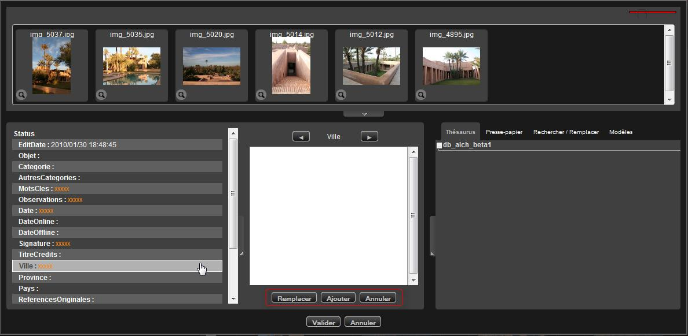
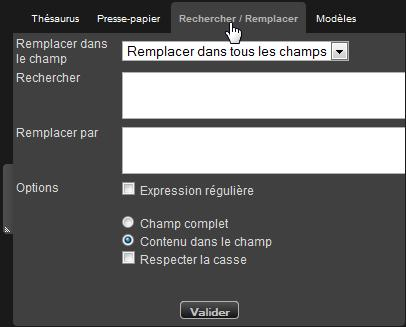
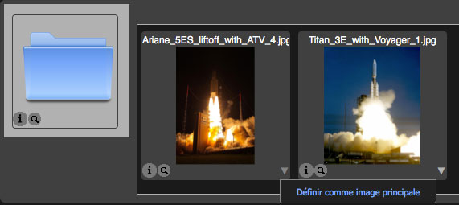

Edit the documentary notes
==========================
.. toctree::
   :maxdepth: 3

.. topic:: The essential

    The action **Edit** allows to edit the fact sheets of the media, stories,
    to write, complete or modify the documentary description fields.

    It is possible to edit these descriptions either one by one or by batch
    from records, baskets, stories from the results area or the work area.

Edit records
------------

Select one or more records in the display area or in an opened basket or story
in the work area then click on one of the Edit buttons to open an edition form.

Edition generalities
********************

.. image:: ../../images/Prod-Editer.jpg
    :align: center

The window has three parts :

* **The scroll bar** displays the selected documents. The size of the area is
  modifiable. The size of the thumbnails is modifiable by moving the cursor.
* **The text-entry area** shows a list of descriptive fields, the status list,
  and reserves some space to display the contents of the active field.
* **The text-entry help tabs area** regroup help tools for the text-entry.

**By default, all the records are selected.**

The fields that have the same contents for the selected documents appear in
bright.

The fields that have different contents appear with orange xxxxx.

.. seealso::

    Refer to :ref:`the section dedicated to selections <Display-Selections>`
    in the display area.

This batch selection mode allows to write common information for the media and
be more productive.

To go from one field to an other, **use the Tab key of the keyboard**.

**No modification or insert is committed as long as the user do not click on the
Validate** button**.

**To discard the ongoing modifications**, click on **Cancel** or press the
Esc key to quit the edition form.

Edit text-only fields
*********************

* Select the record(s) to modify
* Click on the field to modify
* Enter the information

If the field already have different data, choose if the entered information must
replace or be added to the field.

Edit multi-valued text fields
*****************************

* Select the record(s) to modify.
* Click on a multi-valued field
* Enter the term or expression in the form field then click on the "+" or
  validate with the Enter key of the keyboard to add the term to the
  multi-valued field.

The information contained in the notes of each selected document is displayed
in this field. The common terms that are in all the notes are **in white**,
the term that are at least in one note are **in orange**.

To add or remove a descriptive term of the terms list used in other selected
records notes :

* Click on one of the terms of the list of used descriptors
* Click on the "+" symbol to add a term to the records notes selected in the
  scroll bar
* Click on the "-" symbol to delete a term from the records notes selected in
  the scroll bar

Edit date type fields
*********************

A date field has a normalized format, it is mandatory to follow the input rules.

Select the document(s) that the date have to be modified or added.

* Manually enter the date using the format yyyy/mm/dd,

**or**

* Use the calendar's input help.

Edit a field linked to a data source
************************************

The documentary fields linked to data sources have a auto-completion system.
The auto-completion allows to select values from a list of authorized values.
This system is however opened : the entry of term that are not in the
vocabulary source is still possible.

Placed on a field linked to a data source, ...

* Enter at least three characters to initialize the system
* The system suggests a list of values containing the string
* Select the value using the keyboard or the mouse

Edit from thesaurus
*******************

If a thesaurus is installed on the Phraseanet base containing the media, the tab
Thesaurus allows to rapidly index from terms contained in the thesaurus
linked to the Phraseanet :term:`Phraseanet Base`.
The entry is assisted for the fields linked to a thesaurus branch.

* Click on the tab thesaurus
* Select a text field linked to the thesaurus
* Start typing a term
* The tab Thesaurus is refreshed and displays the terms starting with the
  characters typed.

.. image:: ../../images/Prod-Editer-thesaurus.jpg
    :align: center

* Double click on a term to add to the tab Thesaurus
* The term is immediately added to the selected documents.

.. note::
    It is also possible to deploy the thesaurus *tree* to search and select
    terms to index. Click on the "+" in front of these terms.

Edit from suggested values
**************************

A list of suggested values is displayed as a pop-up menu in the left window
listing the editable fields of the base's documentary structure.

.. Seealso::

    Refer to the section dedicated
    :ref:`setting suggested values<AdministrationBasesCollections-values>`
    in the Admin interface

* Click on the pop-up menu
* Double click on the suggested value to add to the field's contents.

.. note::

    To select multiple values, select a value in the list by pressing the "Ctrl"
    key of the keyboard.

Edit the statuses
*****************

Click on the Status section in the field list to edit the statuses of the
selected records.

* Modify the statuses using the radio-buttons

Use the input help systems
--------------------------

The paper block
***************

The Paper Block tab in the help tabs area allows to copy ans paste terms or
expressions to use in the notes.

Search/Replace
**************

This tab allows to search and replace the terms or expressions contained in the
records notes being edited.

* Click on the Search/Replace tab

* Limit if necessary the function to a particular field using the menu, by
  default to all the fields
* Type the term to Search in the current document(s) notes
* Type the replacing term
* Apply the options if necessary
* Click on Validate
* The new term replaces the previous one in the notes

Templates
*********

This tab allows to create and apply description templates to records notes.

Create a documentary description template
^^^^^^^^^^^^^^^^^^^^^^^^^^^^^^^^^^^^^^^^^

* A template is created from a note being edited.
* Click on the Models tab
* Select a note by clicking on the thumbnail

.. note::

    If more than one document are selected, the template will only take the
    common data of these fields.

* Click on Add

.. image:: ../../images/Prod-Editer-modeles.jpg
    :align: center

* Enter a title for the template
* Select the fields to be used in the template, by checking or un-checking the
  boxes. The fields that are not empty are selected by default.
* Click on Validate to save the template

Apply a template to a media selection
^^^^^^^^^^^^^^^^^^^^^^^^^^^^^^^^^^^^^

* Select the records
* Select the **Templates** tab then double click on the title of the template to
  be applied

.. note::

    A template belongs to the user who created it, it can be used only by him.

Particulars of editing stories
------------------------------

Stories and documents have the same structure for documentary notes. The stories
are edited like documents and there are two particulars.

Stories notes and documents notes
*********************************

The edition of stories presents the notes for selected stories **and** the notes
for their contents.

The stories and their contents are selected by default. The input can be applied
to the notes of the stories and the documents they contain.

Select a thumbnail
******************

By default, the stories are represented as a directory. But it is possible to
change to a document's thumbnail when editing.

In the scroll bar of the stories documents...

* Click on the pop-up menu of a document's thumbnail
* Click on the Define as main picture section

.. note::

    Up to version 3.8.5, only the image type documents thumbnails could be
    assigned to stories.