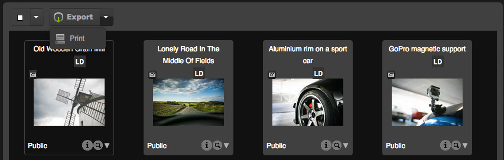
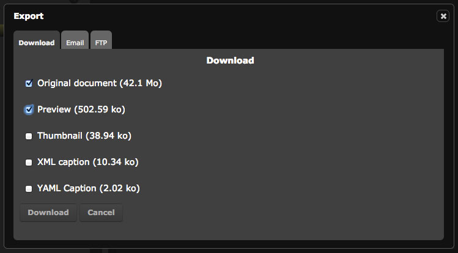
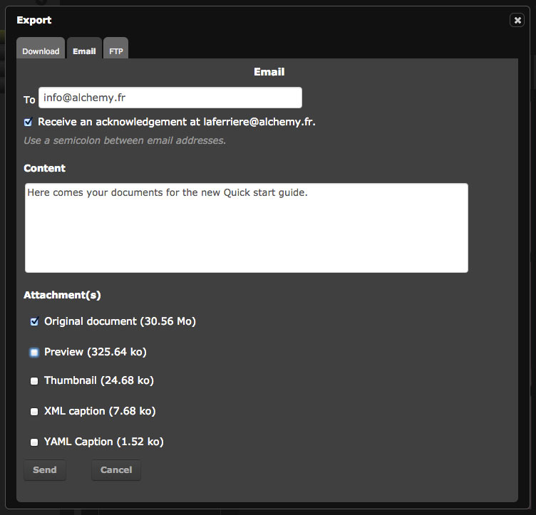
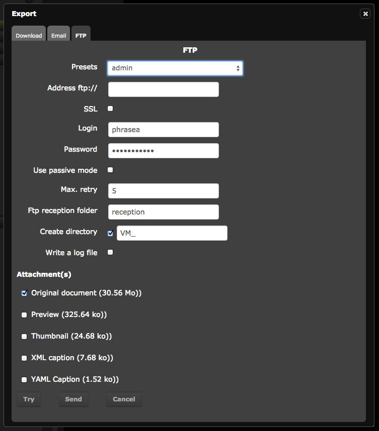
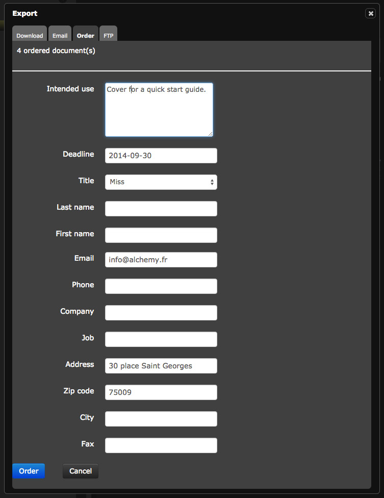
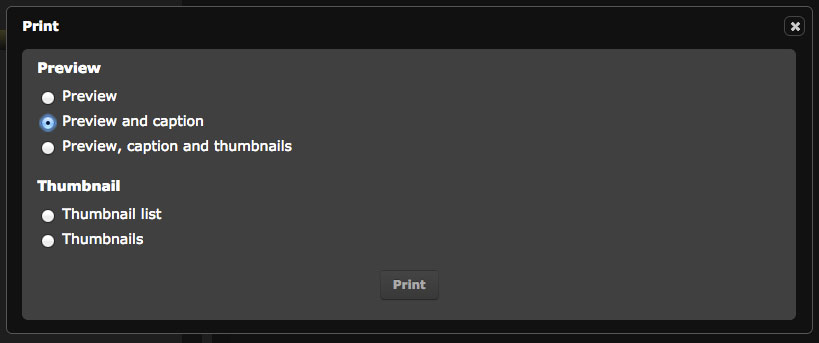
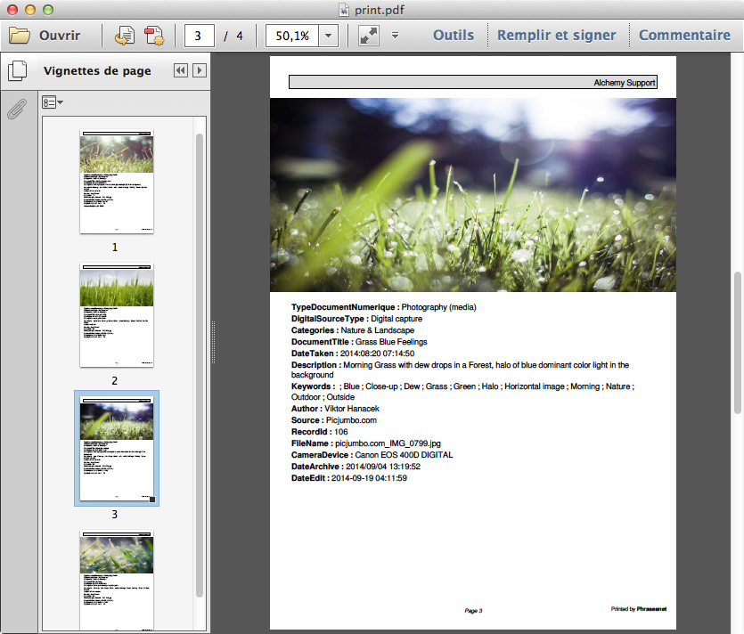

Export and print
================
.. toctree::
    :maxdepth: 3

.. topic:: The essential

    `Export`_ is one of the action of the :doc:`Actions palette <Actions>` in
    *Production*.
    Several export modes are available: download, email or transmission via
    :term:`FTP <FTP>`.

    The non-downloadable documents may be ordered.

    The `Print`_  action is a particular export type. It prints instructions in
    a PDF format.

Export
------

This action allows users to export media depending on their user rights and
subviews attributes. Download can consist of:

* the original document
* subviews
* captions notes in `XML`_ or TXT

**The size of the elements to export are displayed next to each formats.**

.. note::

    Past a certain size limit set by the administrators, the user can get the
    media he wants to export by a download link received in an email.

It is possible to export the media or the contents of the baskets and stories
one by one or in batches from results area or from the baskets and stories area.

By clicking on **Export**, up to 4 export options are available:

* :ref:`Download<Download-Export>` allows to transfer data on the computer's
  hard disk in a Zip file.
* :ref:`Email<Email-Export>` allows to send to recipients a link
  to download a Zip file containing the media.
* :ref:`FTP<FTP-Export>` allows, if implemented, users to
  submit exported media on a file server supporting this type of connection.
* :ref:`Order<Order-Export>` allows ordering non-downloadable media from
  :ref:`order managers<Collections-Order-Managers>`.

.. note::

    Export can be done on batches of documents, coming from several
    Phraseanet bases or collections, on which the user may not have export
    rights. In this case, the number of documents that can be exported is
    indicated.

Select one or more records (documents or stories) then click on the button
Export. The download options are displayed in the tabs of the overlay window.

.. _Download-Export:

Download export
***************

* Use the checkboxes to select items to export.
* Click on **Download**.
* Follow the procedure proposed by the browser.

.. _Email-Export:

The export by email
*******************

* Enter the email of the recipient, use the semi-colon ";" if sending to
  multiple recipients.
* Enter the subject of the email.
* Select the files that have to be attached to the downloadable zipped archive
  via the available link in the email body.
* Complete the email message if necessary.
* Click on **Send**.
* A sending confirmation displays.

.. _FTP-Export:

FTP
***

This tab allows to manually enter the destination address and credentials of a
FTP server on which to submit the exported documents. It is possible to use a
FTP preset.

.. note::

    The FTP preset is editable in the :ref:`Information tab <PhraseanetMenu-Information>`
    of the account settings.

.. _Order-Export:

Order documents
***************

This tab allows to send download requests for the users who have no downloading
rights on the media.

* Fill in and submit the displayed form.
* The order manager is informed of the order by a notification in Phraseanet
  and/or by an email notification. He examines the order then accept or refuse
  the download request.
* For delivered orders, the user is notified and receives the requested
  documents in Lightbox, using a link displayed in the notifications.

.. note::

    The order tab & form are available only if
    :ref:`an order manager <Collections-Order-Managers>` is defined.

Print
-----

This action allows to print the thumbnails, preview images, media description
in a self generated PDF document.

* Select one or several media, then click on **Print**.

In the **Print** window, check the radio button:

* **Preview**, to only print the preview images.
* **Preview and caption**, to only print the preview images and the
  description of the document.
* **Preview, caption and thumbnails**, to print the preview
  images and description and also the thumbnails  gathered in a contact sheet.
* **Thumbnails list**, to print the thumbnails list.
* **Contact sheet**, to print the thumbnails gathered in a contact sheet.

Click on **Print** to start generation of the PDF document.
The selected records are gathered and presented in the chosen format in a PDF
document (Acrobat reader or any software that reads PDF files must be installed
on the computer).
Print the PDF document or save it on the computer's hard disk.

.. _XML: https://wikipedia.org/wiki/Xml
