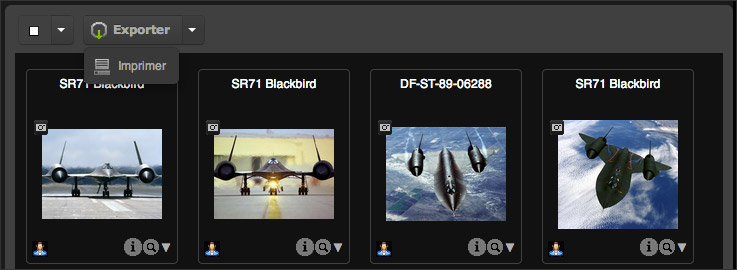
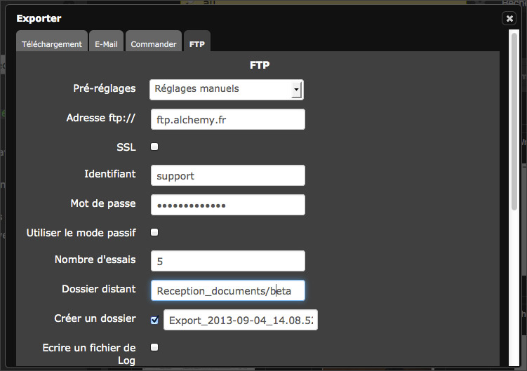
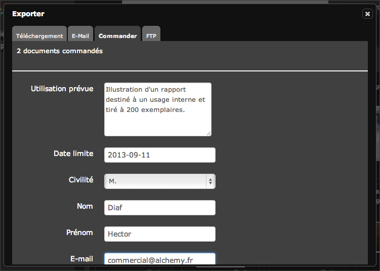
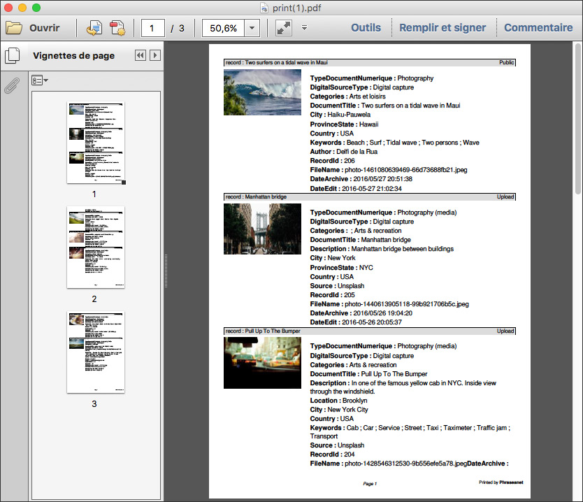

Export and print
================
.. toctree::
    :maxdepth: 3

.. topic:: The essential

    `Export`_ is one of the action of the :doc:`Actions palette <Actions>` in
    *Production*.
    Several export modes are available : download, sending by e-mail or 
    transmission via :term:`FTP <FTP>`.

    The non-downloadable documents can be ordered.
    
    The `Print`_  action is a particular export type. It prints instructions in
    a PDF format.

Export
------

This action allows to export depending on the user rights ot the sub-definition
attributes :

* the original document
* the sub-definitions of documents
* the instructions in `XML`_ or `YAML`_

**The size of the elements to export are displayed next to each formats.**

.. note::

    Past a certain size limit set by the administrators, the user can get the
    media he wants to export using a download link via email.

It is possible to export the media or the contents of the baskets and stories
one by one or in batches from results area or from the baskets and stories area.

By clicking on **Export**, up to 4 export options are available :

* :ref:`The download<Download>` : It allows to transfer data on the computer's
  hard disk in a Zip file.
* :ref:`Send by email<Export-Email>` : It allows to send to recipients a link
  to download a Zip file containing the media.
* :ref:`Send by FTP<Export-FTP>` : If implemented, the FTP sending allows to
  submit exported media on a file server supporting this type of connection.
* :ref:`Order tab<Export-Order>` allows to order non-downloadable with the
  :ref:`collections managers<AdministrationBasesCollections-Managers>`.

.. note::

    The export can be done on batches of documents, coming from several 
    Phraseanet bases or collections, on which the user may not have export 
    rights. In this case, the number of documents that can be exported is
    indicated.

Select one or more records (documents or stories) then click on the button
Export. The download options are displayed in the tabs of the overlay window.
    
.. _Download:
    
Export by download
******************

* Use che checkboxes to select the items to export.
* Click on *Download*.
* Follow the procedure proposed by the browser.

.. image:: ../../images/Exporter-telecharger.jpg
    :align: center

.. _Export-Email:
    
The export by email
*******************

* Enter the e-mail of the recipient, use the semi-colon ";" if sending to
  multiple recipients.
* Enter the subject of the e-mail.
* Select the files that have to be attached to the downloadable zipped archive
  via the available link in the body of the e-mail.
* Complete the e-mail message if necessary.
* Click on **Send**.
* A sending confirmation displays.

.. image:: ../../images/Exporter-mail.jpg
    :align: center

.. _Export-FTP:
    
FTP
***

This tab allows to manually enter the destination address of the FTP server on
which to submit the exported documents. It is possible to use a FTP favourite.

.. note::

    The FTP favourite is editable in the :ref:`Information tab <PhraseanetMenu-Information>`
    of the account settings.
    

.. _Export-Order:
    
Compare documents
*****************

This tab allows to send download requests for the users who have no downloading 
rights on the media.

* Fill in and submit the displayed form.
* The order manager is informed of the order by a notification in Phraseanet or by
  an notification by e-mail. He examines the order then accept or refuse the 
  documents request.
* For delivered orders, the user receives the requested documents in Lightbox,
  using a link displayed in the notifications.

Print
-----

This action allows to print the thumbnails, preview images, media description
in a self generated PDF document.

* Select one or several media, then click on "Print".

.. image:: ../../images/Actions-Imprimer1.jpg
    :align: center

In the **Print** window, check the boxes :

* **Preview image**, to only print the preview images.
* **Preview image and caption**, to only print the preview images and the 
  description of the document.
* **Preview image and description with contact sheet**, to print the preview 
  images and description and also the thumbnails  gathered in one contact sheet.
* **Thumbnails list**, to print the thumbnails list.
* **Contact sheet**, to print the thumbnails gathered in one contact sheet.

Click on **Print** to start the generation of the PDF document.
The selected records are gathered and presented in the chosen format in a PDF
document (Acrobat reader or any software that reads PDF files must be installed
on the computer).
Print the PDF document or save it on the computer's hard disk.

.. _XML: https://wikipedia.org/wiki/Xml
.. _YAML: https://wikipedia.org/wiki/Yaml
