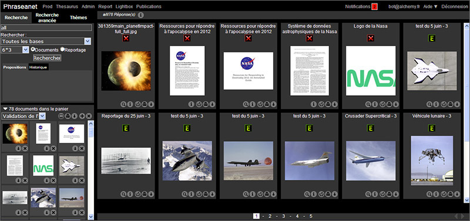
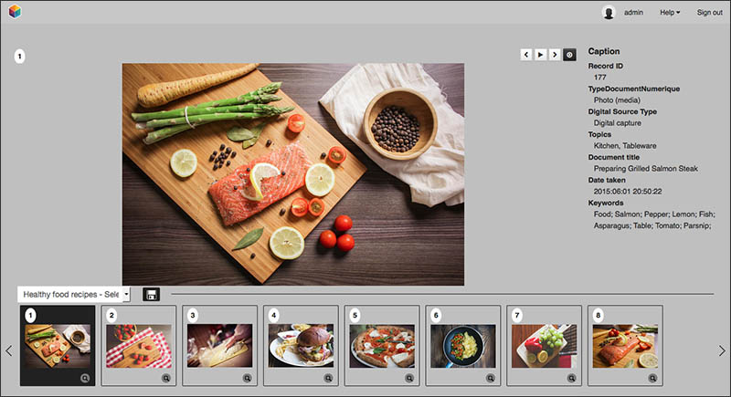
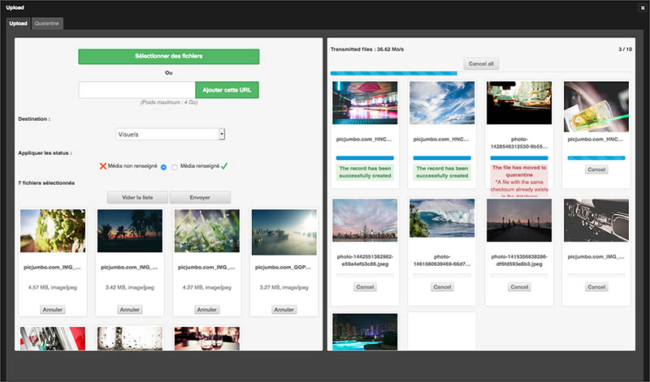

Introduction to Phraseanet
==========================
.. toctree::
    :maxdepth: 4

General information
-------------------

*Phraseanet* is a DAM system, a Digital Asset Management solution.

It's aimed to all professionals who need a powerful tool to secure the
management and broadcast of their images, videos, sounds and other multimedia
or office documents.

Installed either on a local or remote server, it runs through a Web browser.

To use Phraseanet
-----------------

The user must have a computer equipped with internet and a recent internet
browser. JavaScript support must be activated and
`Adobe Flash Player <http://get.adobe.com/fr/flashplayer/>`_ plug-in installed.

The user must also have a valid email address.

.. note::

    On Windows PC, Internet Explorer 7 is the minimum recommended version.
    However, Phraseanet Classic allows access using obsolete Web browsers such
    as Internet Explorer 6.

    The use of Internet Explorer 6 is not recommended for the other Phraseanet
    interfaces, as it is not recommended to use *Phraseanet Classic* with recent
    browsers.

The Phraseanet modules
----------------------

Phraseanet is a complete system to archive, organize and broadcast multimedia
documents.

The solution is based on seven interfaces (or modules), accessible from the main
menu bar, depending on the user rights:

* `Production`_
* `Classic`_
* `Lightbox`_
* `Upload`_
* `Administration`_
* `Thesaurus`_
* `Report`_

Production
**********

*Phraseanet Production* is the most important interface for many users.
This interface is complete and allows to :doc:`import <Import>`,
:doc:`edit <Edit>`, :doc:`search <Search>`, :doc:`display and organize <Display>`,
:doc:`share <Push>` and :doc:`broadcast <Publish>` media documents.

Classic
*******

*Phraseanet Classic* is a viewing interface for the final users who have older
web browsers. It allows to :doc:`view <Display>` and :doc:`download<Export>`
documents.

Lightbox
********

As a collaborative interface, *Phraseanet Lightbox* allows to view and/or
download specific documents sent by *Phraseanet* users. Validation features
allows to :doc:`know users feedback on the media <Push>`.

.. seealso::

    To send, share, compare documents in *Phraseanet Lightbox*, refer to the
    section dedicated to :doc:`Push and Validation <Push>`.

Upload
******

Available only from the Production interface, *Phraseanet Upload* allows
rightful users to import media and documents in Phraseanet from their hard
drive.
This upload manager allows to transfer media without using a third party
:term:`FTP<FTP>` tool.

.. seealso::

    Refer to the section dedicated :doc:`to upload documents <Import>`.

Administration
**************

:doc:`Admin<Administration>` is a user interface allowing to manage and monitor
the application, create Phraseanet bases and :term:`collections <Collection>`,
declare documentary structures, create users and manage their rights.

.. image:: ../../images/General-Administration.jpg
    :align: center

.. seealso::

    :doc:`Refer to the section dedicated to Administration <Administration>`.

Thesaurus
*********

:doc:`Thesaurus<Thesaurus>` creation and management is possible in *Phraseanet*.
The *thesaurus* is used jointly with *Phrasea* search engine.
Along the management of generic and specific keywords, the Phraseanet Thesaurus
handles synonyms and linguistic relations. It is really useful to *Phraseanet*
utilization.

.. seealso::

    :doc:`Refer to the section dedicated to Thesaurus <Thesaurus>`.

Report
******

Using :doc:`Statistics <Stats>`, *Phraseanet Report* gives a detailed view
of a *Phraseanet* system activity and sums up some users behaviour. A datamine
to optimize the access to the assets and know better the users habits.

.. seealso::

    Refer to the section :doc:`Statistics <Stats>` for a presentation of
    this module.
