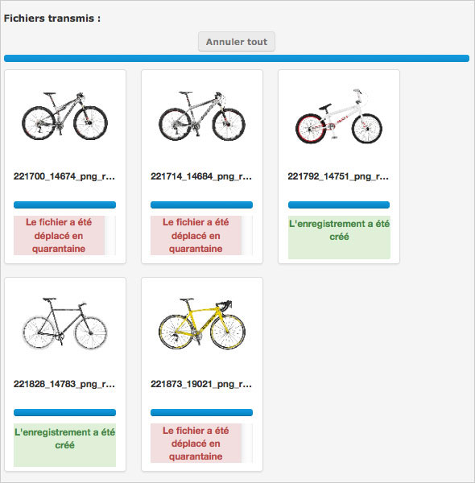

Import
======

.. toctree::
    :maxdepth: 3

.. topic:: The essential

    Relying on a :term:`HTML5` technology, the upload interface is accessible in
    Production via a a link located in title bar of the Phraseanet menu. Upload
    is an interface dedicated to adding media towards collections on which the
    user has adding rights.

.. image:: ../../images/Upload-zones.jpg
    :align: center

.. note::

    For browsers that don't have the full HTML5 support, a display mode lying on
    the Adobe plug-in `FlashPlayer <http://get.adobe.com/fr/flashplayer/>`_ is 
    available.
    

Click on the link **Use the Flash uploader** to use this mode.
This Flash mode offers a downgraded display mode. It does not allow to access 
all the features developed with the HTML5 technology.

Add media
---------

Click on Upload in the :doc:`menu <General>` Phraseanet to start the interface
in an overlay window.

Select files
************

* Click on **Select files** (1). The file browser starts.
* Select the files to integrate by browsing throuh directories, then click on
  Open.

The selected files appear in the left side of the Upload interface (2).

.. image:: ../../images/Upload-fichiers2.jpg
    :align: center

Re-order, delete media from the import list
*******************************************

* **Re-order media** before importing them. Select a file and drag/drop it
  elsewhere in then grid.

  .. image:: ../../images/Upload-reordonner.jpg
    :align: center

* **Delete** from the list one or more media by clicking on Cancel below the
  thumbnails, or
* **Reset the sending list** by clicking on the **Empty the list** button.
    
Choose the collection of destination
************************************

* Select the collection of destination, in the drop-down list of the available 
  collections (3).

.. image:: ../../images/Upload-prezone3.jpg
    :align: center

Apply statuses
**************

* If necessary, apply statuses to media.

.. image:: ../../images/Upload-zone3.jpg
    :align: center

Transmit the media
******************

* Click on **Send** to import media in Phraseanet.

All  the media are transfer in the selected collection.
Progress bars indicate the progress of the transfer in the **Files transmitted**
section (4).

After the transfer, the transmitted media are viewable in the Production and
Classic interfaces.

.. note::

    Other adding possibilities are possible, like using a FTP directory. It
    consists in importing the files contained in a directory using an archiving
    task.

The Quarantine
--------------

During the addition of files, some files can be placed in **Quarantine** : 
they are notified by a red colour symbol and notifications can be sent by the
system.

.. image:: ../../images/Upload-Quarantaine2.jpg
    :align: center

.. note::    

    By default, the files that are already in at least one media of the
    destination base (checked using the 
    :term:`Universally Unique Identifier <Universally Unique Identifier (UUID)>`)
    are quarantined.
    
    Other criteria to quarantine files can be set by administrators (format,
    colorimetry, dimensions...*etc*.).

.. seealso::

    For more information about the setting of additional criteria of quarantine
    retention, consult the dedicated paragraph at **Custom services** on
    :doc:`this page<../../../Admin/Configuration>`.
    
Click on the Quarantine tab of the Upload window to display it contents.

.. image:: ../../images/Upload-Quarantaine0.jpg
    :align: center

For each quarantined media, three options are possible :

.. image:: ../../images/Upload-Quarantaine1.jpg
    :align: center

* **Add** the file as a new record in the initially chosen collection.
* **Remove** the file
* **Substitute** the existing file

The user decide what is the best action to do in order to empty the files queue
in the quarantine space.

The Quarantine can also be entirely deleted using the button
**Remove the quarantine** at the top left of the window.
