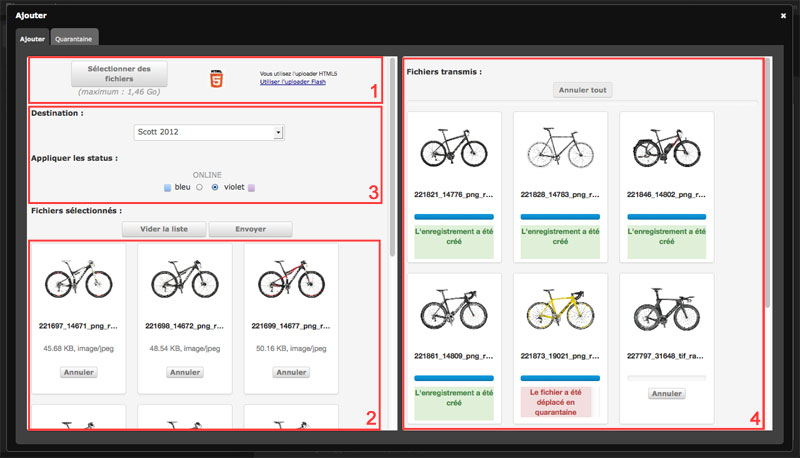
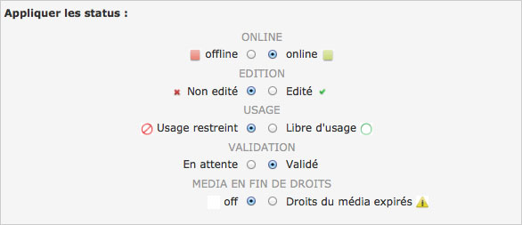
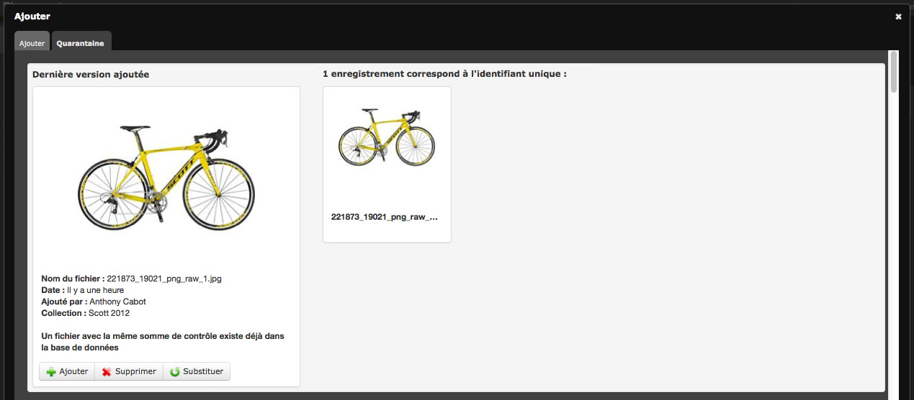
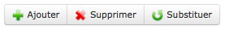

Import
======

.. toctree::
    :maxdepth: 3

.. topic:: The essential

    Relying on a :term:`HTML5` technology, the Upload interface is accessible in
    Production via a link located in Phraseanet menu bar.

    Upload is an interface dedicated to media addition towards collections on
    which users have adding rights.

.. note::

    For browsers that don't have the full HTML5 support, a display mode relying
    on Adobe plug-in `FlashPlayer <http://get.adobe.com/fr/flashplayer/>`_ is
    available.

.. image:: ../../images/Upload-Version-Flash.jpg
    :align: center

Click on the link **Use the Flash uploader** to use this mode.
This mode is a downgraded mode. It does not allow to access all the features
developed with HTML5 technologies.

Add media
---------

Click on the **Upload** link in the :doc:`Phraseanet menu bar <General>` to
prime the upload interface in an overlay window.

Select files
************

* Click on **Select files** (1). The file browser starts.
* Select the files to integrate by browsing through directories of your
  computer, then click on **Open**.

The selected files appear in the left side of the Upload interface (2).

.. image:: ../../images/Upload-fichiers2.jpg
    :align: center

Re-order, delete media from the import list
*******************************************

* **Re-order media** before importing them. Select a file and drag/drop it
  elsewhere in then grid.

  .. image:: ../../images/Upload-reordonner.jpg
    :align: center

* **Delete** from the list one or more media by clicking on Cancel below the
  thumbnails, or
* **Reset the sending list** by clicking on the **Empty the list** button.

Choose the collection of destination
************************************

* Select the collection for destination in the drop-down menu (3).

.. image:: ../../images/Upload-prezone3.jpg
    :align: center

Apply statuses
**************

* If necessary, apply statuses to media.

Transmit the media
******************

* Click on the **Send** button to import media in Phraseanet.

All the media are transferred in the selected collection.
A progress bars indicate the state of the transfer in the
**Transmitted files** section (4).

.. image:: ../../images/Upload-zone4.jpg
    :align: center

After transfer, media are viewable in Production and Classic interfaces.

.. note::

    Other addition possibilities exist, like using a FTP directory. It
    consists in importing the files contained in a directory using an archiving
    task.

The quarantine
--------------

During import procedure, some files can be placed in **Quarantine**:
they are notified by a red colour label and notifications can be sent by the
system.

.. image:: ../../images/Upload-Quarantaine2.jpg
    :align: center

.. note::

    By default, files that are already in the destination base are quarantined
    (achieved by
    :term:`Universally Unique Identifier <Universally Unique Identifier (UUID)>`
    checking).

    Other criteria to quarantine files can be set by administrators (file
    format, color space, dimensions...*etc*.).

.. seealso::

    For more information about the setting of additional criteria for
    quarantine, consult the dedicated paragraph at **Custom services** on
    :doc:`this page<../../../Admin/Configuration>`.

Click on the Quarantine tab of the Upload window to display it contents.

For each quarantined media, three options are possible:

* **Add** the file as a new record in the initially chosen collection
* **Remove** the file
* **Substitute** the existing file

The user decides what is the best option for files in quarantine.

The Quarantine can also be entirely deleted using the **Empty quarantine**
button on the top left side of the window.
