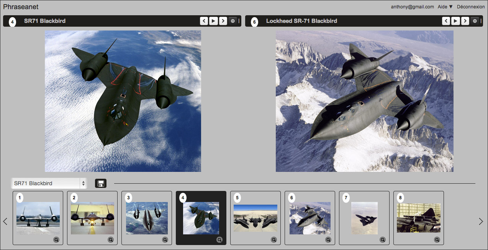
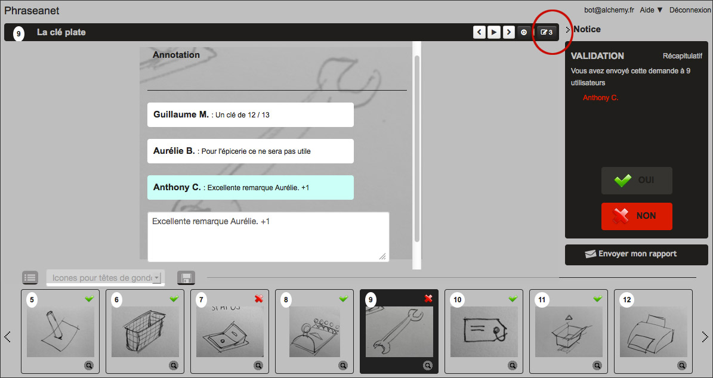

Lightbox
========

.. toctree::
    :maxdepth: 3

.. topic:: The essential

    *Phraseanet Lightbox* is a collaborative viewing interface. It has
    comparison features, slide show, export and allows to validate or comment
    media. The Push and Validation recipients can view their contents using
    this interface.

Access Lightbox
---------------

For the non authenticated users
*******************************

This interface is accessible by clicking on the HTML links of the email sent
when users send :doc:`Pushes and Feedback requests <Push>`. The users
can have to log in to display contents.

.. image:: ../../images/Lightbox-reception_email.jpg
    :align: center

For authenticated users
***********************

Click on the Lightbox section of the menu bar to open the interface.

The interface lists the Pushes and Feedback requests that user has created or
received. Click on one item of the list to display its contents.

.. image:: ../../images/Lightbox-menu.jpg
    :align: center

In Production, the Lightbox item of the context menu of each basket allows to
display its contents in this interface.

The interface
-------------

The interface of Lightbox is simple and intuitive.

.. image:: ../../images/Lightbox-interface.jpg
    :align: center

* **1**. The action bar gives the title of the displayed media, allows to
  browse the records and gives access to download the displayed media.
* **2**. The lightbox, at the center, shows the media, its description and its
  characteristics. This area is different if it's a Push or a Feedback request
* **3**. A menu area allows to browse through Pushes and Feedbacks
* **4**. The thumbnails area lists the media of the basket or feedback

Browse
******

To browse the Lightbox media:

* Select using the mouse a picture to display in the thumbnails viewing area
* Use the keyboard arrows

**Or**

* Use the *Next* or *Back* arrows at the right of the action menu

Slide show
**********

To launch a slide show of media in Lightbox, click on the button **play** of
the action menu.

.. image:: ../../images/Lightbox-play.jpg
    :align: center

Download media
**************

To download the displayed media in lightbox, click on the save icon in the
action menu.

.. image:: ../../images/Lightbox-enregister.jpg
    :align: center

To download all the media from a basket or feedback, click on the export button
on the bottom left of the interface.

.. image:: ../../images/Lightbox-enregister-tout.jpg
    :align: center

Downloading from Lightbox is identical to the export in Production.

.. seealso::

    Refer to the :doc:`export section in Production<Export>`.

Compare two media
*****************

Lightbox allows to display two media side by side to compare them.

* Display one media on the lightbox by clicking on its thumbnail
* While pressing **Ctrl** (Windows) or **Cmd** (Mac OS) of the keyboard, click
  on the second media to compare in the thumbnails list.

This system is really useful for :doc:`Feedbacks<Push>`.

.. _Push-Documents-validation:

Giving feedback on documents in Lightbox
----------------------------------------

*Feedback* is dedicated to collect user reviews about the media. Users
receiving Feedbacks are invited to express their opinions, by **Yes** or **No**
on media.

.. image:: ../../images/Lightbox-validation.jpg
    :align: center

It's possible to add comments on media. To do so, click on the tooltip in the
action menu.

To send a Feedback report, click on the **Send my report** button.

The issuer of the validation request will be immediately notified of opinions
and comments.
