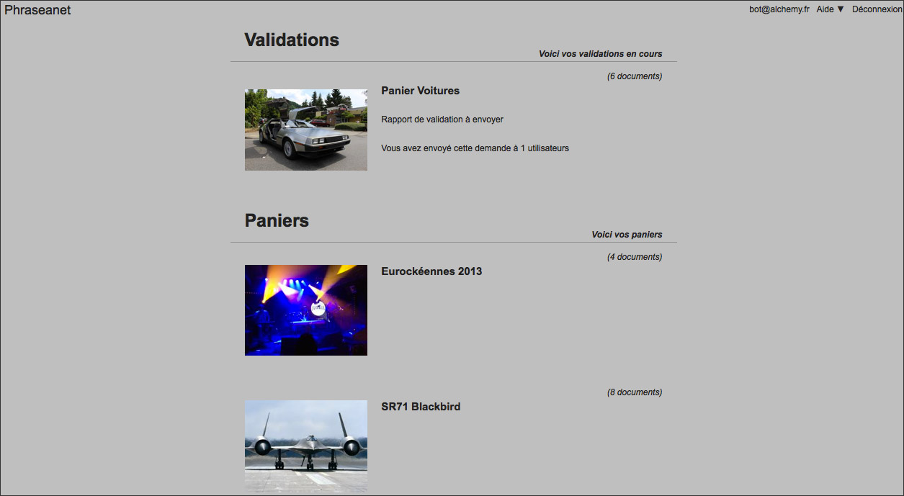
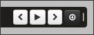
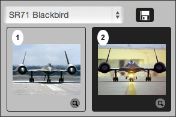
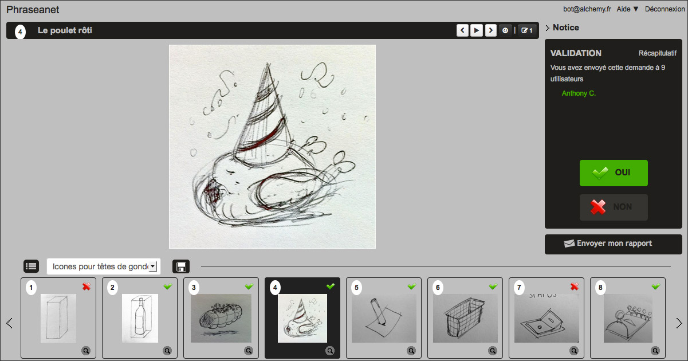

Lightbox
========

.. toctree::
    :maxdepth: 3

.. topic:: The essential

    *Phraseanet Lightbox* collaborative viewing interface. If has comparison
    features, slide show, export and allows to validate or comment media. The
    Push and Validation recipients can view their contents using this interface.

Access the Lightbox
-------------------

For the non authenticated users
*******************************

This interface is accessible by clicking on the HTML link of the email sent when
a Phraseanet user sends a :doc:`Push or validation request <Push>`. The users
can have to log in to display the pushed contents.

.. image:: ../../images/Lightbox-reception_email.jpg
    :align: center

For authenticated users
***********************

Click on the Lightbox section of the menu bar to open the interface.

The interface lists the Pushes and Validation requests that a user created or
received. Click on one item of the list to display its contents.

In Production, the Lightbox section of the pop-up menu of each basket allows to
display its contents in this interface.

The interface
-------------

The interface of Lightbox is simple and intuitive.

.. image:: ../../images/Lightbox-interface.jpg
    :align: center

* **1**. The action bar gives the title of the displayed media, allows to
  browse the records and gives access to download the displayed media.
* **2**. The lightbox, at the center, shows the media, its description and its
  characteristics. This area is different if it's a Push or a Validation request
* **3**. A menu area allows to browse through Push and Validations
* **4**. The thumbnail area lists the media of the basket or validation

Browse
******

To browse the Lightbox media :

* Select using the mouse a picture to display in the thumbnails viewing area
* Use the keyboard arrows

**Or**

* Use the *Next* or *Back* arrows at the right of the action menu

Slide show
**********

To launch a slide show of the Lightbox media, click on the button **play** of
the action menu.

Download media
**************

To download the displayed media on the lightbox, click on the save icon in the
action menu.

.. image:: ../../images/Lightbox-enregister.jpg
    :align: center

To download all the media of a basket or validation, click on the export button
on the bottom left of the interface.

Downloading from Lightbox is identical to the export in Production.

.. seealso::
    
    Refer to the :doc:`export section in Production<Export>`.

Compare two media
*****************

Lightbox allows to display two media side by side to compare them.

.. image:: ../../images/Lightbox-comparer.jpg
    :align: center

* Display a first media on the lightbox by clicking on its thumbnail
* While pressing **Ctrl** (Windows) or **Cmd** (Mac OS) of the keyboard, click
  on the media to compare it with in the thumbnails list.

This system is really useful when :doc:`validation documents <Push>`.

.. _Push-Documents-validation:

Validate documents in the Lightbox
----------------------------------

The documents validation in is an opinion request on the media. The user whom
the validation request is sent to gives his opinion by **yes** or **no** and can
make a comment if he wishes to.

He may, if he wants to, add a comment on the media. To do so, click on the
tooltip in the action menu.

.. image:: ../../images/Lightbox-validation_appreciation.jpg
    :align: center

After the validation, click on the **Send my report** button.

The issuer of the validation request will be immediately notified of the
opinions and comments.
