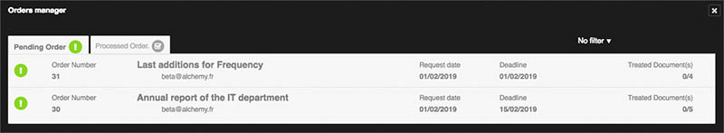
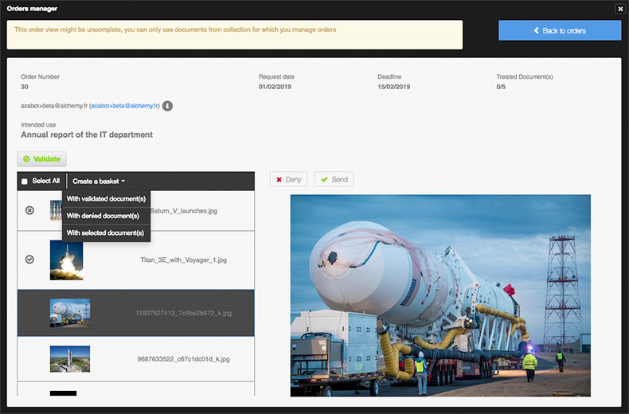

Manage orders
=============
.. toctree::
    :maxdepth: 3

.. topic:: The essential

    The **Orders** item from the menu bar is accessible to
    users listed as an **Order Manager** for at least one collection.

    It allows you to browse and process requests for documents that
    come from users who do not have the right **Access Documents** and
    with the right **Order Documents**.

    To place an order, refer to the :doc:`exports page <Export>`.

List orders
-----------

Click on the **Orders** item on the menu bar to display the list of orders.
Orders are divided into two tabs:

* Pending Orders
* Processed Orders

Orders are presented in chronological order of date of application and can be
filtered.

Click on an item in the list to display the contents of an order
whether it is pending or processed.

Process an order
----------------

The display window of an order is divided into three areas:

* The summary of the order, which includes the elements provided by the user
  in the order form
* The list of ordered media
* A display area for the selected media in list that shows its preview image
  and note

Approving or denying delivering a media from an order is carried out media per
media or by its selection in list.

* Select one or more items in the list of ordered media
* Click the **Deny** or **Send** button
* Switch to the following media if appropriate

**To release the order to the requierant**...

* Click the **Validate** button
* Confirm the sending of the order by clicking the Send button in the
  overlayed window.

.. note::

    It is possible to create a basket gathering the media of a
    command from the context menu **Create a basket** to refer to it.

