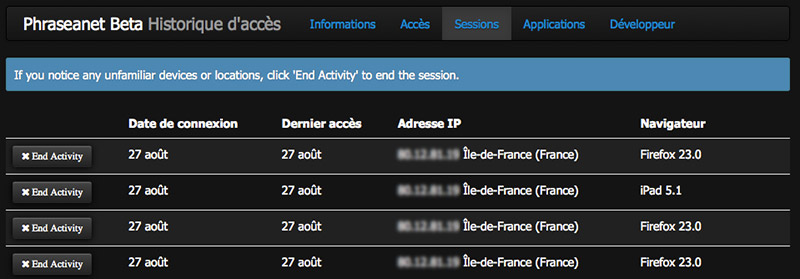

The Phraseanet menu
===================
.. toctree::
    :maxdepth: 2

.. topic:: The essential

    The *Phraseanet* menu bar allows to access the different interfaces of the 
    application, the user account settings and some information and resources.

Access to interfaces
--------------------

All the *Phraseanet* interfaces offer at the top of the window, a menu bar.

**The left part of the menu bar displays the list of the interfaces that the
user can access.** Click on an application's name to launch the application in a
new tab or a new window of the web navigator. 

**The sections in the menu bar depend on the users rights.**

If a user does not have access to some features, the link toward the interface
exploiting it will not appear in the menu bar.
So, users who have only viewing rights on assets have access to a limited number
of sections.

Others users, such as administrators, have a more complete menu bar.

.. image:: ../../images/General-menu1.jpg
    :align: center

**The right part of the menu bar** displays notifications, the account
identifier, on-line help with the keyboard short-cuts and the disconnection 
link.

.. image:: ../../images/General-menu2.jpg
    :align: center

Access to notifications
-----------------------

The notifications are some information messages displayed in real time in the 
interface *Phraseanet Production*.
Notifications give some information about the new available publications, 
validation requests, baskets receiving... *etc* to the user.

**Click on the Notifications section to display them**.

The notifications displayed in the interface are conveyed by the email's sending
To manage the received notifications, access the 
:ref:`Information tab<PhraseanetMenu-Information>` of the account settings.

Account settings access
-----------------------

Click on the user identifier  to display the account settings.
A new page opens and displays the forms and lists in thematic tabs.

.. image:: ../../images/Moncompte.jpg
    :align: center

.. _PhraseanetMenu-Information:
    
Information tab
***************

It regroups the personal information. The form allows to complete or modify :

* The identification information
* The postal address, phone number or email address
* To set the reception of notifications by email
* To edit a favourite :term:`FTP` allowing to receive documents on a server
  supporting this type of connection.

.. seealso::

    :doc:`Activate the reception of documents on a FTP server<../../FAQ/Settings/Activate-ftp>`

Access tab
**********

It lists the Phraseanet collections on which the user can do access requests.

To make an access request to new Phraseanet bases or collections :

* Check the boxe(s) to request access to the new Phraseanet Bases/Collections
* Validate the request by clicking on the *Validate* button.

A message indicates that an access request is in progress. It needs to be
examined by an administrator to be validated.

.. image:: ../../images/Accesbasescoll.jpg
    :align: center

Sessions tab
************

It lists the user's sessions and gives information on the connections and access
dates, IP addresses and web browsers used.

Click on the button **End the session** to delete an active session.

Applications tab
****************

It lists the third party applications authorized to connect to the Phraseanet
user's account.

.. image:: ../../images/ListeApplications.jpg
    :align: center

.. seealso::

  :doc:`Authorize a third party application to connect to a Phraseanet account<../../FAQ/Users/Add-application>`

Developer tab
*************

It allows to implement :term:`API` keys so that third party applications can
communicate with Phraseanet.

.. seealso::

  :doc:`Refer to the API section of the Developer guide <../../Devel/API/V1>`

Help sections
-------------

Click on the *Help* tab to view the online documentation.
Click on the arrow next the Help tab, to show two sub tabs :

.. image:: ../../images/General-menu3.jpg
    :align: center

* The *Shortcuts* section displays a recap of the available shortcuts.
* The *About* section displays information on the Phraseanet version.

Disconnect
----------

Click on *Disconnect* to end the session and exit *Phraseanet*.

