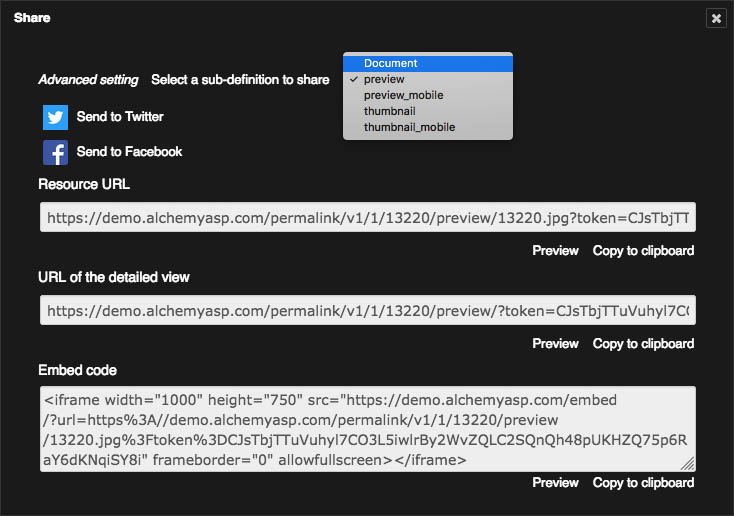

Publish and broadcast with Phraseanet
=====================================
.. toctree::
   :maxdepth: 3

.. topic:: The essential

    Some features of Phraseanet allow to publish and broadcast media.

    * *Publish* allows to publish media in a Media RSS feed
    * **Deprcated**, *Bridge* allows to publish on Flikr, YouTube or
      Dailymotion

    These features are related to the user right **Publications**.

    The **Share** feature allows to broadcast media on Facebook and Twitter
    networks and reveals the URLs of the permalinks of archived media in
    Phraseanet.

     **Share** is activated in the setting of the Phraseanet instance.

.. _Publish-Publications:

Publish media
-------------

**Publications** allows to give the users documents or stories in the
publications page. These publications are also available outside Phraseanet
in third party applications using Media RSS feeds.

.. seealso::

    http://en.wikipedia.org/wiki/Media_RSS

**To publish media**:

* Select the records in the display area then click on the **Publish** item of
  the Push context menu of the main Actions palette.

**Or**,

* Click on the Publish icon in the opened basket or story in the work zone.

A window opens:

.. image:: ../../images/Publier-Panier2.jpg
    :align: center

Fill the form :

* Check or un-check the boxes to notify the users about this publication if
  available
* Give a title and a subtitle to the publication
* The author's name and address are those of the users's account
* Select the publication feed

.. seealso::

    Refer to the Publications section of Phraseanet Admin to
    :ref:`create feeds<Create-a-publication-feed>`.

* Click on **Publish** button

The publication is visible in the Publications section of the menu bar and
available *via* a the corresponding feed outside Phraseanet.

.. _Publish-Bridge:

Broadcast with Bridge - **Deprecated**
--------------------------------------

Phraseanet Bridge allows to publish media to external sites and apps, like :

* FlickR
* YouTube
* Dailymotion

To publish documents to these sites, select the documents, connect a `Flickr`_,
`YouTube`_ or `Dailymotion`_ account to Phraseanet, then publish
using **Bridge**.

Media selection
***************

* Select one or more media in *Phraseanet Production*. They can be regrouped in
  baskets or stories.
* Open the context menu of **Push** button then click on the **Bridge** item

.. image:: ../../images/Bridge-1.jpg
    :align: center

Sign in
*******

In the **Bridge** window:

* Click on **New** to connect to a Flickr, Youtube or Dailymotion account
  depending on the sharing settings configured in **Phraseanet Admin**.
* Log in then authorize Phraseanet to connect.

.. image:: ../../images/Bridge-1b.jpg
    :align: center

Bridge retrieves the existing information from the remote application.

With Flickr, the existing pictures are displayed in "Photos" tab or "Photosets"
tab if organized in albums.

.. image:: ../../images/Bridge-3a.jpg
    :align: center

Publish on Flickr
*****************

Select the media in scroll bar, then click on the **Add** button.
In the "Upload" window of Bridge, modify the selected images titles, add the
tags and describe your media in the description forms.

* Click on the **Add** button on the bottom left.

.. image:: ../../images/Bridge-2.jpg
    :align: center

When the images are sent, it is possible to view the transfer progress by
clicking on the **Sent files** tab.

* The **OK** status tells that media pictures or videos have been transferred
* A date information indicates since when the transfer has been made

Start *Flickr*. The media transferred from Phraseanet are available.

.. image:: ../../images/Bridge-5.jpg
    :align: center

.. _Publish-Share:

Share media
-----------

Located in the contextual menu of each document type record, ** Share ** gives
access to a window overlay.

This reveals:

* Links to social networks `Facebook`_, `Twitter`_
* Permalinks to media resources (this could be a sub-definition files or
  original documents)
* URLs to a detailed media view
* A proposal of code for embedding media in a HTML page

The *Advanced Setting* link allows you to select from a list the resource
media (sub-definition file or original document) concerned by the shared
information.

.. _Flickr: https://www.flickr.com/
.. _YouTube: http://www.youtube.com/
.. _Dailymotion: http://www.dailymotion.com/
.. _Facebook: https://www.facebook.com/
.. _Twitter: https://www.twitter.com/
