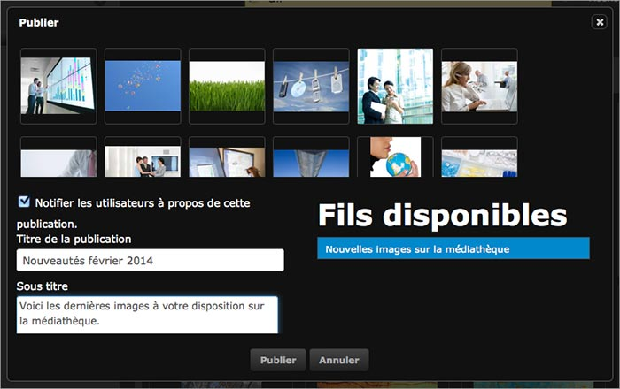
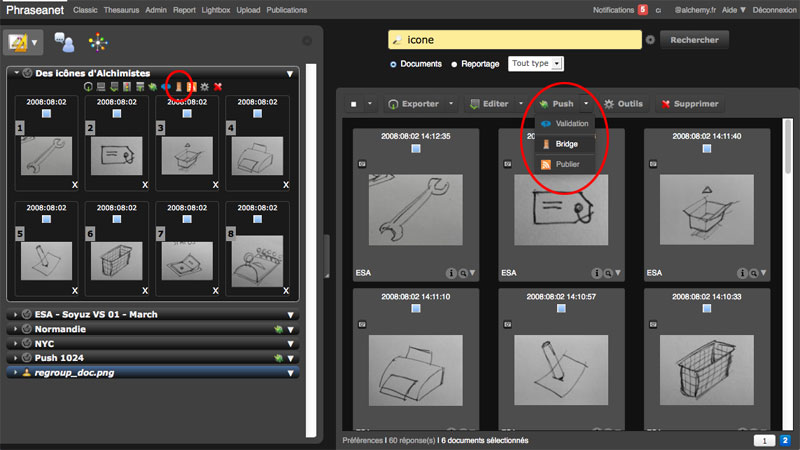
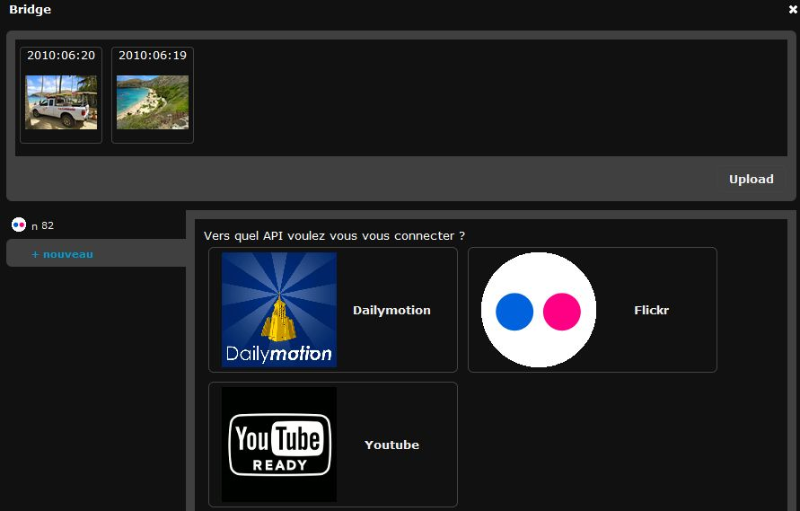
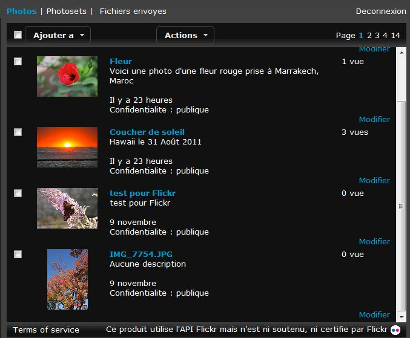
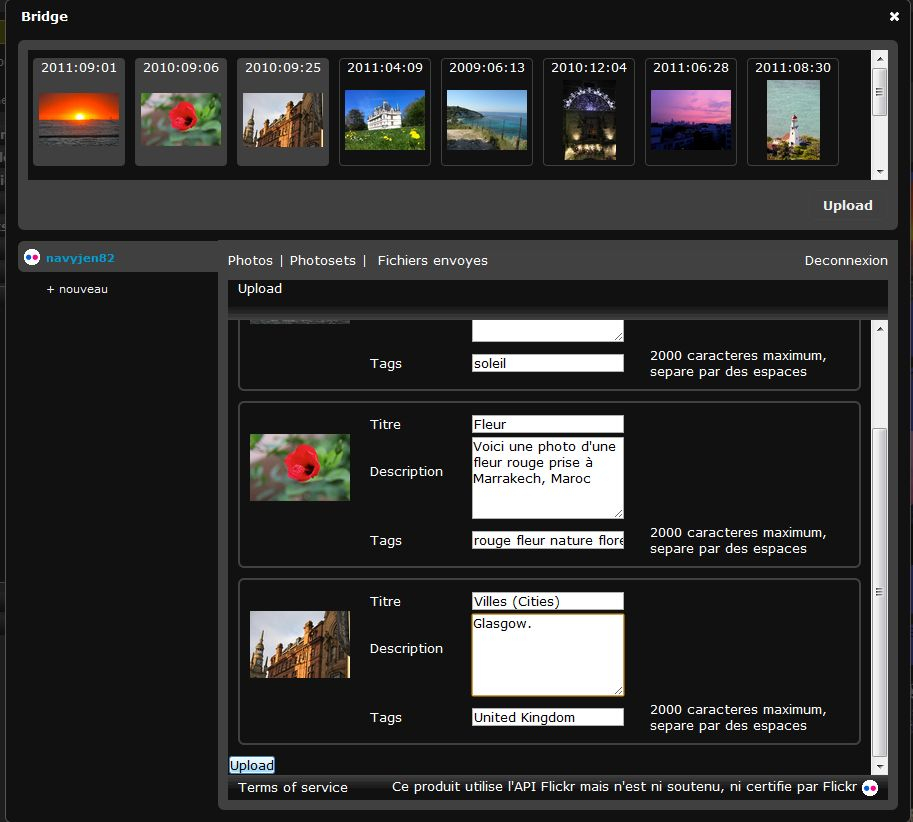
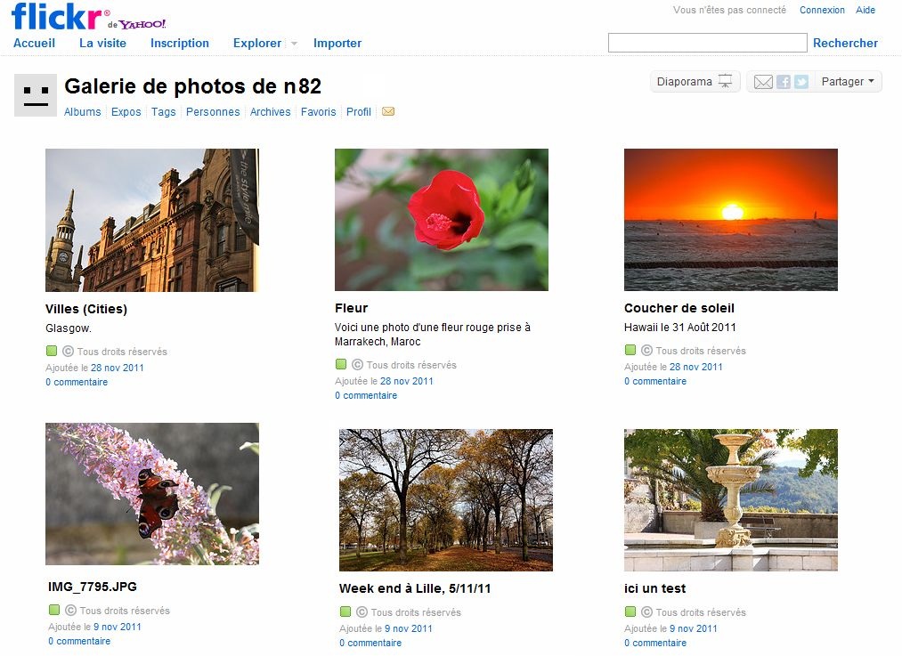

Publish and broadcast with Phraseanet
=====================================
.. toctree::
   :maxdepth: 3

.. topic:: The essential

    Two features of Phraseanet allows to publish and to broadcast media from an
    asset : *Publication* and *Bridge*

.. _Publish-Publications:    

Publish media
-------------

**Publications** allows to give the users documents or stories in the
publication page. These publications are also available and usable outside
Phraseanet in third party applications using the RSS Media feeds.

**To publish media** :

* Select the records in the display area then click on the Publish section of
  the pop-up menu of the Push button of the Actions palette.

**Or**,

* Click on the Publish icon in the opened basket or story of the work area.

A window opens:

Fill the form :

* Check or un-check the boxes to notify the users about this publication
* Give a title and a subtitle
* The author's name and address are those of the users's account
* Select the publication feed

.. seealso::

    Refer to the Publications section of Phraseanet Admin to 
    :ref:`create feeds<Create-a-publication-feed>`.

* Click on Publish

The publication is visible in the Publications section of the menu bar and
available via a feed outside the application.

.. _Publish-Bridge:

Broadcast with Bridge
---------------------

The Bridge allows to publish media to external sites, like :

* FlickR
* YouTube
* Dailymotion

To publish documents to these sites, select the documents, connect a `Flickr`_,
`YouTube`_ or `Dailymotion`_ account to Phraseanet, then publish
using **Bridge**.

Media selection
***************

* Select one or more media in *Phraseanet Production*. They can be regrouped in
  baskets or stories.
* From one of the Actions palette, open the pop-up menu of the **Push** button
  then click on the **Bridge** section.

Sign in
*******

In the **Bridge** window :

* Click on **New** to connect to a Flickr, Youtube, Dailymotion... account
  depending on the sharing settings configured in **Phraseanet Admin**.
* Log in then authorize Phraseanet to connect.
  

Bridge retrieves the existing information from the remote application.

With Flickr, the existing pictures are displayed in the ""Photos" or "Photosets"
tab if they are organized in albums.

Publish on Flickr
*****************

Select the media in scroll bar, then click on the **Add** button.
In the "Upload" window of Bridge, modify the selected images titles, add the
tags and describe your media in the description forms.

* Click on the **Add** button on the bottom left.

When the images are sent, it is possible to view the transfer progress by
clicking on the tab **Sent files**.

* The status **OK** tells the media pictures or videos have been transfered.
* A date information indicates since when the transfer was made.

Start *Flickr*. The media transferred from Phraseanet are available.

.. _Flickr: https://www.flickr.com/
.. _YouTube: http://www.youtube.com/
.. _Dailymotion: http://www.dailymotion.com/