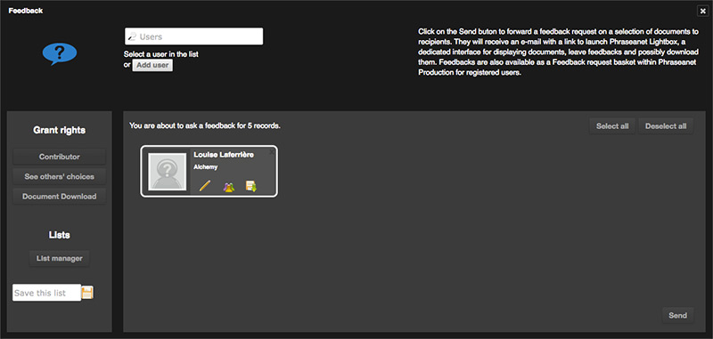
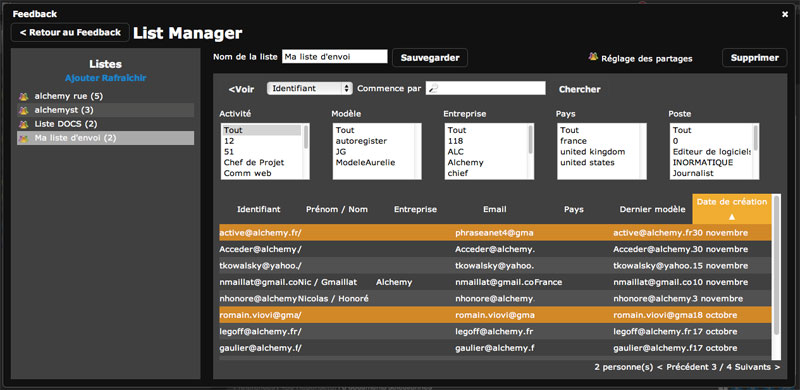

Push and Feedback
=================

.. toctree::
    :maxdepth: 3

.. topic:: The essential

    *Push* and *Feedback* are two actions intended to transmit documents to
    users, whether or not they have originally a Phrasenaet account.

    A *Push* is used to push media toward users. A *Feeback* is intended to
    collect advisory opinions about media from them.

    A :ref:`Lists manager <List-Manager>` allows to create sending lists to
    answer some repetitive sending towards the same users.

Push
----

Push is a submission of documents or selection of documents. Unlike an
email export, the *Push* does not physically transmit documents. It
notifies in the interface and/or by email, and leave at the users
disposal some media selections that they can consult and eventually download.

Push documents
**************

* **Select one or several documents** in the results display area or in an
  opened basket or story in the work zone.

* **Click on the Push button** of one of the Actions palettes:

In the Push window...

* **Add one or several users** to push toward them the selected documents.

To do so, enter their names, first names or email address in the form
field on the top left of the interface. An auto-completion system is activated
as soon as the third character is entered in order to facilitate users searches.
Once the Phraseanet user is detected in the suggested users list, click on his
name to add him to the sending list.

**To add one or several non registered users** to a sending list, click on the
link **Add a user**.
Fill in at least the mandatory fields (those with an asterisk) then click
on the "Add" button. The contact is created and added to the recipients area and
his account is created.

.. note::

    The users listed in the recipient area can be gathered and saved in the
    sending list.

    To save a sending list, fill in the form located on the left of the
    recipient area then save by clicking on the icon:

    .. image:: ../../images/Push-icone-disquette.jpg
        :align: center

.. seealso::

    Refer to the functionalities of the :ref:`list manager<List-Manager>`.

.. warning::

    To be able to create users from Pushes and Feedbacks, the
    **Users management rights** is required.

To allow recipients to download original documents, two methods are available:

* Select one or several users in the recipient area, then click on the
   *Download document* button located on the left of the recipients list.

**Or**,

* Click on the icon located on each recipient label for grant them their
  download rights.

* Click on the *Send* button to validate and transmit the Push.

The following form is aimed to give a name and a description to the push. Those
information will part of the email notification addressed to recipients.
If needed, an acknowledgement receipt of the email if this function is supported
by the recipients mail boxes.

Feedback
--------

Feedback is almost identical to Push. It differs only in the allocation of
additional privileges.

* Select one or several documents in the results display area or an opened
  basket or open a story in the work area.
* Click on the Feedback item of Push context menu in the Actions palette or on
  the Feedback button of an opened basket or story in work zone.

**In the validation window**,

* Select the Phraseanet user(s) who will receive the Feedback request. To
  address this request to non-registered users on the application, the
  operating mode the same as for a Push.

Giving additional rights (the *Grant Rights*) works the same way as for a
Push. Rights that can be elevated are wider:

* **Document download** to grant access to original media and its subviews that
  are part of the *Document* class attribute
* **Contributor**, default option to allow to giving opinions on
  the documents in feedbacks
* **See others'choice** to allow recipients to view opinions and comments of
  other users who take part to feedback sessions

To validate and transmit a Feedback request, click on the *Send* button.
The following form allows to set the period of validity to the Feedback session,
to give a name and description. Those infos will be part of the email
notification received by recipients.
To ask an acknowledgement, check the appropriate box.

Push and Feedback reception
---------------------------

Pushes and Validations are notified in two different ways :

*  By notification in the Production interface
*  By email notification

Each notification mode has a permanent link allowing to display Pushes and
Feedbacks in Phraseanet Lightbox.
In Production, received Pushes and Feedbacks are displayed as received
baskets in the work zone and are regrouped in Phraseanet Lightbox.

.. Seealso::

    :doc:`Refer to the page dedicated to <Lightbox>`

.. _List-Manager:

Lists manager
-------------

.. topic:: The essential

    The *Lists manager* allows to set up and administrate recipients lists
    for *Pushes* and *Feedbacks*.

The *Lists manager* is accessible from the Push or Feedback windows. Click on
the **Lists manager** link on the left of the recipients area.

Create and edit a list
**********************

To create a new list, click on the **Add** link.

* Give a name to the list in the displayed form, then validate the form. The
  name of the created list displayed in the list area on the left of the
  interface. Click on its name to view and edit its content.
* Click on the *Edit* button on the left of the display area to edit the list.
  Phraseanet users accounts are displayed.

* To add one or several users in a list, click on the line of the user
  to add. Added users or those already in the edited list are highlighted in
  orange color.
* To remove a user from the edited list, click on the corresponding line.

.. note::

    Search and filters system allows to limit the displayed users by login,
    name or first name, activity, company...*etc.*

* To go back to the list's summary, click on the **< View** button.

Share a list
************

To share lists with other Phraseanet users and allocate them some management
or administration rights, display the list to share by selecting it in the
list area then click on the **Set sharing permission** link.

**To share a list with a Phraseanet user**, search the user by his name,
first name, login, or email address in the search form. An auto-completion
device facilitate this.

Once the user is identified, add him to the sharing by clicking on its
presentation label. His name is added to the list of users who share the list.

By default sharing right is *Access level*:

* The **Access level** is a read-only (and use-only) mode
* The **Editor level** is a read-write mode on the contents of the list
* The **Admin level** is a read-write-delete mode that give full access to the
  shared list

Delete a list
*************

**To delete a list**, display it by selecting it in the left menu, then click
on the **Delete** button on the top right of the interface. Validate
(or cancel) deletion.

.. note::

    If the name of the deleted list still appears in the list of the sending
    lists, click on the *Refresh* button on the left of the interface.

