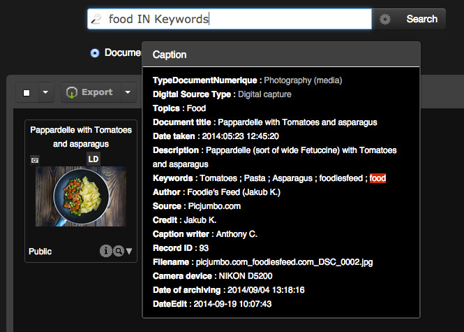
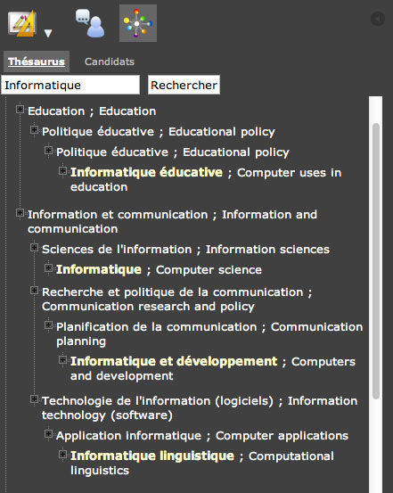
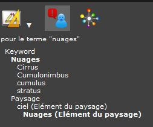

Search for records
==================
.. toctree::
    :maxdepth: 3

.. topic:: The essential

    The media and stories searches in *Phraseanet* are made through a full text
    search engine that works like many search engines.

    Combined with common search operators, these searches are more relevant.
    Extended searches can be made with other less used operators. It is also
    possible to search in specific fields if needed.

    If a *Thesaurus* is activated, the search and review of the results can be
    greatly enhanced.

    **Remember that in most case, indexation quality remains the dominant
    factor in search results**.

Full text search
----------------

*Phraseanet* suggests by default a full text search that allows to display media
depending on the information contained in the documentary fields of their
descriptive note.

By default, **the search apply on Phraseanet bases and collections documents**
accessible by the user. The displayed records are the result of a
:ref:`customizable initial question <Customize-Initial-Question>`.

.. image:: ../../images/Rechercheavancee1.jpg
    :align: center

**To search stories**, place the radio-button of the search mode in the story
position. In this mode, the search is on the content of the stories note.

.. note::

    Simultaneous searches on documents and stories are not possible.

To search :

* Type the term(s) to look for in the search form
* Click on the **Search** button

The search engine is not case sensitive and do not distinguish accented
characters from others.

The results are displayed in the display area. The relevance depends on the
indexation quality of the media and the search query.

.. note::

    The number of results per page is customizable. Refer to the page
    :ref:`Customize the interface <Customize-Display-Settings>` for more
    information.

Boolean operators and wildcards
*******************************

By default, the operator between two terms is the boolean operator **AND**.
Therefore it's not necessary to type it.
All the terms typed in the form are in the descriptive notes of the displayed
media.

**Other common operators are available**:

* The operator **OR** allows to look alternatively for several terms in the
  media notes. For example, if the search is **sea or mountain**, the
  descriptive notes of the displayed media will contain either the word sea, or
  the word mountain, or both.
* The operator **EXCEPT** allows to exclude a term from the search. If the
  search is on beaches not in France, type **beach EXCEPT France**.
* The operator ***** is a wildcard. It allows to truncate the characters on the
  right of the searched term : a search like **natur*** displays the media which
  descriptive notes contain the words starting with "natur" like nature, natures
  ... *etc*.
* **The search between double quotes** is possible : it allows to search for
  contiguous terms or exact match expression in the media descriptive notes.

Other options exists using advanced operators.

.. seealso::

    :doc:`See the full list of these operators in the FAQ<../../FAQ/Media/All-search-operators>`.

Specific operators
******************

*Phraseanet* has other specific operators:

* **All**, to search all the documents of the selected Phraseanet
  bases or collections.
* **Last** ( with or without specifying a number) displays by
  default the 12 last documents added by Phraseanet base in the selected
  collections. Combined with an integer, the *n* last documents will be
  displayed.

In a **Last 100** search with 3 opened Phraseanet bases/collection, the
number of displayed media can be up to 300 (3 times the last 100 added media),
considering the number of documents for each base or collection is more than 100

Search in a specific field
--------------------------

It is possible to limit the search to a field of the description.
The search pattern is the term searched IN a specific field.

A search **London in City** will display the documents that contain the term
**London** in a field named **City**.

A search **France in Country** will display the documents that contain the term
**France** in the field named **Country**.

.. note::

    For a field search, be sure to use the field name as stated in the
    documentary structure. Field names are case sensitive.

Advanced search
---------------

To display the advanced search form, click on the geared wheel between
the search field and the button **Search**.

.. image:: ../../images/Rechercheavancee0.jpg
    :align: center

The window of advanced search is in three parts:

* The search form
* The list of available bases and collections
* The list of search filters

Check or uncheck the Phraseanet bases and collections to search in.

It is possible to un-select all the :term:`Phraseanet bases<Phraseanet Base>`
and collections. Click on "None" or on each label of the bases to select or
deselect them.

.. note::

    If no collection is selected, then the search apply on all Phraseanet bases
    and collections available to user.

The available filters allow to narrow the search results:

* Activate or de-activate the search by :term:`Stemm`
* Search one or more specific fields
* Filter by status
* Limit the searches with periods

**The options of the advanced search stay**. The choices used in the advanced
search window are kept as long as they are not modified.
If there are search options, the form background will be yellow.

Search using the Thesaurus
--------------------------

If a Thesaurus is activated, the search and the results review can be greatly
enhanced.

Display the Thesaurus
*********************

The search using the Thesaurus is launched from the Thesaurus tab of the work
area.

.. image:: ../../images/Recherche-Thesaurus.jpg
    :align: center

It presents a tree of the deployed thesaurus where the nodes and terms are
clickable.

* Click on the "+" of the nodes to deploy them and browse through the terms it
  contains.
* **Double click on a term to start searching**.

**A search in the thesaurus terms is possible** using a form.
Include at least the first three characters of a term to trigger the
auto-completion system.

Use the proposals
*****************

The proposals tab displays suggestions related to the user search and the terms
contained in the thesaurus of the searched bases.

By going up the terms in Thesaurus, the user is advised to specify its
research or to widen it to a larger cognitive scope with suggested terms.

Each proposal is clickable and allows to launch a new *Thesaurus* search.

.. note::

    The relevance of the proposals in this tab are linked to the construction
    of the deployed thesaurus.
