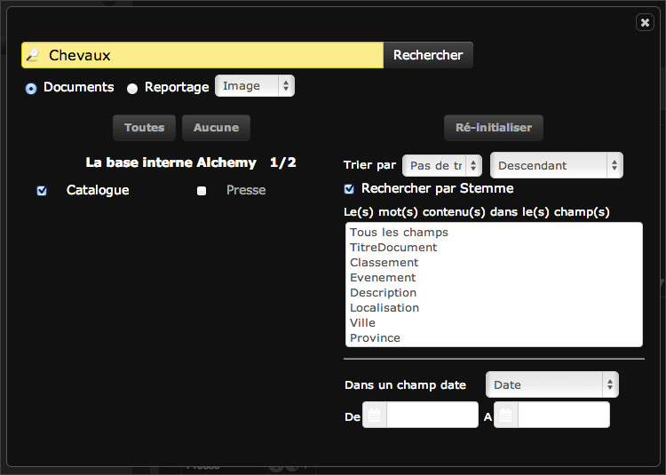

Search for records
==================
.. toctree::
    :maxdepth: 3

.. topic:: The essential

    The media and stories searches in *Phraseanet* are made through a full text
    search engine that works like many search engines.

    Combined with common search operators, these searches are more relevant.
    Extended searches can be made with other less used operators. It is also
    possible to search in specific fields if needed.

    If a *Thesaurus* is activated, the search and review of the results can be
    greatly enhanced.

    **Remember that in most case, indexation quality remains the dominant
    factor in search results**.

Full text search
----------------

*Phraseanet* feature a full text search mode that allows to retrieve assets
depending on the information contained in the documentary fields of their
descriptive note.

By default, **the search apply on Phraseanet bases and collections documents**
accessible by the user. The displayed records are the result of a
:ref:`customizable initial question <Customize-Initial-Question>`.

**To search stories**, place the radio-button of the search mode in the story
position. In this mode, the search is on the content of the stories note.

.. note::

    Simultaneous searches on documents and stories are not possible.

To search :

* Type the term(s) to look for in the search form
* Click on the **Search** button

The search engine is not case sensitive and do not distinguish accented
characters from others.

The results are displayed in the display area. The relevance depends on the
indexation quality of the media and the search query.

.. note::

    The number of results per page is customizable. Refer to the page
    :ref:`Customize the interface <Customize-Display-Settings>` for more
    information.

Supported boolean operators
***************************

By default, the operator between two terms is the boolean operator **AND**.
Therefore it's not necessary to type it.
All the terms typed in the form are in the descriptive notes of the displayed
media.

**Other common operators are available**:

* The operator **OR** allows to look alternatively for several terms in the
  media notes. For example, if the search is **sea or mountain**, the
  descriptive notes of the displayed media will contain either the word sea, or
  the word mountain, or both.
* The operator **EXCEPT** allows to exclude a term from the search. If the
  search is on beaches not in France, type **beach EXCEPT France**.
* **The search between double quotes** is possible : it allows to search for
  contiguous terms or exact match expression in the media descriptive notes.

Other options exists using advanced operators.

.. seealso::

    :doc:`See the page dedicated to Elasticsearch in FAQ<../../FAQ/Media/Elasticseach-supported-operators>`.

Navigating with facets
----------------------

Information contained in documentary fields or metadata of the
original documents can be faceted according to the choices of
parameterization in fields setting or in search engine aggregates.

Facets allows the user to navigate through a collection of documents
filtering the results..

The content of each facet is updated when applying a new search or a new
filter.

Click on one of the facets proposed on the Facets tab of the work aera to
filter the results of a search.

.. image:: ../../images/Recherche-Facette-01.jpg
    :align: center

The facets can be cumulated:

* With a facet from another faceted documentary field or from another faceted
  technical characteristic of the document
* With another facets from the same documentary filed if this one is
  multivalued

To apply a complementary facet filter to the results of a search, click on
the desired facets.

.. image:: ../../images/Recherche-Facette-02.jpg
    :align: center

It is possible to subtract results from a search corresponding to one or
more facets.

Holding the **Alt** key of keybord, click on the corresponding facet(s)
filter(s) to subtract displayed results.

.. image:: ../../images/Recherche-Facette-03.jpg
    :align: center

This action can be applied to criteria contained in a facets or on one
already applied as a filter.

Search in a specific field
--------------------------

It is possible to limit the search to a field of the description.
The syntax to indicate in the search field is the field name (as stated in the
documentary structure), the operator and the searched value.

TitleEn: Limelight

**The engine performs automatic hyphenation on the spaces and voided
characters**: the searched term in the specified field is between
the operator and the first space after the search term.
To search for a phrase contained in a field, surround it with quotes.

TitleEn: "Modern Times"

.. note::

    For a field search, be sure to use the field name as stated in the
    documentary structure. **Field names are case sensitive**.

For the operator, two possibilities: the colon punctuation mark (:)
or the equal sign (=).

Field **Contains**
******************

Use the operator **:** (colon) to search for a single term or a phrase in
quotes that is part of information entered in the field to search to.

Examples:

* TitleEn: Rocky
* TitleEn: "Star Wars"
* TitleEn: "Naked gun"

.. note::

    In this kind of searches, language analyzers integrated in the engine are
    used to maximize response results.

Field **Is**
************

Use the **=** (equal) to search for accurate and strict values (including
case sensitivity).

Examples:

* TitleEn= Rocky
* TitleEn= "Star Wars"
* TitleEn= "The Naked gun 33⅓: the final insult"

.. note::

    This kind of searches do not implement any language or syntax analyzers.

Advanced search
---------------

To display the advanced search form, click on the geared wheel between
the search field and the **Search** button.

The window of advanced search is in three parts:

* The search form
* The list of available bases and collections
* The list of search filters

Check or uncheck the Phraseanet bases and collections to search in.

It is possible to un-select all the :term:`Phraseanet bases<Phraseanet Base>`
and collections. Click on "None" or on each label of the bases to select or
deselect them.

.. note::

    If no collection are selected, searches apply on all Phraseanet bases
    and collections available according to user's rights.

The available filters allow to narrow the search results:

* Sort by relevance, date added, numerical values or dates from parameterized
  fields in the database structure
* Search one or more specific fields
* Filter by status
* Limit the searches with periods

**The options of the advanced search stay**. The choices used in the advanced
search window are kept as long as they are not modified.
If there are search options applied, the search form background turns blue.

Search using the Thesaurus
--------------------------

If a Thesaurus is activated, the search and the results review can be greatly
enhanced.

Display the Thesaurus
*********************

The search using the Thesaurus is launched from the Thesaurus tab of the work
area.

It presents a tree of the deployed thesaurus where the nodes and terms are
clickable.

* Click on the "+" of the nodes to deploy them and browse through the terms it
  contains.
* **Double click on a term to start searching**.

**Searching in the thesaurus is possible** using the dedicated form.
Include at least the first three characters of a term to trigger the
auto-completion system.

