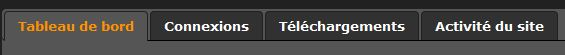

Statistics
==========

.. toctree::
    :maxdepth: 3

.. topic:: The essential

    Statistics are available in Phraseanet. In Production, statistics
    on documents are available in a couple tabs in detailed view.

    **Report** gives more detailed information on the site's activity.

Statistics in Production
------------------------

Statistics on the records are available in two tabs of the
:ref:`detailed view <Detailed-View>`.

Timeline
********

.. seealso::

    :ref:`Refer to the paragraph dedicated to records history<Display-Timeline>`.

Document's statistics
*********************

.. seealso::

    :ref:`Refer to the paragraph dedicated to records popularity<Display-Statistics>`.

Statistics in *Report*
----------------------

** Report ** provides information about connections, downloads and documentary
contents.

It proposes pre-established queries that, for a range of dates, deliver results
as CSV files. These data can be manipulated outside Phraseanet in spreadsheets
or DBMS.

Click on **Report** item to launch interface.

Connections
***********

The **Connections** tab delivers, for dates, information on users connections
grouped or not by browsers, systems operating or screen definition.

**To get a report on connections**:

* Select a date range
* Depending on context, select a databox
* Choose the type of report
* Click the Download button

Downloads
*********

The **Downloads** tab provides information about downloads by databases
and collections on dates intervals.

These reports can be grouped by user or by record from a databox.

**To get a report on Downloads**:

* Select a date range
* Depending on context, select a dataox
* Select one or more collections
* Choose the type of report
* Click the Download button

Databox content
***************

The **Databox content** tab allows access to documentary contents of created
or modified records in a date range in databoxes and collections.

**To get a report on Databox content**:

* Select a date range
* Depending on context, select a databox
* Select one or more collections
* Choose the document fields to be included in the report
* Click the Download button

