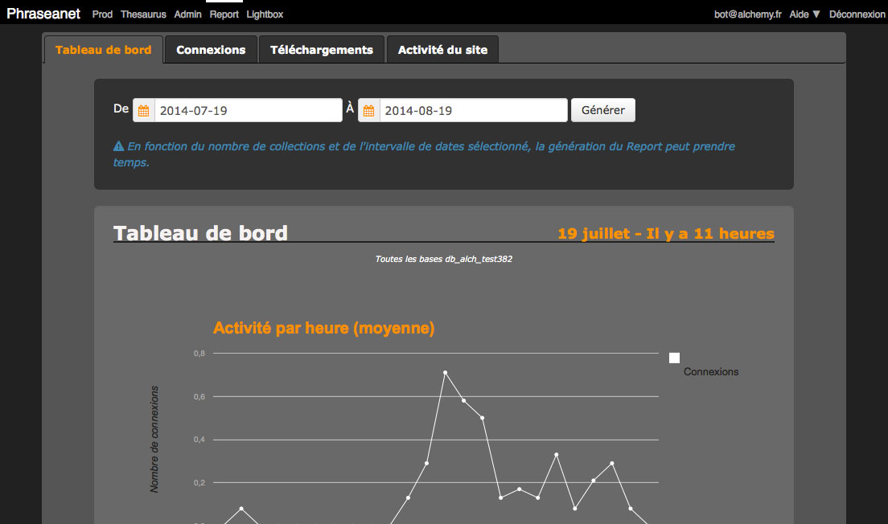

Statistics
==========

.. toctree::
    :maxdepth: 3

.. topic:: The essential

    Statistics are available in Phraseanet. In Production, statistics
    on documents are available in a couple tabs in detailed view.

    **Report** gives more detailed information on the site's activity.

Statistics in Production
------------------------

Statistics on the records are available in two tabs of the
:ref:`detailed view <Detailed-View>`.

Timeline
********

.. seealso::

    :ref:`Refer to the paragraph dedicated to records history<Display-Timeline>`.

Document's statistics
*********************

.. seealso::

    :ref:`Refer to the paragraph dedicated to records popularity<Display-Statistics>`.

Statistics in *Report*
----------------------

Report regroups the statistics on connections, downloads, and site activity.
A dashboard sums up these main information.

**To start a Report**, click on the corresponding section in the menu bar then
generate the report for a chosen period.

Dashboard
*********

The dashboard gives general details about:

* The number of connections to the site
* Addition of documents
* Records edition
* The number of original documents download, of sub-definitions, and the
  bandwidth they represent on the network.
* The most active users (questions asked)
* The 10 top frequently asked questions
* The sites where the media are the most viewed

These statistics are detailed in the Connections, Downloads and Site activity
tabs.

Connections
***********

The Connections tab gives details about connections on Phraseanet instance.
Three type of reports are available :

* The number of connections per user
* The connections history
* The details on platforms and web browsers used by the users

To generate these reports:

* Choose a period
* Select bases and collections on which the statistics are calculated
* Select a type of report

.. note::

    Chosen dates are persistent from one tab to one other.

Downloads
*********

The Downloads tab lists the downloads for a specified period, by bases and
collections:

* By user
* By chronological order
* By day
* By documents of a base

Links on the infos in the **RecordID** column allows to display a note of the
downloaded documents. This note contains:

* A preview
* Metadatas like the date of creation in the base, title or filesize

Click on the cross on the top right of the overlay window to quit the note and
go back to the downloads list.

Site Activity
*************

The **Site activity** tab regroups details on queries made during searches,
connections during the last hours and activities on documents.

The reports are generated on demand after selecting date interval, bases and
collections

Activity related to questions
^^^^^^^^^^^^^^^^^^^^^^^^^^^^^

Three types of reports are on search queries:

* **The questions history** lists the questions asked by the users in
  chronological order.
* **The most frequently asked questions** lists the most frequent searches and
  the average number of answers.
* **The unanswered questions** lists the queries with no results and the number
  of times they were made.

Activity per hour (Site activity)
^^^^^^^^^^^^^^^^^^^^^^^^^^^^^^^^^

This report gives a graph of the number of average connections per 24 hour
period in over the selected dates.

Documents
^^^^^^^^^

This report allows to get details of the activity of documents. A list of
choices allows to choose the actions made on documents:

* Pushed documents
* Added documents
* Caption edited documents
* *Feedbacked* documents
* Documents sent to recipients

.. note::

    A setting option allows to anonymize reports. In this case the account IDs
    do not appear in the generated reports.
    Refer to the Report display options section of the
    :ref:`Admin Settings <Application-setting>`.

Customize and export reports
****************************

It is possible to hide the contents of columns in the generated reports.
Click on the cogwheel to display the overlay window allowing to hide the
contents of the columns.

Some column headers allows to sort if needed.

Most of the generated reports can be exported as PDF or CSV files. Click on the
dedicated icons to export to obtain the reports in the desired format.
