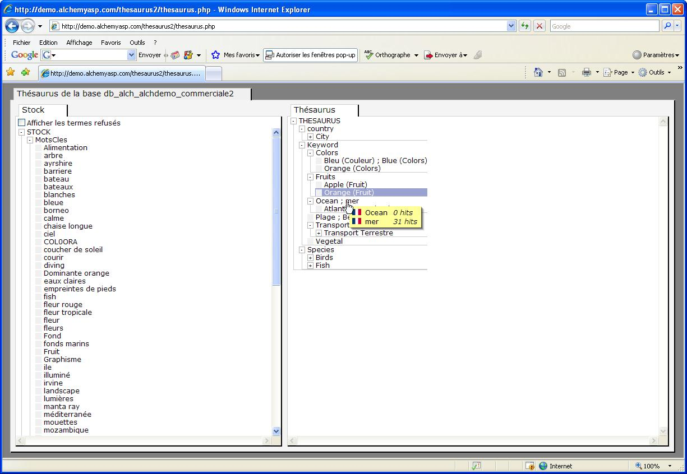

Thesaurus
=========

.. toctree::
    :maxdepth: 3

.. topic:: The essential

    Thesaurus is a documentary language management tool. In Phraseanet, its
    implementation is optional. It can be used with the Phrasea engine only (not
    compatible with the Sphinx search engine).

    In Production, the thesaurus serves :

    * **Contributors**, to give a reference vocabulary to describe resources
      of the base in the edition form.
    * **Users** (all kind), to browse assets and make suggestions allowing to
      narrow or expand searches.

    The Thesaurus application is the interface dedicated to the thesaurus
    administration. However some maintenance actions are possible in Production.

About thesaurus
---------------

A terminology management tool
*****************************

At its simplest, a thesaurus is a corpus of simple words or expressions reduced
to a restricted knowledge domain, the one covered by the holdings. It brings the
reference terms to precisely describe the documentary resources.

Artificial language, the concepts are represented by terms or expressions,
organized so the relationship between them are explicit. The preferred terms
used to describe the resources come along with their synonyms or quasi-synonyms.

Relations in the Phraseanet thesaurus
*************************************

The Phraseanet thesaurus manages :

* The relations broader terms (BT) terms and narrow terms (NT)
* The synonymy relations, in the same language or to other languages of the
  application.

This synonymy relation can be used to reflect associations between terms and
expressions of the thesaurus.

.. Warning::

    A thesaurus is a powerful tool. Its implementation may seem easy but
    sometimes, knowledge in Information science may be necessary to achieve the
    expected results.

Activation of the thesaurus on a *Phraseanet* instance
******************************************************

The Phraseanet thesaurus is activated in the Additional modules section of
:ref:`Administration settings<Application-setting>`.

Set the radio button to *True* then submit the form to activate the thesaurus.

**There is one thesaurus per Phrasneanet base.**

Access the thesaurus of a base
------------------------------

Click on the Thesaurus item in the menu bar then...

* Choose the Thesaurus base to edit in the drop-down menu list
* Choose a the language to work with then click on validate

The Thesaurus application window is in two parts.

* The left side of the window displays the list of **candidates**,
  terms and expressions resulting from the indexation and the list of **rejected
  or deleted terms** displayed by documentaries fields of the database
  structure.
* The right side displays the existing Thesaurus, as a browsable tree. Putting
  the mouse cursor on a branch or a term display in rollover all the synonyms
  and associated terms and their number of appearances in the database.
* To deploy a branch click on the "+" symbol. To close it, click on the "-"

Editing the thesaurus
---------------------

Add a term
**********

Adding a narrower term to a branch or to an existing term of the thesaurus
means adding a strictly subordinate term in the semantic relation.
Broader terms in the thesaurus can be added on any existing branch from
the main branch called **Thesaurus**.
To create a term :

* Right click on a branch, on a term
* Click on **New term**.
* Type the term
* Type if needed a context (this may help to discriminate synonyms)
* Select a language for the term
* Click on **Validate**

A window opens if the term is not part of the candidates.

**Add term without re indexation** is the selected choice. Choose this
option in most cases.

The choice **Add the term and re index** will re-index the base and reset the
rejected terms.

* Click on Validate

.. note::
    Immediate re-indexation is not necessary if other terms are not yet
    added. The re-indexation can be done later from **Phraseanet Admin**.

Create a new synonym
********************

This action allows to create equivalence relations on the terms of a branch or
node of the thesaurus.

To create a synonym :

* Right click on a term
* Click on **New synonym**

In the **New synonym** window :

* Type the term
* Type if needed a context for this term
* Select a language for the term
* Click on **Validate**

A window opens if the term is not part of the candidates.

By default **Add a term without re-indexation** is checked.

The choice **Add the term and re index** will re-index the base and reset the
rejected terms.

* -> Click on **Validate**

Delete a branch or a specific term
**********************************

* Right click on a branch or thesaurus node
* Click on **Delete**.
* Confirm the deletion in the alert window

The branch or term is deleted and so are its linked terms (Narrower terms and
synonyms)

Branch or terms deleted from the thesaurus are copied in the *Stock*
branch of Candidates. They are usable as candidate terms and can be added
to any branches or nodes of the thesaurus.

.. note::

    As relations between terms are kept for delated branch and terms, this
    method can be used to move a part of the thesaurus tree towards another
    node or branch.

Delete a synonym term
*********************

* Right click on a branch or thesaurus node
* Click on **Properties**

In the properties window...

* Right click on the term to delete from the node
* Choose the Delete item on the menu list then confirm the deletion in the
  alert window

.. note::

    In Firefox, a menu window can hide the Property window of the thesaurus.

Search for a term in Candidates or Thesaurus
********************************************

* Right click on a branch or node of Candidates or Thesaurus then select
  the Search section

In the Search window,

* Choose among the search options, type the searched term or expression then
  submit the form

The display refreshes and the searched term are displayed in the tree structure
of Candidates or Thesaurus depending of search root.

Export the candidates or the Thesaurus
**************************************

* Right click on a branch or on the node Candidates or Thesaurus then select
  the **Export** item in pop-up menu

In the Export window,

* Choose the export options then submit the form

The exported terms are displayed in a new tab, new window of the Web browser.

Import an existing thesaurus
****************************

Thesaurus consists od a tabulated text files encoded in UTF-8. This kind of
file can be integrated as thesaurus in the application.

* Right click on the term Thesaurus on the top right of the interface
* Select the **Import** item

In the Import window...

* Select the thesaurus file on the computer then click on **Validate**

.. note::

    In case of errors in the tabulated text file, the import procedure is
    suspended and an alert window indicated the anomaly.

To proceed with the integration of the imported thesaurus, link the branches
to the documentary fields of the base.

Linking one or more branches of the thesaurus to a documentary field
********************************************************************

This action allows to link one or more documentary fields of a base to a
thesaurus branch, to collect as candidates terms they contain (after
re-indexation or while indexing).

At the root of the thesaurus...

* Create heading terms for branches of thesaurus in order to link them to
  documentary fields
* Do a right click on a heading term
* Click on **Link to fields** item

In the Link thesaurus branch to field window...

* Check the box(es) of the fields to link then submit the form

.. note::
    All the new terms contained in the fields linked to thesaurus branches
    will appear as candidate terms.

Working on candidates
---------------------

Candidates are terms and expressions linked to branches of the thesaurus but
are not part of it. These terms can either come from information extracted
from metadata of added files, or from information added while capturing
records notes.

A part of the maintenance of thesaurus consists in examining these candidates.
Relevant terms are destined to be integrated while irrelevant ones can justify
corrections in notes in order to use more appropriate descriptors.

Adding candidates to thesaurus can be made either in Thesaurus or in Production
interfaces.

In Thesaurus
************

Accept candidates
^^^^^^^^^^^^^^^^^

* Click on the candidate term in the Candidates and drag/drop it on the broader
  term to relates with.

In the Accept window...

* Choose to add as a narrower term (specific term) or a synonym then Validate

.. note::

    The candidates can only be added to the branches linked to the documentary
    fields they come from.

Reject candidates
^^^^^^^^^^^^^^^^^

* Right click on a candidate term of Candidates
* Select the section **Reject**

If it is typed again in the documentary notes, a rejected term is no more
categorised as a candidate.

**To display the rejected terms**, check the case *Display the rejected terms*
in the interface.

**Rejecting a candidate is reversible**:

* Display the rejected terms
* Right click on the rejected term
* Select **Accept**

Delete  candidates
^^^^^^^^^^^^^^^^^^

* Right click on a term
* Click on **Delete**
* Confirm the deletion in the alert window

The deletion of a candidate term does not affect the records. A candidate can
be deleted then re-added:

* If it is reused during the edition of records notes
* If it stays in the documentary notes and that the base is re-indexed

.. Warning::

    During the re-indexation of a base, the refused or deleted terms of a
    thesaurus reappear, this action reinitialises the candidates of the
    thesaurus.

In Production
*************

Accept candidates
^^^^^^^^^^^^^^^^^

Click on the *Thesaurus* tab in the work zone then on the section Candidates.
Deploy the base thesaurus by clicking on the **+**.
The documentary fields linked to the thesaurus branches are showed.
By clicking on the **+** allows to show the list of candidate terms sorted by
alphabetical order.

Searches on candidates terms can be launched with a double-click. The search
is then on a query by field.

The *Candidate* tab allows specific action on the Thesaurus.

Accept a candidate
^^^^^^^^^^^^^^^^^^

To add a candidate term to the Thesaurus:

* Right click (or click while pressing the "ctrl" key pressed) on a term to
  display the pop-up menu
* Accept the term in one of the interface languages by selecting the
  corresponding item in menu list

The display switches to the Thesaurus tab

* Search or browse to the term of the thesaurus to link to the candidate term
  and right click on it
* Accept the candidate term as a specific term (narrow term - NT) or as
  a synonym

Delete a candidate
^^^^^^^^^^^^^^^^^^

Made from Production, this operation deletes the candidates terms from the
documents notes as well as removing it from candidates. Up to 25 records can
be treated during this deletion.

To delete a candidate term:

* Right click on the term to delete
* Select **Delete** in menu list
* Confirm the deletion in the alert window

Replace a candidate
^^^^^^^^^^^^^^^^^^^

This operation allows to correct candidates terms in up to 25 documentaries
notes.

To replace a candidate term in notes:

* Right click on the term to correct then select the **Replace with** item in
  menu list
* Fill the form then click on **Search**
* Confirm the replacement in the alert window

.. note::

    To delete or replace a term in more than 25 sheets, use the edition form.
