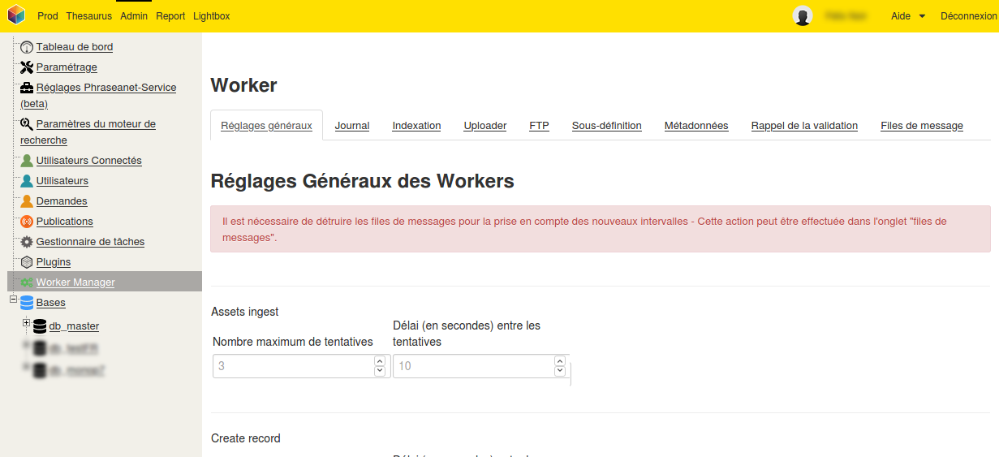

Gestionnaire de workers
=======================

*Pour éviter toute incompréhension, l'anglicisme* "**worker**" *est utilisé pour désigner le terme* "**travail**".

############
Introduction
############

Phraseanet intègre un gestionnaire de workers afin de réaliser des travaux asynchrones.
Ce gestionnaire remplace à terme le :doc:`Gestionnaire de tâches <MoteurDeTaches>`.

Chaque worker permet de manière asynchrone d'être assigné pour les types de tâches suivantes :

* L'indexation de databox par ElasticSearch (populateIndex)
* La création de sous-définition (subdefCreation)
* L'écriture des méta-données (writeMetadatas)
* La notification via par mail de validations non terminées
* Edition des fiches d'indexation des records
* Injestion de document (relayé par un uploader phraseanet-service)
* Creation de records
* Suppression de records
* Export de medias
* Sous-titrage de vidéos
* Emission de webhooks
* Export de documents via protocole FTP
* Main Queue (pour certaines actions, un message principal est posté dans la "Main Queue" pour produire des messages unitaires comme "recordEdit")

A chaque type de tâche à réaliser, il est possible d'assigner un ou plusieurs worker selon le besoin.

Les workers utilisent `RabbitMQ`_, un agent de messages (message broker) pour fonctionner.

#######
Console
#######

Des commandes propres aux workers sont intégrées dans l'utilitaire en ligne de commande :doc:`Konsole Commander <Console>` :

.. code-block:: bash

 worker
  worker:execute                            Listen queues define on configuration, launch
                                            corresponding service for execution
  worker:run-service                        Execute a service
  worker:show-configuration                 Show queues configuration

Exemples de configuration
-------------------------

* Lancer 10 workers sans spécialités :

.. code-block:: bash

  bin/console worker:execute -m 10

* Lancer 10 workers sur la file **recordedit** :

.. code-block:: bash

  bin/console worker:execute --queue-name=recordedit -m 10

* Lancer 10 workers sur la queue **recordedit** et la queue **FTP**. Note : il y a pas de priorité entre les jobs.

.. code-block:: bash

  bin/console worker:execute --queue-name=recordedit --queue-name=ftp -m 10

* On attribue ici 3 workers pour un ensemble de queues :

.. code-block:: bash

  bin/console worker:execute --queue-name=assetsIngest --queue-name=createRecord
  --queue-name=deleteRecord --queue-name=exportMail --queue-name=exposeUpload
  --queue-name=ftp --queue-name=mainQueue --queue-name=populateIndex
  --queue-name=pullAssets --queue-name=subtitle --queue-name=validationReminder
  --queue-name=webhook -m 3

###############################
Accès via l'interface graphique
###############################
Pour accéder au panel "Worker manager" :

* Se connecter à l'application **avec un compte Administrateur Phraseanet**
* Lancer l'interface **Admin**
* Cliquer sur la rubrique *Worker Manager* dans le menu latéral

Réglages généraux
-----------------
Cette rubrique permet de définir pour chaque type de tâche le nombre maximum de tentatives ainsi que le délai entre chaque tentative.

.. note::
    Pour certaines tâches (exemple : "Subdef creation"), un troisième paramètre permet de régler l'intervalle (en secondes) de tentative d'exécution pour les messages différés.

.. note::
    Pour tout changement de paramétrage sur une queue, il faut la détruire via l'onglet **Files de Messages** pour que les modifications soient prisent en compte.

Journal
-------
Cette rubrique permet d'afficher sous forme de liste l'état des travaux. Chaque travail présente quatre états possibles :

* En cours
* Terminé
* En erreur
* Interrompu

.. warning::

    Les travaux en erreurs publiés dans les queues **dead-letter** dédiées aux erreurs (nommées "xxx_failed") sont automatiquement effacées de la file RabbitMQ au bout de 96 heures.

    Exemples de queues **dead-letter** dédiées aux erreurs (encadrées en rouge) :

    .. image:: ../images/Administration-workerManager-queues.png
        :align: center

Indexation
----------
Cette rubrique permet de relancer manuellement l'indexation sur une ou plusieurs base.

FTP
---
Cette rubrique permet le paramétrage d'un serveur :term:`FTP` pour le dépôt des documents.

Actions sur les records
-----------------------

Ce worker permet de mettre à jour, de déplacer, ou de supprimer des enregistrements sélectionnés.

Des critères de contenu (texte ou date) ou de status Phraseanet peuvent être pris en compte pour sélectionner des enregistrements.

En pratique, ces actions peuvent être utilisées pour automatiser la gestion d'actifs dont les dates d'échéance des droits d'utilisation approchent ou sont dépassées.

Paramètrage
^^^^^^^^^^^

* Database : choix de la Base Phraseanet (databox)
* intervalle d’exécution : intervalle d’exécution de la tâche
* Collection : collection initiale ====> collection de destination
* Status : status-bit initial ====> status-bit final

Principe de fonctionnement
^^^^^^^^^^^^^^^^^^^^^^^^^^

Des actions sont effectuées successivement dans une liste de tâches.

Une tâche sélectionne des enregistrements correspondants à des critères de recherche contenus dans la balise "from", les met à jour (critères "to") ou les supprime.

Interface
^^^^^^^^^
Les settings sont éditables en XML. L'interface affiche le SQL correspondant, 
le nombre de records impactés par chaque tâche (si cette tâche était exécutée
maintenant), ainsi que les identifiants des dix premiers enregistrements impactés.

Une tâche peut être maintenue 'désactivée' durant sa mise au point
(une croix rouge est visible).

Settings XML
^^^^^^^^^^^^

<tasks> énumère l'ensemble des tâches <task>.

Une <task> agit sur une base (attribut "databoxId") et peut soit modifier des
enregistrements, soit les supprimer (attribut "action" dont la valeur est "update" ou "delete").

Une <task> peut être nommée (attribut "name").

Pour s'éxécuter, une <task> doit avoir l'attribut "active" égal à 1. Si celui-ci est égal à 0, la tâche ne s'éxécute pas.

Une <task> agit sur les records répondants à TOUS les critères énumérés dans la
partie <from>

Les critères possibles sont :

- le type de record :

.. code-block:: xml

    <type type="RECORD" />
    seulement les documents (par défaut)

    <type type="STORY" />
    seulement les reportages

- les collections :

.. code-block:: xml

    <coll compare="=" id="3,5,7" />
    le record est dans une des collections 3, 5 ou 7

    <coll compare="!=" id="8,9" />
    le record est dans n'importe quelle collection, sauf la 8 ou la 9

- les status-bits :

.. code-block:: xml

    <status mask="1x0xxxx" />
    le status 4 est à 0 ET le status 6 est à 1 (les status 0 à 3 sont réservés
    à Phraseanet, d'ou les xxxx en fin de valeur de l'attribut *status mask*)

- la valeur d'un champ texte :

.. code-block:: xml

    <text field="Ville" compare="=" value="Paris"/>
    la ville est Paris

    <text field="Auteur" compare="!=" value="Dupond"/>
    n'importe quel auteur sauf Dupond

- la valeur d'un champ date, comparé avec la date courante :

.. code-block:: xml

    <date direction="before" field="MISEENLIGNE"/>
    la date de mise en ligne n'est pas atteinte (= on est AVANT la date de mise
    en ligne)

    <date direction="after" field="#createdate" delta="+365"/>
    la date de création de l'enregistrement dans la base est dépassée de 365        jours

    <date direction="after" field="#moddate" delta="+365"/>
    la date de modification est dépassée de 365 jours

    <date direction="after" field="MISEENLIGNE" delta="+30" />
    la date de mise en ligne est passée de 30 jours (= on est APRES la date+30j)

    <date direction="after" field="PURGE" delta="-2" />
    on est 2j avant la date de purge

Pour l'action "update", les opérations décrites dans <to> peuvent porter sur :

- la collection

.. code-block:: xml

    <coll id="2" />
    le record passe dans la collection 2

- un ou plusieurs champs documentaires

.. code-block:: xml

    <text field="SpecialInstruction" value="Edited by records action #6" />
    le champ documentaire SpecialInstruction est mis à jour par la valeur           indiquée

- les status

.. code-block:: xml

    <status mask="0x1xxxx" />
    baisser le sb 6, lever le sb 4

L'action "trash" déplace des enregistrements décrits dans <to> vers la corbeille applicative \_TRASH\_ de la databox.

.. code-block:: xml

    <comment>Move to trash records they are in the 'injector' collection and credate  modified from 9 days</comment>
    <task active="1" name="TRASH record and not modified from 9 days " action="trash" databoxId="3">
      <from><coll compare="=" id="8"/><date direction="after" field="#credate" delta="+9" />
    </from>
      </task>

L'action "delete" effectue la suppression des enregistrements décrits dans <to>

.. code-block:: xml

     <task active="1" name="Delete records from collection trash not modified since 365 days" action="delete" databoxId="3">
       <from>
         <coll compare="=" id="6"/>
         <date direction="after" field="#moddate" delta="+365" />
      </from>
    </task>

L'attribut *deletechildren="1"* demande la suppression des enregistrements contenus dans les reportages supprimés.

.. code-block:: xml

     <task active="1" name="Delete stories from collection trash not modified since 365 days" action="delete" deletechildren="1" databoxId="3">
       <from>
         <type type="STORY" />
         <coll compare="=" id="6"/>
         <date direction="after" field="#moddate" delta="+365" />
      </from>
    </task>

.. _RabbitMQ: https://www.rabbitmq.com/
