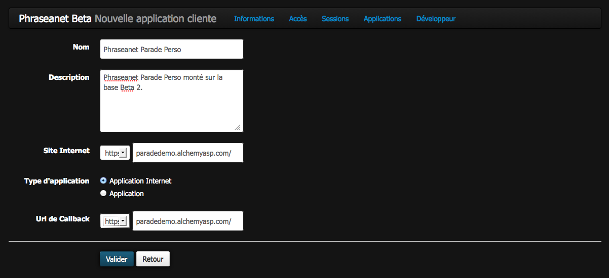

Créez des applications en utilisant l'API Phraseanet
====================================================

Phraseanet dispose d'une API publique, permettant aux développeurs d'intégrer
les documents (vidéos, photos etc ...) et fonctionnalités Phraseanet sur une
application tierce.

 * site internet
 * application mobile
 * application de bureau

Voici la marche à suivre :

    * Lire la :doc:`documentation de l'API <API>` et bénéficier de l'aide
      de :doc:`l'équipe Phraseanet et de la communauté <Forums>`.

    * Pour pouvoir utiliser les fonctionnalités de l'API Phraseanet, Il faut
      enregistrer une nouvelle application et obtenir une clé d'API.

Enregistrer une application auprés de l'API phraseanet
------------------------------------------------------

Cliquer sur le login dans le :doc:`menu <../User/Manuel/General>` Phraseanet.

Dans la rubrique *Phraseanet mon compte*

Cliquer sur l'onglet *développeur*

.. image:: ../images/MonCompteDeveloppeur.png
    :align: center

Cliquer sur *créer une nouvelle application*

* Donner un nom à l'application
* Remplir la description concernant l'application, cette information est à
  destination de l'utilisateur qui utilisera votre application, elle sera
  affiché sur la page d'authentification, veiller à être
  précis en expliquant brièvement le but de votre application.
* Remplir le champ du site internet de votre application, ce champ
  est obligatoire. Ce lien est présenté à l'utilisateur sur la page
  d'authentification à votre application
* Choisir le type d'application développée *application internet* ou
  *application de bureau*
* S'il s'agit d'une application internet, remplir le champ d'url de rappel
  Les utilisateurs authentifiés seront automatiquement redirigés sur cet URL
  aprés leur authentification

Une fois l'application enregistrée elle apparaît dans un tableau de bord

.. image:: ../images/MonCompteDeveloppeurDashboard.png
    :align: center

Le tableau de bord liste toutes les applications créées par l'utilisateur
authentifié

Paramètres d'une application
----------------------------

Dans le tableau de bord des applications développeurs cliquer sur le nom d'une
application, La page des paramètres de l'application s'affiche.

.. image:: ../images/MonCompteDeveloppeurApplication.png
    :align: center

**Cette page présente**

* Le *Client ID* est un identifiant unique public de l'application
* Le *Client Secret* est un mot de passe privé de l'application afin d'identifier
  le propriétaire de l'application, ne jamais divulguer cette information.
* L'url de rappel de l'application, celle-ci peut être édité à tout moment
  en passant la souris dessus.
* Les points d'authentifiaction concernant l'authorisation et l'accés à l'API
* L'activation du grant_type password qui permet à votre application d'identifier
  les utilisateurs grâce à leurs identifiants Phraseanet.

.. warning::

    Eviter ce type d'authentification il est conseillé de l'utiliser
    lorsque le propriétaire de la ressource à une grande relation de
    confiance avec le client, comme le système d'exploitation ou un dispositif
    hautement privilégiée avec Phraseanet.

* Le jeton d'accés développeur est un jeton qui identifie le propriétaire de
  l'application sur l'API phraseanet.

.. note::

    Le jeton développeur peut être utilisé lors du développement de
    l'applicatio ou bien pour effectuer des requêtes sur l'API par
    l'intermediaire d'un processus automatisé qui ne nécessite pas
    d'authentification.

.. seealso::  Phraseanet s'appuie sur le protocole d'authentification oAuth2.0.
            Afin de mieux appréhender le processus de création et
            d'authentification des applications clientes à l'API Phraseanet nous
            invitons les développeurs à lire la RFC du protocole `Oauth2`_.

.. _Oauth2: http://tools.ietf.org/html/draft-ietf-oauth-v2
