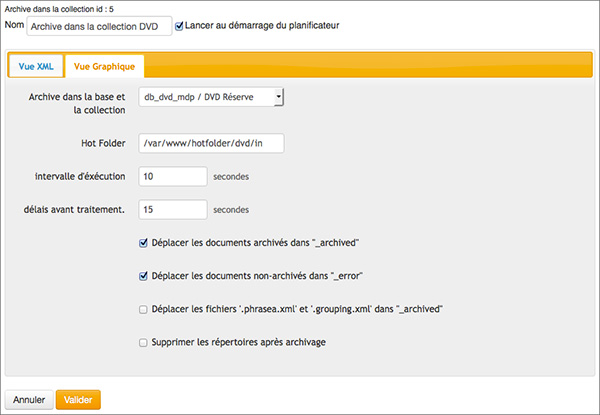
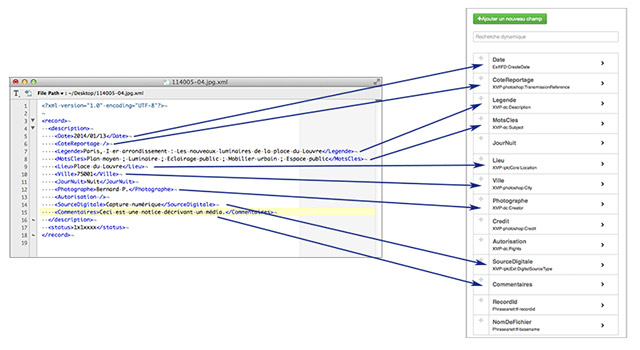
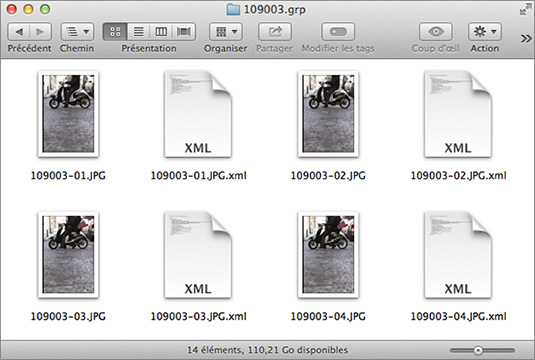
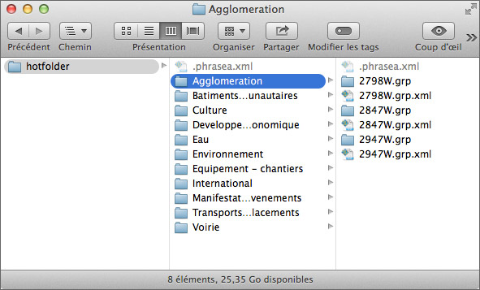

Mise en oeuvre d'une tâche d'archivage
======================================

.. topic:: L'essentiel

    Une tâche d'archivage est destinée à intégrer dans Phraseanet le contenu
    média d'un répertoire accessible à l'application sur un serveur.
    L'interface graphique de paramétrage d'une tâche d'archivage permet de
    configurer l'archivage simple du contenu du répertoire avec quelques
    options de contrôle.
    Il est possible d'ajouter davantage d'options en utilisant le mode
    d'édition XML.

Paramétrage simple d'une tâche d'archivage
------------------------------------------

Pour créer une tâche d'archivage, se rendre dans la section *Gestionnaire de
tâches* de l'administration Phraseanet puis sélectionner la rubrique *Archive
dans la collection* dans le menu *Nouvelle tâche*.
Le paramétrage en mode graphique consiste à remplir un formulaire.

**Indiquer** :

* **Un nom pour cette tâche**
* **Si le démarrage de cette tâche est lié au Scheduler** (cocher, décocher
  la case)
* **Une collection d'archivage** sélectionnée dans la liste déroulante
* **Le chemin d'accès complet du répertoire** ou *hotfolder* contenant les
  données à archiver

.. note::

    L'application doit être en mesure de lire et d'écrire dans le répertoire.

* **Le délai de l'intervalle d'exécution de la tâche** (10 secondes par défaut)
* **Le délai avant traitement**, exprimé en secondes

Quatre cases à cocher permettent des options de traitement :

* **Déplacer les documents archivés dans _archived** déplace le contenu des
  éléments archivés dans un répertoire à coté du *hotfolder*. l'option permet
  de rejouer le scénario d'archivage si nécessaire sans devoir recharger les
  données sur le serveur Phraseanet.
* **Déplacer les documents non-archivés dans _error** déplace les fichiers
  non archivés dans un répertoire à coté du *hotfolder*. Cela permet d'examiner
  les fichiers rejetés par la tâche lors de l'archivage.
* **Déplacer les fichiers .phrasea.xml et .grouping.xml dans _archived**
  permet de déplacer les fichiers cachés contenant des instructions d'archivage
  en même temps que les fichiers archivés.
* **Supprimer les répertoires après archivage** permet de supprimer le contenu
  du répertoire *hotfolder* après l'archivage.

.. warning::

    Il est nécessaire de créer un fichier caché, vide **.phrasea.xml** à la
    racine du répertoire à archiver.

Options avancées pour l'archivage média
---------------------------------------

Pour mettre en place des options d'archivage avancé cliquer sur l'onglet
*Vue XML*.

La vue XML présente les données du formulaire sous la forme d'un paramétrage
texte XML. Les options d'archivage doivent être introduites dans une balise
XML *<files>*.

Filtrer des fichiers par le nom ou l'extension
**********************************************

Il est possible de filtrer les fichiers à prendre en compte lors de l'archivage
du répertoire avec une balise *<file>* et son attribut *mask*.

La valeur de l'attribut *mask* satisfait une expression régulière choisie selon
un contexte, un scénario d'archivage dépendant du projet Phraseanet.

Dans l'exemple ci-dessous, seuls les fichiers avec les extensions jpg, JPG,
tif ou TIF sont pris en compte lors de l'archivage.

.. code-block:: xml

    <?xml version="1.0" encoding="UTF-8"?>
      <tasksettings>
        <base_id>1</base_id>
        <hotfolder>/chemin/complet/du/repertoire/a/lister</hotfolder>
        <period>10</period>
        <move_archived>1</move_archived>
        <move_error>1</move_error>
        <delfolder>0</delfolder>
        <copy_spe>0</copy_spe>
        <cold>5</cold>
        <files> <!-- Mise en place d'un filtre sur la tache -->
          <file mask="^(.*)\.(jpg|JPG)$" /> <!-- accepter les fichiers avec une extension jpg ou JPG -->
          <file mask="^(.*)\.(tif|TIF)$" /> <!-- accepter les fichiers avec une extension tif ou TIF -->
        </files>
      </tasksettings>

Archiver en associant des médias avec des descriptions XML
**********************************************************

Il est possible d'archiver des médias dont les descriptions documentaires sont
contenues dans des notices au format XML avec l'attribut *caption* de la balise
*<file>*.

Dans les fichiers de notices XML, les balises qui contiennent les informations
reprises portent les intitulés de champs de la structure documentaire.

La notice XML utilise une syntaxe standard.

.. code-block:: xml

    <?xml version="1.0" encoding="UTF-8" standalone="yes"?>
    <record>
      <description>
        <Titre>L'accident de la gare de l'Ouest</Titre>
        <Date>1895/10/22</Date>
        <Description>Accident gare de l'Ouest à Paris (aujourd'hui gare Montparnasse) le 22 octobre 1895</Description>
        <Auteur>Mercier, L.</Auteur>
        <MotsCles>Accident ; Chemin de fer ; Gare ; Locomotive ; Train ; Transport ; Transport ferroviaire</MotsCles>
        <Ville>Paris</Ville>
        <Pays>France</Pays>
      </description>
    </record>

Dans l'exemple ci-dessous, les fichiers jpg, JPG, tif ou TIF sont pris en
compte lors de l'archivage. Ils sont **tous** décrits par une notice XML
portant le nom complet du fichier (la valeur de *caption* exploitant le résultat
de l'expression régulière de *mask*).

.. code-block:: xml

    <?xml version="1.0" encoding="UTF-8"?>
    <tasksettings>
      <base_id>1</base_id>
      <hotfolder>/chemin/complet/du/repertoire/a/lister</hotfolder>
      <period>10</period>
      <move_archived>1</move_archived>
      <move_error>1</move_error>
      <delfolder>0</delfolder>
      <copy_spe>0</copy_spe>
      <cold>5</cold>
      <files> <!-- Mise en place d'un filtre dur la tache -->
        <file mask="^(.*).jpg$" caption="$1.jpg.xml"/> <!-- les fichiers jpg sont décrits par les fichiers jpg.xml-->
        <file mask="^(.*).JPG$" caption="$1.JPG.xml"/> <!-- les fichiers JPG sont décrits par les fichiers JPG.xml-->
        <file mask="^(.*).tif$" caption="$1.tif.xml"/> <!-- les fichiers tif sont décrits par les fichiers tif.xml-->
        <file mask="^(.*).TIF$" caption="$1.TIF.xml"/> <!-- les fichiers TIF sont décrits par les fichiers TIF.xml-->
        <file mask="^(.*).xml$" caption="$1"/><!-- obligatoire pour empecher le fichier .xml de partir en erreur s'il arrive en premier -->
      </files>
    </tasksettings>

.. note::

    La tâche d'archivage donnée en exemple ne permet pas d'alternative de
    traitement.

    Les fichiers qui ne satisfont pas l'expression régulière *mask* ou qui ne
    sont pas décrits par des notices sont déplacés dans le répertoire
    **_error**.

Archivage et regroupement en reportage
**************************************

Pour regrouper les médias dans des reportages Phraseanet lors de l'archivage,
les rassembler dans des répertoires avec un suffixe **.grp**.

Dans l'exemple ci-dessous, le paramétrage introduit une balise XML *<grouping>*
permettant le regroupement de médias en reportage lors de l'archivage.

.. code-block:: xml

    <?xml version="1.0" encoding="UTF-8"?>
    <tasksettings>
      <base_id>1</base_id>
      <hotfolder>/chemin/complet/du/repertoire/a/lister</hotfolder>
      <period>10</period>
      <move_archived>1</move_archived>
      <move_error>1</move_error>
      <delfolder>0</delfolder>
      <copy_spe>0</copy_spe>
      <cold>5</cold>
      <files> <!-- Mise en place d'un filtre dur la tache -->
        <grouping mask="^(.*)\.grp$"/> <!-- insertion des médias archivés dans un reportage -->
        <file mask="^(.*).jpg$" caption="$1.jpg.xml"/> <!-- les fichiers jpg sont décrits par les fichiers jpg.xml -->
        <file mask="^(.*).JPG$" caption="$1.JPG.xml"/> <!-- les fichiers JPG sont décrits par les fichiers JPG.xml -->
        <file mask="^(.*).tif$" caption="$1.tif.xml"/> <!-- les fichiers tif sont décrits par les fichiers tif.xml -->
        <file mask="^(.*).TIF$" caption="$1.TIF.xml"/> <!-- les fichiers TIF sont décrits par les fichiers TIF.xml -->
        <file mask="^(.*).xml$" caption="$1"/> <!-- obligatoire pour empecher le fichier .xml de partir en erreur s'il arrive en premier -->
      </files>
    </tasksettings>

La balise *<grouping>* peut prendre l'argument complémentaire **Caption**.
Il permet d'indiquer que des notices XML décrivent les reportages formés par
les répertoires .grp.

Exemple de balise *<grouping>* exploitant cet arguments :

.. code-block:: xml

    <grouping mask="^(.*)\.grp$" caption="$1.grp.xml" representation="$1.grp.jpg"/>

Archiver dans plusieurs collections
-----------------------------------

Il est possible d'archiver des médias dans plusieurs collections :

* **Le répertoire à archiver doit contenir des sous-répertoires**
* **Dans chacun des sous-répertoires, un fichier caché .phrasea.xml renseigne
  la collection dans laquelle archiver** les médias du repertoire et ainsi que
  ceux des éventuels répertoires sous-jacents.

Dans les fichiers cachés *.phrasea.xml* des sous-répertoires, l'identifiant de
collection est indiqué ainsi :

.. code-block:: xml

    <?xml version="1.0" encoding="UTF-8" ?>
    <record collection="4" />

.. note::

    L'identifiant de collection distante peut être consulté en affichant
    les :ref:`informations de la collection <Afficher-Collection>`.

**Dans le cas de répertoires imbriqués**, la collection d'archivage est
héritée des répertoires de niveau supérieurs.

En l'absence de fichier *.phrasea.xml* dans les sous-répertoires, les médias
sont archivés dans la collection renseignée par défaut via le formulaire de
paramétrage de la tâche d'archivage.

.. warning::

    Le fichier caché, vide *.phrasea.xml* à la racine du *hotfolder* demeure
    obligatoire.

.. seealso::

    Consulter le paragraphe relatif à :ref:`la tâche d'archivage dans le
    manuel Administrateur <Archiver-dans-collection>`.

