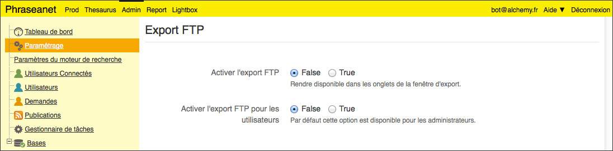

Exploiter les fonctionnalités de FTP
====================================

.. topic:: L'essentiel

  Phraseanet permet d'interagir avec des serveurs supportant le protocole de
  transfert de fichiers FTP.
  Voici quelques astuces permettant d'exploiter ces possibilités.

Activer les fonctionnalités FTP
-------------------------------

C'est un préalable obligatoire.

* Comme Administrateur, se rendre dans l'Admin puis dans la rubrique Paramètre
* Rechercher la ligne **Export FTP**
* Activer l'export FTP en ajustant le bouton radio sur **True**

Par défaut, lorsqu'activées les fonctionnalités d'export FTP ne sont disponibles
que pour les administrateurs. Ajuster si besoin le second bouton radio pour en
faire bénéficier tous les utilisateurs.
