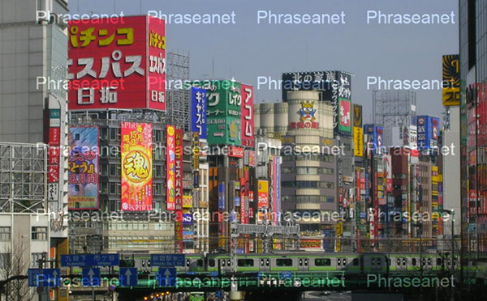

Personnaliser les filigranes
============================

Un filigrane (ou Watermark) est un logo qui se superpose aux prévisualisations.
Ce dispositif est une mesure dissuasive à l'utilisation abusive d'images.
Par défaut le filigrane se compose d'un croix barrant la surface d'une image
accompagnée du nom de la collection.
Il est possible de personnaliser les filigranes appliqués aux images pour
chacune des collections.

Caractéristiques du fichier de filigrane
----------------------------------------

Le fichier de filigrane doit être un fichier gif ou png de format carré,
contenant autant de pixels de côté que le plus grand côté de la sous définition
Preview.

Charger le fichier de filigrane
-------------------------------

Le filigrane est personnalisable pour chacune des collections Phraseanet.
Dans Phraseanet Admin, afficher la collection pour laquelle personnaliser le
filigrane.
A la section **Filigrane**, cliquer sur le bouton *Sélectionner* pour charger un
filigrane personnalisé.

Appliqué à une image, le filigrane donne le résultat suivant.

A savoir
--------

Après la mise à jour d'un filigrane vers un filigrane personalisé, et si des
médias sont déjà présents dans *Phraseanet*, il faut supprimer les fichiers de
caches préalablement créés par l'application.
Utiliser la commande suivante :

.. code-block::bash

    find /path/to/subdefs -name 'watermark_*' -exec rm {} \;
