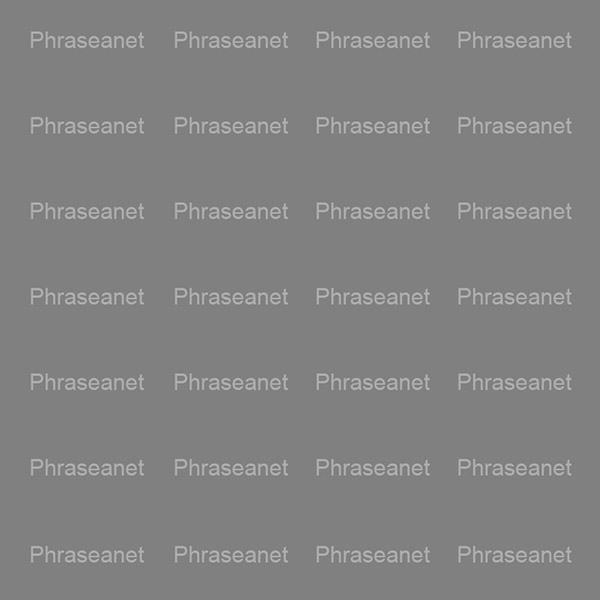

Personnaliser les filigranes
============================

Un filigrane (ou Watermark) est un logo qui se superpose aux prévisualisations.
Ce dispositif est une mesure dissuasive à l'utilisation abusive d'images.
Par défaut le filigrane se compose d'un croix barrant la surface d'une image
accompagnée du nom de la collection.
Il est possible de personnaliser les filigranes appliqués aux images pour
chacune des collections.

Caractéristiques du fichier de filigrane
----------------------------------------

Le fichier de filigrane doit être un fichier jpeg en niveau de gris carré
contenant autant de pixels de côté que le plus grand côté de la sous définition
Preview.

Charger le fichier de filigrane
-------------------------------

Le filigrane est personnalisable pour chacune des collections Phraseanet.
Dans Phraseanet Admin, afficher la collection pour laquelle personnaliser le
filigrane.
A la section **Filigrane**, cliquer sur le bouton *Sélectionner* pour charger un
filigrane personnalisé.

Comment est appliqué le filigrane ?
-----------------------------------

Le masque est appliqué tel quel au centre de la preview (sans mise à l'échelle).
Il faut donc veiller à ce que le watermark reste "compréhensible" même s'il est
tronqué en haut, en bas, à gauche ou à droite selon que l'image soit
horizontale, verticale ou panoramique.

Il est préférable d'avoir un watermark réduit au centre de l'image, ou un motif
répété plusieurs fois.

Les pixels *clairs* vont éclaircir l'image (monter la luminosité) et les
*foncés* vont assombrir l'image.
Le gris neutre (127 ou #808080) laisse l'image telle quelle : c'est la couleur
de choix pour créer le fond de masque.
Pour les motifs du filigrane, le tests montrent que trop monter la luminosité
crée des artefacts de couleur : mieux vaut donc se limiter la plage de gris.
La gamme des gris clairs donnent les meilleurs résultats (par exemple ceux
compris entre #0c0c0c et #f3f3f3 en valeurs ).

Voici un exemple de fichier de filigrane.

Appliqué à une image, le filigrane donne le résultat suivant.

.. image:: ../../images/Faq-filigrane1.jpg
    :align: center

A savoir
--------

Après la mise à jour d'un filigrane vers un filigrane personalisé, et si des
médias sont déjà présents dans *Phraseanet*, il faut supprimer les fichiers de
caches préalablement créés par l'application.
Utiliser la commande suivante :

.. code-block::bash

    find /path/to/subdefs -name 'watermark_*' -exec rm {} \;
