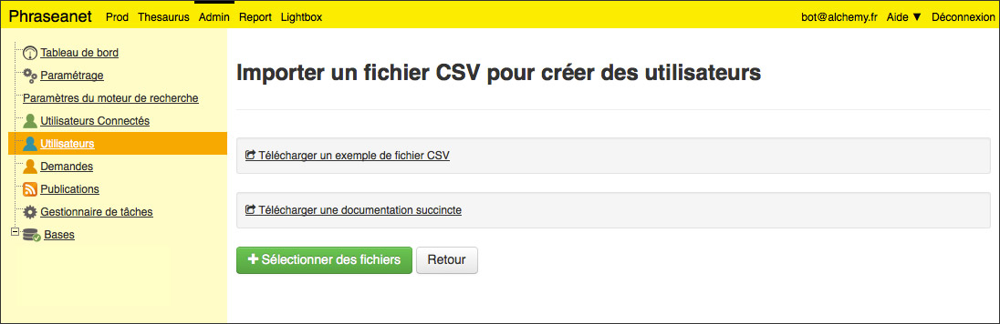

Ajouter des utilisateurs en masse
=================================

Dans certains cas, il n'est pas envisageable d'inscrire des dizaines ou des
centaines d'utilisateurs un a un *via* la procédure habituelle de création de
comptes.

Dans ce cas, le plus simple est de procéder à un import d'utilisateurs.

* Se rendre dans **Admin** puis à la rubrique **Utilisateurs**
* Cliquer sur le lien **Import**

L'interface affichée propose un exemple de fichiers CSV ainsi qu'une notice
explicative (en anglais).

Préparer le fichier CSV selon l'exemple proposé puis l'importer au moyen du
formulaire proposé.

L'import d'utilisateurs a été testé avec succès avec un fichier de 10 000
utilisateurs.

.. note::

    La procédure d'import est capable de détecter d'éventuels doublons dans les
    identifiants si bien que cette méthode de création de compte peut-être
    réutilisée régulièrement.
