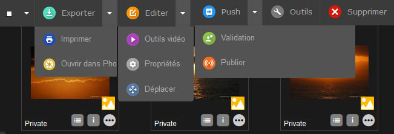

Actions sur les enregistrements
===============================
.. toctree::
    :maxdepth: 3

.. topic:: L'essentiel

    Les actions sur les enregistrements s'effectuent au moyen de commandes
    rassemblées dans des palettes d'actions.

    La :term:`palette principale <Palette des Actions>` placée sous
    le formulaire de recherche permet d'agir sur les enregistrements
    sélectionnés dans la zone d'affichage.

    Dans la zone de travail, la palette d'actions du panier ou du reportage
    ouvert permet d'intervenir sur les enregistrements qu'il contient ou qui
    y sont sélectionnés.

    Accessibles selon les droits des utilisateurs, certaines de ces commandes
    sont des fonctions de base, d'autres sont des fonctions étendues.

Les fonctions de base
---------------------

Sélection d'enregistrements par type
************************************

.. seealso::

    Consulter :ref:`la page consacrée aux sélections
    <Affichage-Selections-Type>` dans les fondamentaux.

Exporter et Imprimer
********************

.. seealso::

    Consulter :doc:`la page consacrée à l'export et à l'impression <Exporter>`
    dans les fondamentaux.

Les fonctions étendues
----------------------

Les fonctions étendues sont accessibles via les boutons des palettes d'actions
ou via les menus contextuels de ces boutons.

Éditer
******

Cette fonction permet d'éditer les notices des enregistrements. Compléter ou
modifier les descriptions documentaires accompagnant les *assets* à l'unité ou
en lots.

.. seealso::

    Se reporter à :doc:`la section dédiée à l'édition <Editer>`.

Dans la palette principale, le menu contextuel du bouton regroupe les fonctions
:ref:`Propriétés <Actions-Proprietes>` et :ref:`Déplacer <Actions-Deplacer>`.

.. _Actions-Proprietes:

Propriétés
**********

Cette action permet de modifier :

* les :term:`status <Status>` des enregistrements
* les types des documents sélectionnés

Modifier les status des enregistrements
^^^^^^^^^^^^^^^^^^^^^^^^^^^^^^^^^^^^^^^

Les status permettent de caractériser des enregistrements. Ils apportent des
informations relatives à leurs états : état d'avancement dans un *workflow*,
signalement de droits expirés, restriction d'accès à des populations
d'utilisateurs.

.. note::

    28 status sont paramétrables dans Phraseanet Admin. Ils peuvent mis en
    oeuvre pour des besoins de workflow, de mise en place de restrictions
    d'accès aux enregistrements ou de sélection d'enregistrements par des
    tâches personnalisées.

Pour éditer les status d'enregistrements :

* Sélectionner un ou plusieurs enregistrements dans la zone d'affichage ou dans
  un panier ou reportage ouvert
* Cliquer sur le bouton Propriétés dans la palette d'actions correspondante
* Manipuler les boutons radio pour agir sur l'état des status
* Cliquer sur Valider pour sauvegarder les modifications

.. note::

    L'édition d'état des status est aussi possible depuis la fenêtre Éditer.

    **Les interfaces étant asynchrones**, les symboles des status affichés sont
    mis à jour lors du rafraîchissement de l'interface.

Changer le type des documents
^^^^^^^^^^^^^^^^^^^^^^^^^^^^^

Cette action permet d'altérer le type des documents attribués automatiquement
lors de l'import. Elle est utile pour corriger les types des documents importés
au cas ou ils auraient été mal interprétés par la plateforme sur laquelle
est déployé Phraseanet.

* Sélectionner un ou plusieurs enregistrements dans la zone d'affichage ou dans
  un panier ou reportage ouvert
* Cliquer sur le bouton Propriétés dans la palette d'actions correspondante
* Sélectionner l'onglet Type des documents
* Choix le type à appliquer aux documents. Cette action peut être effectuée à
  l'unité ou par lot
* Cliquer sur Valider pour sauvegarder les modifications

.. _Actions-Deplacer:

Déplacer
********

L'action déplacer permet de déplacer des médias d'une collection à une autre
au sein d'une même base (il n'est pas possible de déplacer des enregistrements
d'une base à une autre).

* Sélectionner un ou plusieurs enregistrements dans la zone d'affichage ou dans
  un panier ou reportage ouvert
* Cliquer sur le bouton **Déplacer**
* Sélectionner la collection dans laquelle les enregistrements doivent être
  déplacés
* Cliquer sur **Valider** pour effectuer l'action

.. note::

    Asynchrone, l'interface ne rend pas compte du changement de collection.
    Rafraichir l'affichage pour contrôler les déplacements effectués.

Push, validation, bridge et publications
****************************************

Le bouton Push (et son menu contextuel dans la palette principale) regroupe les
fonctions de Push, de validation, le Bridge et l'action Publier.
Ces fonctionnalités permettant de pousser et de promouvoir des enregistrements
vers des destinataires ou des applications.

.. seealso::

    * Consulter la section dédiée au :doc:`Push et à la validation <Push>`
    * Consulter la section dédiée au :ref:`Bridge <Publier-Bridge>`
    * Consulter la section dédiée aux :ref:`publications <Publier-Publications>`

Outils
******

Le bouton **Outils** regroupe des actions qui permettent d'agir sur :

* **Les vignettes ou images de choix** (régénération, substitution, rotation,
  options de partage des fichiers de sous-définition, choix de la vignette pour
  les vidéos)
* **La substitution de documents orignaux ou de sous définitions** si la
  fonctionnalité est activée dans le paramétrage de l'application
* **D'afficher les informations de métadonnées** existantes dans un document
  sélectionné

Sélectionner un ou plusieurs documents dans la zone d'affichage ou dans un
panier ou reportage ouvert dans la zone de travail puis cliquer sur le bouton
Outils. Choisir un des onglets proposés :

* **Régénération de sous-définitions** : pour recréer les vignettes et
  sous-définitions à partir des documents originaux des enregistrements
  sélectionnés
* **Outils vidéos** : Disponible si et seulement si l'unique média sélectionné
  est de type vidéo, l'onglet propose les outils permettant le choix d'une
  vignette de présentation personnalisée.
* **Rotation** : permet des rotations des vignettes, des sous-définitions et
  des documents originaux pour les médias sélectionnés, lorsque cela est 
  possible.
* **Substitution** : Permet de remplacer le document original par un autre. Une
  case à cocher permet de choisir si la vignette et l'image de choix doivent
  être reconstruites
* **Substitution des sous-défs** : pour remplacer la vignette par un autre
  visuel
* **Métadonnées** : pour afficher l'ensemble des informations de métadonnées
  lues par l'utilitaire **Exiftool** dans le média original du document
  sélectionné (cet onglet n'est disponible que si un seul document est
  sélectionné)
* **Partage des sous-définitions** : pour désactiver ou activer les permaliens
  pointant vers les fichiers ressources (documents originaux, sous-définitions
  et vignettes). Les permaliens désactivés retournent des codes d'erreur
  HTTP 404.

Supprimer
*********

**Dans la zone d'affichage**, l'action Supprimer permet de supprimer des
enregistrements (documents, paniers ou reportages).

* Sélectionner un ou plusieurs enregistrements dans la zone d'affichage ou
  dans un panier ou reportage ouvert
* Cliquer sur le bouton Supprimer puis confirmer pour supprimer les éléments
  sélectionnés

**Dans la zone de travail**, cliquer sur Supprimer dans la palette d'actions
d'un panier ou reportage ouvert supprime le panier ou le reportage.
Dans le cas d'un reportage, une case à cocher permet de choisir si les
documents contenus dans le reportage doivent être supprimés.
