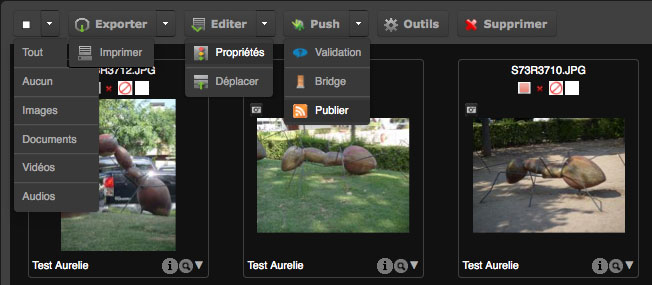
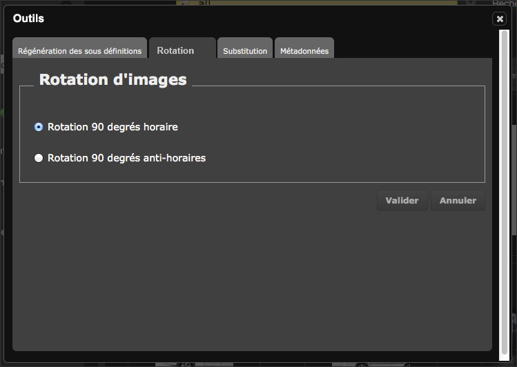

La Palette des Actions
======================
.. toctree::
    :maxdepth: 3

.. topic:: L'essentiel

    La Palette des Actions dans *Phraseanet Production* vous permet d'effectuer
    un grand nombre d'actions sur les documents.

    Plusieurs actions sont accessibles à partir de cette :term:`Palette
    <Palette des Actions>`, on peut différencier les fonctions de base des
    fonctions étendues.

    **Ces différentes actions sont accessibles en fonction des droits des
    utilisateurs**. Ces droits sont tous paramétrables dans l'interface
    :doc:`Phraseanet Administration <Administration>`.

**Les fonctions de base :**

* :doc:`Exporter <Exporter>`
* :doc:`Imprimer <Exporter>`

**Les fonctions étendues :**

* `Éditer`_
* `Déplacer`_
* `Propriétés`_
* `Push`_
* `Supprimer`_
* `Outils images`_

Présentation de la Palette
--------------------------

La Palette des Actions se trouve dans l'interface de *Phraseanet Production*
dans la partie haute de la fenêtre, au-dessous du formulaire de recherche.
Selon les droits de l'utilisateur, la palette peut proposer un nombre variable
d'actions.

.. image:: ../../images/Palette.jpg
    :align: center

A droite de chaque bouton d'action se trouve une flèche sur laquelle l'
utilisateur peut cliquer pour dérouler l'ensemble des actions disponibles.

Les fonctions de base
---------------------

Exporter et Imprimer
********************

Plusieurs modes d'export sont proposés : le téléchargement, envoyer par email ou
encore envoyer via le :term:`FTP <FTP>`.
L'impression complète les fonctions les plus élémentaires de la palette des
actions.

:doc:`Se reporter à la section dédiée à l'Export et à l'impression dans
Phraseanet <Exporter>`.

Les fonctions étendues
----------------------

Les fonctions étendues sont accessibles via les boutons de la palette des
actions ou via des menus contextuels d'actions.

Éditer
******

Cette fonction permet d'éditer des enregistrements dans *Phraseanet* : édition
des médias, des paniers. Compléter ou modifier les descriptions documentaires
accompagnant les assets à l'unité ou en lots.

:doc:`Se reporter à la section dédiée à l'édition <Editer>`.

Le menu contextuel du bouton éditer regroupe également les fonctions *Propriétés*
et *Déplacer*.

Propriétés
^^^^^^^^^^

Cette action permet de modifier :

* les :term:`status <Status>` des documents
* les *types mimes* des documents sélectionnés

Les Status sont comme des "interrupteurs" en position "On" ou "Off" et sont
applicables sur les médias et les reportages.
Leurs mises en oeuvre s'effectuent dans *Phraseanet Administration* et permet le
nommage des Status et le choix de minilogos associés.
A travers la gestion des utilisateurs, il est possible de lier des droits
utilisateurs en fonction de l'état de status.

.. note::

    Il existe 32 :term:`status <Status>`. 28 sont paramétrables et
    peuvent être utilisés pour des besoins de workflow ou la mise en place
    des restrictions d’accès aux documents entre autres.
    Le changement d'état des status est aussi disponible directement
    depuis la fenêtre :doc:`Éditer <Editer>`.

**Changer les status des documents**

Cette action permet de changer les status des documents.

* Sélectionner une ou plusieurs vignettes, un :term:`panier <Panier>` ou un
  :term:`reportage <Reportage>` puis cliquer sur Propriétés.

La fenêtre s'ouvre.

* Cocher la case correspondante au nouveau :term:`status <Status>` (plusieurs
  status possibles).
* Cliquer sur **Valider** pour enregistrer les changements.

.. image:: ../../images/Actions-Proprietes-status.jpg
    :align: center

**Changer le type des documents**

Cette action permet de changer le type mime des documents.

Elle est utile si des documents ajoutés n’ont pas été correctement interprétés
et qu’il faut les associer "au bon" type de fichier.

* Sélectionner une ou plusieurs vignettes, un :term:`panier <Panier>` ou un
  :term:`reportage <Reportage>` et cliquer sur **Propriétés**.

La fenêtre s'ouvre.

* Cliquer sur l’onglet **Type** puis changer le type des documents.
* Cliquer sur **Valider** pour enregistrer les modifications.

.. image:: ../../images/Actions-Proprietes-types.jpg
    :align: center

Déplacer
^^^^^^^^

**Déplacer** permet de déplacer des médias d'une :term:`collection <Collection>`
à une autre.

* Sélectionner une ou plusieurs médias puis cliquer sur la rubrique
  **Déplacer**.

.. image:: ../../images/Actions-Deplacer.jpg
    :align: center

* Sélectionner la collection dans laquelle les médias doivent être déplacés
* Cliquer sur **Ok** pour effectuer cette action.

Les médias sont alors déplacés dans la collection sélectionnée.

.. note::

    Asynchrone, l'interface ne rend pas compte du changement de
    collection. Relancer la recherche sur les médias déplacés si vous voulez
    contrôler les déplacements effectués.

Push
****

On utilise le :term:`"push" <Push>` dans *Phraseanet* pour pousser des documents
vers un ou plusieurs destinataires.
Le menu contextuel du bouton Push regroupe également les fonctions de
*Validation*, le *Bridge* et l'action *Publier*.

:doc:`Consulter la section dédiée au Push et à la validation<Push>`.
:doc:`Consulter la section dédiée au Bridge<Push>`.
:doc:`Consulter la section dédiée aux publications<Push>`.

Supprimer
*********

Cette action permet de supprimer des :term:`enregistrements <Enregistrement>`
(Paniers, documents de la :term:`base`/Collection, Reportages).

* Sélectionner l'élément puis cliquer sur l'icône le bouton **Supprimer**.

.. image:: ../../images/Actions-Supprimer.jpg
    :align: center

Une boîte de dialogue demande la confirmation de la suppression.

Outils images
*************

Cette icône permet d'effectuer des actions sur les vignettes ou images de choix
(régénération, substitution, rotation, choix de la vignette pour les vidéo),
sur le remplacement d’un document orignal, ou d’afficher toutes les informations
sur les métadonnées existantes dans le document sélectionné.

* Sélectionner une image et cliquer sur l'icône **Outils**.

La fenêtre Outils s'ouvre.

Choisir un des onglets proposés :

* **Régénération sous-défs** : pour créer de nouvelles vignettes et
  sous-définitions des médias sélectionnés.
* **Outils vidéos** : Disponible si et seulement si un média de type vidéo est
  sélectionné, l'onglet propose les outils permettant de choisir une vignette
  de présentation personnalisée pour les médias vidéos.

* **Retourner sous défs** : permet des rotations de vignettes et d'images de
  choix pour les médias sélectionnés.
* **Substitution document** : Permet de remplacer le document original par un
  autre (une case à cocher permet de choisir si la vignette et l’image de
  choix doivent être reconstruites).
* **Substitution des sous-défs** : Pour remplacer la vignette et l’image de
  choix par un autre fichier.
* :term:`Métadonnées <Métadonnées>` : Permet d’afficher l’ensemble
  des informations de métadonnées :term:`EXIF <EXIF>`, :term:`IPTC <IPTC>`,
  :term:`XMP <XMP>` lisibles dans le document sélectionné.

Pour appliquer les modifications apportées, cliquer sur **Valider**.
