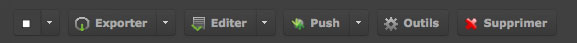
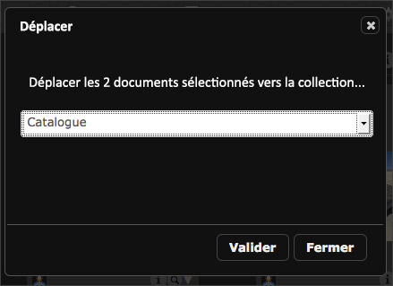
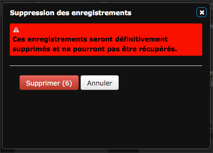

La Palette des Actions
======================
.. toctree::
    :maxdepth: 3

.. topic:: L'essentiel

    La Palette des Actions dans *Phraseanet Production* permet d'effectuer des
    actions sur les documents.

    Plusieurs actions sont accessibles à partir de cette :term:`Palette
    <Palette des Actions>`. Certaines sont des fonctions de base, d'autres des
    fonctions étendues.

    **Les actions sont accessibles en fonction des droits des utilisateurs**.
    Ces droits sont tous paramétrables dans l'interface
    :doc:`Phraseanet Administration <Administration>`.

**Les fonctions de base :**

* :doc:`Exporter <Exporter>`
* :doc:`Imprimer <Exporter>`

**Les fonctions étendues :**

* `Éditer`_
* `Déplacer`_
* `Propriétés`_
* `Push`_
* `Supprimer`_
* `Outils`_

Présentation de la Palette
--------------------------

La Palette des Actions est située dans la partie haute la zone d'affichage,
au-dessous du formulaire de recherche.
Selon les droits de l'utilisateur, la palette peut proposer un nombre variable
d'actions.

A droite de certains boutons d'action se trouve une flèche permettant l'accès à
un menu contextuel donnant davantage d'options.

.. image:: ../../images/Actions-PaletteBeta.jpg
    :align: center

Les fonctions de base
---------------------

Exporter et Imprimer
********************

Plusieurs modes d'export sont proposés : le téléchargement, envoyer par email ou
encore envoyer via le :term:`FTP <FTP>`.
L'impression complète les fonctions les plus élémentaires de la palette des
actions.

:doc:`Se reporter à la section dédiée à l'Export et à l'impression dans
Phraseanet <Exporter>`.

Les fonctions étendues
----------------------

Les fonctions étendues sont accessibles via les boutons de la palette des
actions ou via des menus contextuels d'actions.

Éditer
******

Cette fonction permet d'éditer des enregistrements dans *Phraseanet* : édition
des médias, des paniers. Compléter ou modifier les descriptions documentaires
accompagnant les assets à l'unité ou en lots.

:doc:`Se reporter à la section dédiée à l'édition <Editer>`.

Le menu contextuel du bouton éditer regroupe également les fonctions *Propriétés*
et *Déplacer*.

Propriétés
^^^^^^^^^^

Cette action permet de modifier :

* les :term:`status <Status>` des enregistrements
* les *types mimes* des documents sélectionnés

Changer les status des documents
~~~~~~~~~~~~~~~~~~~~~~~~~~~~~~~~

Les :term:`status <Status>` permettent de caractériser des enregistrements en
leurs affectants des indicateurs correspondants à des états.
Leurs mises en oeuvre s'effectuent dans *Phraseanet Administration* (définition
et choix de minilogos associés).
A travers la gestion des utilisateurs, il est possible de lier des droits
utilisateurs en fonction de l'état de status.

.. note::

    Il existe 32 :term:`status <Status>`. 28 sont paramétrables et
    peuvent être utilisés pour des besoins de *workflow* ou de mise en place
    de restrictions d’accès aux enregristrements.
    Le changement d'état des status est aussi disponible directement
    depuis la fenêtre :doc:`Éditer <Editer>`.

* Sélectionner une ou plusieurs vignettes, un :term:`panier <Panier>` ou un
  :term:`reportage <Reportage>` puis cliquer sur Propriétés.

La fenêtre s'ouvre.

.. image:: ../../images/Actions-Proprietes-status.jpg
    :align: center

* Cocher la case correspondante au nouveau :term:`status <Status>` (plusieurs
  status possibles).
* Cliquer sur **Valider** pour enregistrer les changements.

Changer le type des documents
~~~~~~~~~~~~~~~~~~~~~~~~~~~~~

Cette action permet de changer le type des documents attribués automatiquement
lors de l'import dans *Phraseanet*.

Elle est utile si des documents ajoutés n’ont pas été correctement interprétés
et qu’il faut les associer "au bon" type de fichier ou type *mime*.

* Sélectionner une ou plusieurs vignettes, un :term:`panier <Panier>` ou un
  :term:`reportage <Reportage>` et cliquer sur **Propriétés**.

La fenêtre s'ouvre.

* Cliquer sur l’onglet **Type** puis changer le type des documents.
* Cliquer sur **Valider** pour enregistrer les modifications.

.. image:: ../../images/Actions-Proprietes-types.jpg
    :align: center

Déplacer
^^^^^^^^

**Déplacer** permet de déplacer des médias d'une :term:`collection <Collection>`
à une autre.

* Sélectionner une ou plusieurs médias puis cliquer sur la rubrique
  **Déplacer**.

* Sélectionner la collection dans laquelle les médias doivent être déplacés
* Cliquer sur **Valider** pour effectuer l'action.

Les médias sont alors déplacés dans la collection sélectionnée.

.. note::

    Asynchrone, l'interface ne rend pas compte du changement de
    collection. Relancer la recherche sur les médias déplacés si vous voulez
    contrôler les déplacements effectués.

Push
****

Le bouton :term:`"push" <Push>` et son menu contextuel regroupe les fonctions de
*Validation*, le *Bridge* et l'action *Publier*.
Ces fonctionnalités permettant de pousser et de promouvoir des enregistrements
vers des destinataires ou des applications.

* :doc:`Consulter la section dédiée au Push et à la validation<Push>`.
* :doc:`Consulter la section dédiée au Bridge<Push>`.
* :doc:`Consulter la section dédiée aux publications<Push>`.

Supprimer
*********

Cette action permet de supprimer des :term:`enregistrements <Enregistrement>`
(Paniers, documents de la :term:`base`/Collection, Reportages).

* Sélectionner les enregistrements à supprimer puis cliquer sur l'icône le
  bouton **Supprimer**.

Une boîte de dialogue demande la confirmation de la suppression.

Outils
******

Outils regroupe des actions permettant d'agir sur les vignettes ou images de
choix (régénération, substitution, rotation, choix de la vignette pour les
vidéo), sur la substitution de documents orignaux ou de sous définitions, ou
d’afficher toutes les informations de métadonnées existantes dans un document
sélectionné.

* Sélectionner une document, cliquer sur **Outils**.

La fenêtre Outils s'ouvre.

.. image:: ../../images/Actions-Outilsimages.jpg
    :align: center

Choisir un des onglets proposés :

* **Régénération de sous-définitions** : pour recréer de nouvelles vignettes et
  sous-définitions des médias sélectionnés.
* **Outils vidéos** : Disponible si et seulement si le média sélectionné est
  sélectionné, l'onglet propose les outils permettant le choix d'une vignette
  de présentation personnalisée.

.. image:: ../../images/Actions-OutilsThumbnailVideo.jpg
    :align: center

* **Rotation** : permet des rotations de vignettes et d'images de
  choix pour les médias sélectionnés.
* **Substitution** : Permet de remplacer le document original par un
  autre. Une case à cocher permet de choisir si la vignette et l’image de
  choix doivent être reconstruites.
* **Substitution des sous-défs** : Pour remplacer la vignette et l’image de
  choix par un autre fichier.
* :term:`Métadonnées <Métadonnées>` : Permet d’afficher l’ensemble
  des informations de métadonnées :term:`EXIF <EXIF>`, :term:`IPTC <IPTC>`,
  :term:`XMP <XMP>` lisibles dans le document sélectionné.

Pour appliquer les modifications apportées, cliquer sur **Valider**.
