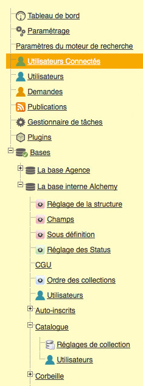

Administration
==============
.. toctree::
    :maxdepth: 3

.. topic:: L'essentiel

    L'interface *Phraseanet Admin* vous permet d'administrer et de paramétrer
    l'application Phraseanet.

    Les écrans et jeux de formulaires permettent de gérer et de monitorer la solution
    applicative, d'effectuer des inscriptions et de paramétrer les droits des
    utilisateurs, de déployer et de paramétrer des bases et des collections
    documentaires.

L'interface *Phraseanet Admin* comporte un cadre à gauche de l'écran qui affiche
un menu listant les différentes rubriques d'administration.

Si l'utilisateur ne voit pas certaines de ces rubriques, c'est que ses :doc:`droits <AdministrationUtilisateurs>` ne
le lui permettent pas.

Certaines de ces rubriques comportent des sous-rubriques. Cliquer sur les boutons " + "
pour les afficher et les boutons " - " pour les masquer.

Pour accéder à une rubrique ou sous-rubrique de Phraseanet Admin, cliquer sur son icône
ou son intitulé pour l'afficher dans la partie droite de l'écran.

Afin de présenter les principale fonctionnalités du module Phraseanet Admin, nous
proposons de suivre le plan suivant.

.. toctree::
    :maxdepth: 2
    :glob:

    AdministrationSolution
    AdministrationUtilisateurs
    AdministrationBasesCollections
