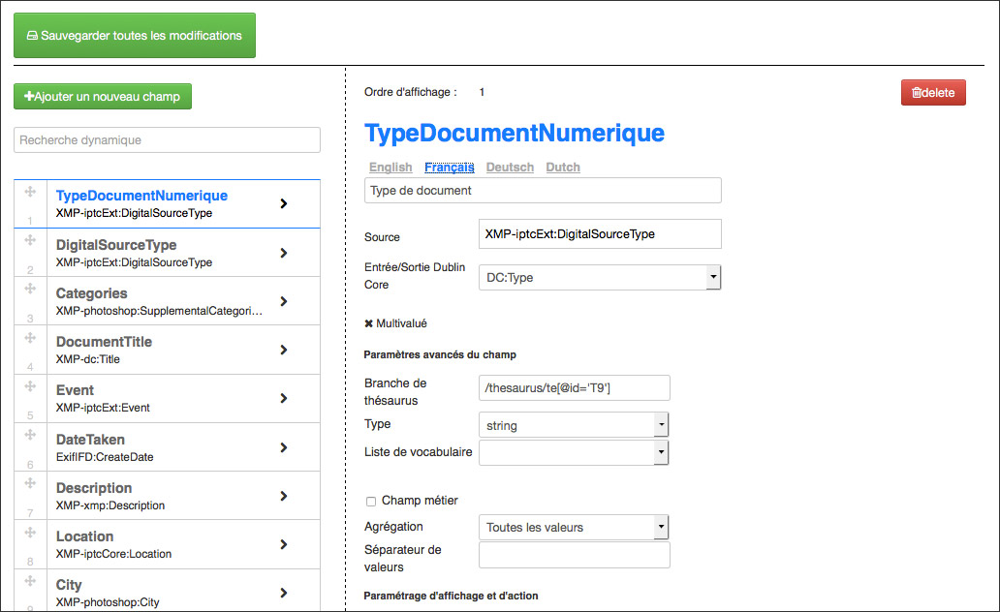
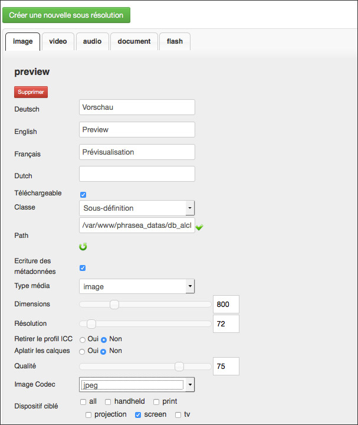
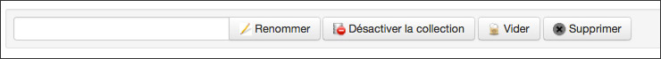

Administration des bases et des collections
===========================================
.. toctree::
    :maxdepth: 3

.. topic:: L'essentiel

    Une application Phraseanet est organisée en bases et en collections.
    A chacune des bases correspond une structure documentaire paramétrable, les
    collections pouvant être assimilées à des sous ensembles d'une base.

.. _Parametrage-Structure:

Paramétrage par base
--------------------

Cliquer sur une base pour afficher son état.

.. image:: ../../images/Administration-base.jpg
    :align: center

Cet écran montre l'état d'indexation de la base et permet des actions dont :

* La ré-indexation d'une base
* La création de collections dans la base
* La suppression des logs
* La purge des enregistrements de la base
* La suppression de la base

Système multibases, chacune des bases d'une solution Phraseanet est finement
paramétrable. Pour ce faire, cliquer sur l'icône **+**.

Réglage de la structure
***********************

La rubrique affiche la structure documentaire de la base sélectionnée sous la
forme d'un fichier XML éditable.

Il est rare de devoir manipuler le paramétrage d'une base par cette interface.
Utilisez les interfaces `Champs`_, `Sous définition`_ ou `Réglage des Status`_.

Champs
******

Champ permet de définir et d'éditer la structure documentaire d'une base au
moyen de formulaires dans une interface graphique.

Les champs de la structure documentaire sont définis par des propriétés
paramétrables :

* Un nom unique
* Un type texte, texte multivalué, date, ...etc.
* Des labels ou intitulés localisés en fonction des langues d'interface
* Une présence obligatoire ou non
* Une source de données optionnelle
* Une équivalence :term:`Dublin Core` optionnelle
* Une propriété de :term:`champ métier <Business field ou Champ métier>`
  optionnelle
* L'ordre

.. note::

    **Les types de champs sont liés au moteur Phrasea**.
    :doc:`Se reporter aux explications relatives au typage des champs dans la FAQ <../../FAQ/Parametrage/type-des-champs-phrasea>`.

Déclarer une facette pour un champ
^^^^^^^^^^^^^^^^^^^^^^^^^^^^^^^^^^

Pour déclarer une facette pour un champ :

* Sélectionner le champ dans la partie gauche du formulaire
* Fixer un nombre de valeurs dans le champs *Agrégation* du formulaire de
  paramétrage
* Recréer les index ElasticSearch

.. note::

    D'une manière générale, et à l'exception des changements de labels, les
    opérations sur le structure documentaire, implique de recréer et de
    reconstruire les index Elasticsearch.

    :ref:`Se reporter aux opérations sur les index <Operations-sur-les-index>`.

    L'opération "populate" peut, en fonction du volume du fonds archivé,
    prendre plusieurs heures.

Sous définition
***************

La rubrique Sous définition permet l'ajout et l'édition les sous définitions
des médias intégrés dans Phraseanet.

Les natures des sous définitions dépendent des documents originaux intégrés.
Le tableau ci-dessous liste des exemples de sous définitions fabriquées par
l'application.

+------------------------------------------------+------------------------------------------------------------+
| Nature du média original                       | Nature de la sous définition                               |
+================================================+============+==========+===============+=========+==========+
| Image de type Jpeg, psd, gif, png...           | Sous définition au format Jpeg, Png ou Tiff (paramétrable) |
+------------------------------------------------+------------------------------------------------------------+
| Vidéo Mpeg, Avi, Mov...                        | Sous définition au format Mpeg4, Jpeg ou Gif               |
+------------------------------------------------+------------------------------------------------------------+
| Document sonore de type Wav, Mp3...            | Sous définition au format Mp3 ou Jpeg                      |
+------------------------------------------------+------------------------------------------------------------+
| Document bureautique Pdf, Word...              | Animation Flash (Swf) ou Jpeg                              |
+------------------------------------------------+------------------------------------------------------------+

.. warning::

    Les sous définitions *thumbnail* et *preview* sont indispensables.
    Elles sont utilisées dans les interfaces Phraseanet pour afficher
    les vignettes et images de choix des médias.

Réglage des Status
******************

Les :term:`status <Status>` permettent d'indiquer des états sur des documents
et d'introduire des limitations d'accès aux enregistrements à des utilisateurs
indépendamment de la notion de collection.
Liés à la structure documentaire d'une base, il est possible d'intégrer
jusqu'à 28 status.

* Pour déclarer un status, cliquer sur l'icône page pour éditer un nouveau
  status puis remplir le formulaire.
* Pour modifier un status existant, cliquer sur l'icône stylo.
* Pour supprimer un status, cliquer sur l'icône croix puis confirmer la
  suppression.

CGU (Conditions générales d'utilisation)
****************************************

Les conditions générales d'utilisation sont proposées aux utilisateurs lors
de l'inscription, lors d'une première connexion ou lors de modification
de celles-ci.

* Saisir ou copier-coller un texte dans les différentes langues proposées.
* Cocher la case "Les utilisateurs doivent accepter..." pour faire valider aux
  utilisateurs déjà inscrits des conditions générales mises à jour.
* Cliquer sur **Mettre à jour** pour enregistrer les modifications.

Ordre des Collections
*********************

.. image:: ../../images/Administration-ordrecollections.jpg
    :align: center

Par défaut, les collections sont affichées dans Phraseanet par ordre de
création. Il est possible d'altérer cette ordre.

* Cliquer sur la rubrique **Ordre des collections**
* Cliquer sur une collection
* Cliquer sur **Monter** ou **Descendre** ou cliquer sur **Ordre Alphabétique**
* Cliquer sur **Valider** pour enregistrer les changements

Les collections
---------------
Les :term:`collections <Collection>` sont des sous ensembles d'une base dont
elles partagent le paramétrage. La mise en place de collections répond à des
besoins de segmentation d'un fonds documentaire et/ou à l'attribution de
droits utilisateurs particuliers sur des fonds.

Créer une collection
********************

Pour créer une collection, cliquer sur le titre de la base dans laquelle créer
la collection puis cliquer sur **Créer une collection**.

Indiquer le nom de la collection à créer dans le champ prévu à cet effet puis
valider le formulaire.

.. note::

    Lors de la création d'une collection, il est possible d'appliquer
    (dupliquer) les droits utilisateurs d'une collection existante.

.. _Afficher-Collection:

Afficher une collection
***********************

Cliquer sur le titre de la collection pour afficher ses informations.

.. image:: ../../images/Administration-affichercollection.jpg
    :align: center

L'écran donne les informations essentielles sur la collection.
Il permet de la renommer, de la désactiver (voir section
:ref:`activate-collection`), de la vider ou de la supprimer.

Afficher les détails d'une collection
*************************************

Cliquer sur **Détails** pour afficher un inventaire du contenu de la collection.

.. image:: ../../images/Administration-afficherdetail.jpg
    :align: center

Le tableau liste les objets composant la collection (enregistrements, documents,
sous résolutions, vignettes), les nombres par objet, la taille en méga-octets,
la taille en giga-octets.

Pour masquer les détails de la collection, cliquer sur **Retour**.

.. _AdministrationBasesCollections-Gestionnaires:

Gérer les gestionnaires de commande
***********************************

Un gestionnaire de commande est un utilisateur disposant d'un droit de réponse
aux demandes de téléchargement de documents originaux émises par des
utilisateurs ne bénéficiant pas des droits de téléchargements.

.. note::

    Les gestionnaires de commande reçoivent les demandes de
    téléchargement par notifications dans l'interface Phraseanet et par
    email.

**Pour ajouter un gestionnaire de commande**, sur la collection affichée, saisir
le nom, prénom ou identifiant de l'utilisateur dans le formulaire d'ajout de
gestionnaires. Valider le choix proposé par le dispositif d'auto-complétion.

**Pour supprimer un gestionnaire de commande**, décocher la case à cocher
précédent son nom d'utilisateur puis **Valider**.

Marquage d'une collection
*************************

Pour appliquer un marquage sur les documents publiés à partir de Phraseanet sur
d'autres sites, sélectionner l'une des trois options proposées dans le groupe de
boutons radio.

.. image:: ../../images/Administration-marquagecollection.jpg
    :align: center

* Cocher la case  **Par défaut** pour n’appliquer aucun marquage,

Ou

* Cocher la case **Fichier de filigrane** pour appliquer le filigrane par
  défaut ou s’appuyer d'un fichier de filigrane préalablement chargé.

Ou

* Cocher la case **Bandeau de Notice** pour ajouter un bandeau sous la dernière
  ligne de pixels des fichiers images (ceci nécessite un paramétrage des
  informations à afficher sur le bandeau "champs, logo").

Autres actions sur les collections
**********************************

Un formulaire regroupe d'autres actions sur la collection sélectionnée.

Définir des labels
^^^^^^^^^^^^^^^^^^

Les labels permettent d'attribuer des noms de collections dans chacune des
langues d'interface de l'application.
Pour définir ou modifier les labels d'une collection, remplir le formulaire
puis cliquer sur le bouton **Définir les labels**.

.. _activate-collection:

Activer ou désactiver une collection
^^^^^^^^^^^^^^^^^^^^^^^^^^^^^^^^^^^^

Par défaut, les collections crées sont activées. Cela signifie qu'elles sont
publiées et que les utilisateurs qui y ont accès peuvent parcourir son contenu.

* Pour désactiver une collection et arrêter sa publication, cliquer sur
  **Désactiver la collection**.
* Pour activer une collection, cliquer sur **Activer la collection**.

Renommer une collection
^^^^^^^^^^^^^^^^^^^^^^^

Saisir un nouveau nom de collection puis cliquer Renommer.

Vider une collection
^^^^^^^^^^^^^^^^^^^^

Vider une collection a pour effet de supprimer définitivement les
enregistrements (documents, sous définitions et notices) d'une collection.

Cette action est définitive et s'applique sur les documents, les
sous définitions et les notices.

Cliquer sur **Vider la collection** pour supprimer les enregistrements
d'une collection.

Supprimer une collection
^^^^^^^^^^^^^^^^^^^^^^^^

Cliquer sur **Supprimer** la collection pour supprimer la collection de la base.

.. note::

    Pour être supprimée, la collection doit être vide.

Personnalisation d'une collection
*********************************

Une collection est personnalisable par un ensemble d'éléments graphiques
distinctifs.

Minilogo
^^^^^^^^

Pour ajouter un logo symbolisant la collection :

* Cliquer sur le bouton **Sélectionner des fichiers** pour sélectionner un logo
  (fichier au format Gif ou Png, taille maximum conseillée : 30 pixels dans
  la hauteur).

Filigrane
^^^^^^^^^

Utiliser le formulaire proposé pour ajouter un filigrane (ou watermark)
personnalisé à appliquer aux sous résolution des documents de la collection.

.. note::

    Le filigrane est appliqué aux documents images visualisés par les
    utilisateurs disposants de la case No watermark décochée.

.. seealso::

    :doc:`Se reporter à la section consacrée au filigrane dans la FAQ.<../../FAQ/Personnalisation/Filigrane>`

Stamp
^^^^^

Un stamp ajoute un bandeau intégrant un logo et certaines metadonnées à
l'export des documents originaux des enregistrements de type image.

La configuration du stamp doit être complétée par l'édition de balises XML dans
les préférences de collections.

.. seealso::

    :doc:`Se reporter à la section consacrée à la mise en place d'un Stamp logo dans la FAQ.<../../FAQ/Personnalisation/Stamp-logo>`

.. _AdministrationBasesCollections-valeurs:

Préférences : Valeurs suggérées
*******************************

Les valeurs suggérées sont des menus de choix déroulants qui apparaissent dans
le formulaire d'édition. Elles permettent une indexation rapide à partir d'un
vocabulaire suggéré. Les valeurs sont éditables par collections et par champs.

L'édition des valeurs suggérées s'effectue soit via un formulaire d'édition en
 mode graphique soit dans une vue XML.

* Sélectionner le champ pour lequel éditer des valeurs
* Renseigner les valeurs souhaitées

Dans la vue graphique, il est possible de trier les valeurs en cliquant sur
une valeur affichées.

**Pour supprimer une valeur**, la sélectionner puis cliquer sur **Supprimer**.
