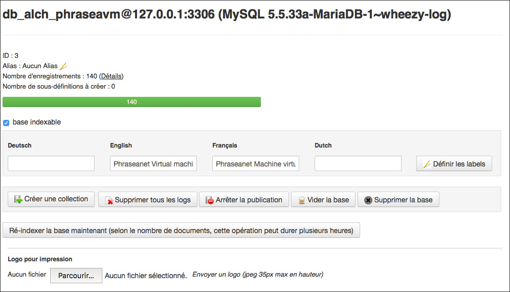
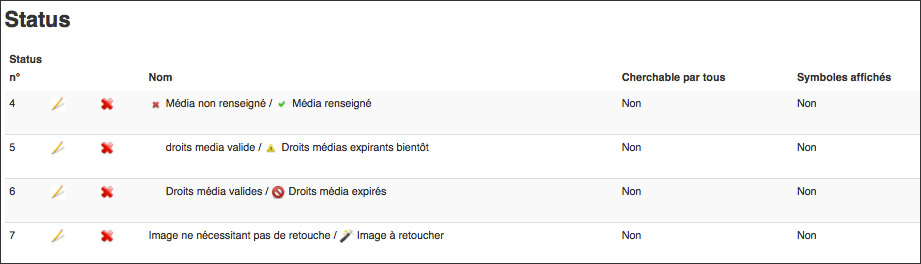
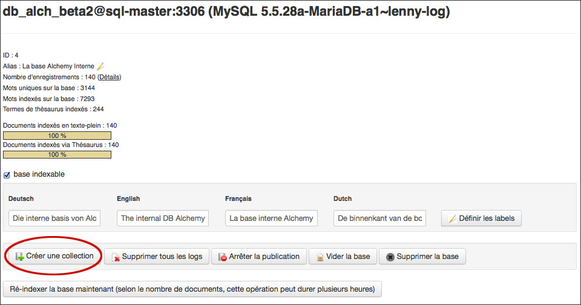
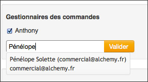

Administration des bases et des collections
===========================================
.. toctree::
    :maxdepth: 3

.. topic:: L'essentiel

    Une application Phraseanet est organisée en bases et en collections.
    A chacune des bases correspond une structure documentaire paramétrable, les
    collections pouvant être assimilées à des sous ensembles d'une base.

Paramétrage par base
--------------------

Cliquer sur une base pour afficher le tableau d'état d'une base Phraseanet.

Cet écran montre l'état d'indexation de la base et permet des actions dont :

* La ré-indexation d'une base
* La création de collections dans la base
* La suppression des logs
* La purge des enregistrements de la base
* La suppression de la base

Système multibase, chacune des bases d'une solution Phraseanet est finement
paramétrable. Pour cela, cliquer sur l'icône **+**.

Réglage de la structure
***********************

La rubrique **Réglage de la structure** permet d'afficher la structure
documentaire de la base sélectionnée sous la forme d'un fichier xml éditable.

.. image:: ../../images/Administration-structurexml.jpg
    :align: center

Il est rare de devoir manipuler le paramétrage d'une base par cette interface,
les interfaces `Champs`_ , `Sous définition`_ ou `Réglage des status`_ étant
bien plus conviviales pour effectuer des paramétrages.

Champs
******

La rubrique **Champ** permet de définir et d'éditer la structure documentaire d'
une base Phraseanet au moyen de formulaires dans une interface graphique.

.. image:: ../../images/Administration-structurechamps.jpg
    :align: center

Chacun des champs de la structure documentaire est défini par des propriétés
paramétrables :

* Un titre
* Un type texte, texte multivalué ou date
* Des labels ou intitulés localisés en fonction des langues d'interface
* Une présence obligatoire ou non
* Une source de données optionnelle
* Une source :term:`Dublin Core <Dublin Core>` optionnelle
* Une propriété de :term:`champ métier <Business field ou Champ métier>`
  optionnelle
* L'ordre
* ...etc.

Sous définition
***************

La rubrique *Sous définition* permet d'ajouter et d'éditer les sous définitions
des médias de type image, vidéo et audio intégrés dans Phraseanet.

La nature des sous définitions dépend de la nature des documents originaux
intégrés dans Phraseanet.
Le tableau ci-dessous liste quelques exemples types de sous définitions
fabriquées par l'application.

+------------------------------------------------+---------------------------------------+
| Nature du média original                       | Nature de la sous définition          |
+================================================+============+==========+===============+
| Image de type Jpeg, psd, gif, png...           | Sous définition au format Jpeg        |
+------------------------------------------------+---------------------------------------+
| Vidéo Mpeg, Avi, Mov...                        | Sous définition au format Mpeg4       |
+------------------------------------------------+---------------------------------------+
| Document sonore de type Wav, Mp3...            | Sous définition au format Mp3         |
+------------------------------------------------+---------------------------------------+
| Document bureautique Pdf, Word...              | Animation Flash (Swf)                 |
+------------------------------------------------+---------------------------------------+

.. warning::

    Les sous définitions thumbnail et preview sont indispensables.
    Elles sont utilisées dans les interfaces Phraseanet pour afficher
    les vignettes et images de choix des médias.

Réglage des Status
******************

Les :term:`Status` sont des marqueurs qui indiquent des états sur des
enregistrements.
Ils interagissent ou non avec les droits des utilisateurs (voir **Limitation
par les Status** sur la page consacré à la :doc:`Gestion des utilisateurs
<AdministrationUtilisateurs>`).

Dans Phraseanet, soit un status est baissé (l'état par défaut), soit il est
levé.
En pratique, les status permettent d'illustrer des états sur des documents et
d'obtenir au besoin une granularité supplémentaire sur l'accès des
utilisateurs à ces documents.

Liés à la structure documentaire d'une base, il est possible d'intégrer
jusqu'à 28 status.

* Pour déclarer un status, cliquer sur l'icône page pour éditer un nouveau
  status bit puis remplir le formulaire.
* Pour modifier un status existant, cliquer sur l'icône stylo.
* Pour supprimer un status, cliquer sur l'icône croix puis confirmer la
  suppression.

CGU (Conditions générales d'utilisation)
****************************************

.. image:: ../../images/Administration-cgu.jpg
    :align: center

Les conditions générales d’utilisation sont proposées aux utilisateurs au moment
de leur inscription.

* Saisir ou copier et coller un texte dans les différentes langues proposées.
* Cocher la case "Les utilisateurs…." pour faire valider aux utilisateurs déjà
  inscrits des conditions générales mises à jour.
* Cliquer sur Mettre à jour pour enregistrer les modifications.

Ordre des Collections
*********************

.. image:: ../../images/Administration-ordrecollections.jpg
    :align: center

Par défaut, les collections sont affichées dans Phraseanet selon leur ordre de
création. Il est donc possible d'altérer cette ordre.

* Cliquer sur la rubrique **Ordre des collections**
* Cliquer sur une collection
* Cliquer sur Monter ou Descendre ou cliquer sur **Ordre Alphabétique**
* Cliquer sur Valider pour enregistrer les changements

Les collections
---------------
Les collections sont des sous ensembles d'une base dont elle partagent le
paramétrage. La mise en place de collections répond à des besoins de
segmentation d'un fonds documentaire et à l'attribution de droits utilisateurs
particuliers sur les documents d'une collection.

Créer une collection
********************

Pour créer une collection, cliquer sur le titre de la base dans laquelle créer
la collection puis cliquer sur **Créer une collection**.

Indiquer le nom de la collection à créer dans le champ prévu à cet effet puis
valider le formulaire.

.. note::

    Lors de la création d'une collection, il est possible d'appliquer
    les droits utilisateurs d'une collection existante.

Afficher une collection
***********************

Cliquer sur le titre de la collection pour afficher ses informations.

.. image:: ../../images/Administration-affichercollection.jpg
    :align: center

Cet écran donne les informations essentielles sur la collection.
Il permet de la renommer, de la désactiver (voir section
:ref:`activate-collection`), de la vider ou de la supprimer.

Afficher les détails d'une collection
*************************************

Cliquer sur **Montrer le détail** pour afficher le détail du contenu de la
collection.

.. image:: ../../images/Administration-afficherdetail.jpg
    :align: center

Le tableau liste les objets composant la collection (enregistrement, document,
sous résolutions, vignette), les nombres par objet, la taille en méga-octets,
la taille en giga-octets.

Pour masquer les détails de la collection, cliquer sur **Masquer les détails**.

Gérer les gestionnaires de commande
***********************************

Un gestionnaire de commande est un utilisateur disposant d'un droit de réponse
aux demandes de téléchargement de documents originaux (images, vidéo en haute
définition) émises par des utilisateurs ne bénéficiant pas des droits de
téléchargements.

.. note::

    Les gestionnaires de commande reçoivent les demandes de
    téléchargement par notifications dans l'interface Phraseanet et par
    email.

**Pour ajouter un gestionnaire de commande**, sur la collection affichée, saisir
le nom d'utilisateur ou son login dans le formulaire d'ajout d'un gestionnaire.

Un dispositif d'auto-complétion guide l'utilisateur en lui proposant des choix
d'utilisateurs. Cliquer sur l'utilisateur choisi puis appliquer le choix au
moyen du bouton **Valider**.

**Pour supprimer un gestionnaire de commande**, décocher la case à cocher
précédent son nom d'utilisateur puis appliquer le choix au moyen du bouton
**Valider**.

Marquage d'une collection
*************************

Pour appliquer un marquage sur les documents publiés à partir de Phraseanet sur
d'autres sites, sélectionner l'une des trois options proposées dans le groupe de
boutons radio.

.. image:: ../../images/Administration-marquagecollection.jpg
    :align: center

* Cocher la case  **Par défaut** pour n’appliquer aucun marquage,

Ou

* Cocher la case **Fichier de filigrane** pour appliquer le filigrane par
  défaut ou s’appuyer d'un fichier de filigrane préalablement chargé.

Ou

* Cocher la case **Bandeau de Notice** pour ajouter un bandeau sous la dernière
  ligne de pixels des fichiers (ceci nécessite un paramétrage des informations
  à afficher sur le bandeau "champs, logo").

Autres actions sur les collections
**********************************

Un formulaire regroupe d'autres actions sur la collection sélectionnée.

.. _activate-collection:

Activer ou désactiver une collection
^^^^^^^^^^^^^^^^^^^^^^^^^^^^^^^^^^^^

Par défaut, les collections crées sont activées. Cela signifie qu'elles sont
publiées et que les utilisateurs qui y ont accès peuvent parcourir son contenu.

**Pour désactiver une collection** et arrêter sa publication, cliquer sur
**Désactiver la collection**.

Inversement, **Pour activer une collection**, cliquer sur **Activer la
collection**.

Renommer une collection
^^^^^^^^^^^^^^^^^^^^^^^

Cliquer sur *Renommer* pour changer le nom de la collection.
Saisir le nouveau nom dans le champ qui s'affiche et cliquer sur **Envoyer**.

Vider une collection
^^^^^^^^^^^^^^^^^^^^

Vider une collection a pour effet de supprimer définitivement les
enregistrements (documents, sous définitions et notices) d'une collection.

Cette action est définitive.

Cliquer sur **Vider la collection** pour supprimer tous les enregistrements de
la collection.

Supprimer une collection
^^^^^^^^^^^^^^^^^^^^^^^^

Cliquer sur *Supprimer* la collection pour supprimer totalement la collection de
le base.

Personnalisation d'une collection
*********************************

Une collection est personnalisable par un ensemble d'éléments graphiques
distinctifs.

Minilogo
^^^^^^^^
Pour ajouter un logo symbolisant la collection (il apparaîtra dans les
interfaces *Classic* et *Production* sous les vignettes dans le coin inférieur
droit) :

* Cliquer sur le bouton **Parcourir** pour sélectionner le fichier contenant
  le logo (taille maximum 30 x 30 pixels).

* Cliquer sur **Envoyer le logo** pour télécharger le logo dans les bases
  Phraseanet.

Filigrane
^^^^^^^^^

Utiliser le formulaire proposé pour ajouter un filigrane (ou watermark)
personnalisé à appliquer aux sous résolution des documents de la collection.

.. note::

    Le filigrane est appliqué aux documents images visualisés par les
    utilisateurs disposants du droits No watermark décoché.

:doc:`Se reporter à la section consacrée au filigrane dans la FAQ.<../../FAQ/Personnalisation/Filigrane>`

Préférences : Valeurs suggérées
*******************************

Les valeurs suggérées sont des menus de choix déroulants qui apparaissent dans
la fenêtre :doc:`Édition <Editer>` pour permettre une indexation rapide. Elles
sont éditables par collections et par champs.

Les valeurs suggérées sont des menus de choix déroulants qui apparaissent dans la
fenêtre :doc:`Édition <Editer>` pour permettre une indexation rapide. Elles sont
éditables par collections et par champs.

L'édition de valeurs suggérées est possible via un formulaire d'édition en mode
graphique.

D'autres utilisateurs préfèrent utiliser le mode par vue XML.

* Sélectionner le champ dans lequel vous souhaitez travailler
* Pour ajouter une valeur, la saisir dans la zone prévue à cet effet, cliquer
  sur Ajouter

Il est possible de trier les valeurs en cliquant sur une valeur puis sur
"monter" ou "descendre" ou de les classer par ordre Alphabétique en cliquant sur
*Tri Alpha*.

Pour supprimer, cliquer sur une valeur puis cliquer sur Supprimer.
