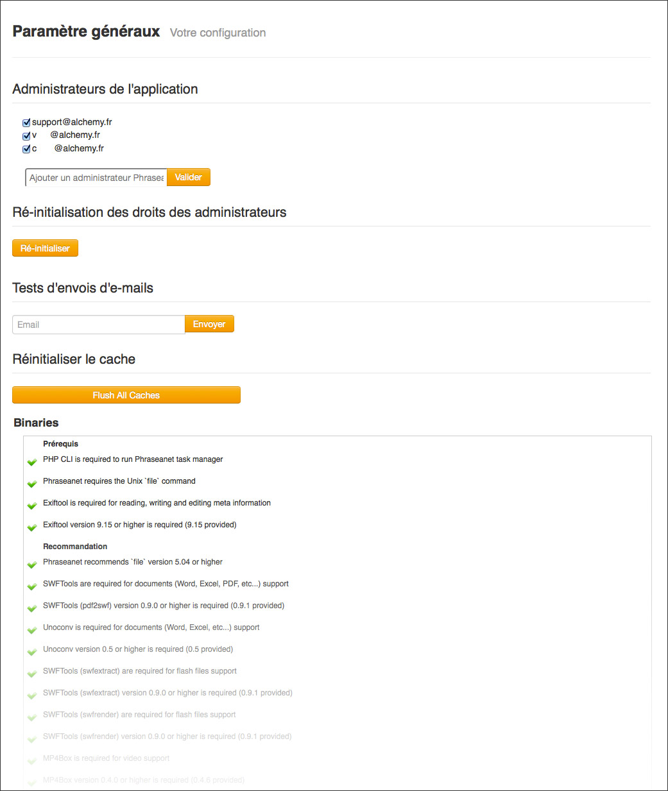
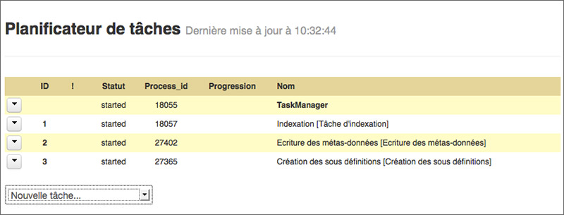
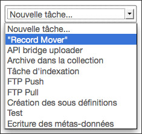

Administration de l'application
===============================
.. toctree::
    :maxdepth: 3

.. topic:: L'essentiel

    L'administration de l'application consiste à surveiller le fonctionnement
    de la solution et à apporter si besoin des modifications de paramétrage.

Tableau de bord
---------------

**Accessible aux seuls administrateurs Phraseanet**, le *tableau de bord* permet
d'ajouter ou de supprimer des administrateurs Phraseanet.

Les **administrateurs Phraseanet** sont des utilisateurs dotés de pouvoirs de
paramétrage et de maintenance applicative.

En outre, le tableau de bord offre une vue sur l'état de la configuration du
système de fichier, des exécutables, des extensions, des serveurs de caches et
des serveurs web qui entrent dans la mise en oeuvre de la solution *Phraseanet*.

Paramétrage
-----------

**Accessible aux seuls administrateurs Phraseanet**, l'écran de *Paramétrage*
propose une interface graphique permettant de modifier des paramètres d'
installation et de configuration de l'instance Phraseanet.

.. image:: ../../images/Administration-setup.jpg
    :align: center

Setup propose un jeu de formulaires permettant notamment :

* **De modifier les adresses et les chemins de l'application** ou de composants
  permettant sa mise en oeuvre
* **De placer l'application en mode maintenance**
* **D'activer ou de désactiver des connectivités à des services web**
* **D'activer ou de désactiver des connectivités à des réseaux sociaux** mis en
  oeuvre dans :ref:`bridge-share`
* **D'activer ou de désactiver des fonctionnalités et options de l'application**

.. warning::

    Setup permet de modifier en profondeur les paramètres d'
    installation de l'application. L'administrateur sera particulièrement
    attentif aux modifications apportées dans les formulaires proposés.

Paramétrage du moteur de recherche
----------------------------------

Cette rubrique permet de configurer le moteur de recherche utilisé par l'
instance au moyen d'interfaces graphiques.

.. note::

    Cette rubrique se destine aux administrateurs systèmes chargés de déployer
    Phraseanet.

    `Se reporter à la page consacrée à la configuration des moteurs dans la documentation Administrateur <../Admin/Configuration>`_.

Configuration du moteur Phrasea
^^^^^^^^^^^^^^^^^^^^^^^^^^^^^^^

Le moteur Phrasea, moteur par défaut, comporte peu d'option de configuration.

L'interface de paramétrage propose le paramétrage des champs de type date
disponibles à la recherche ainsi que le choix de l'ordre d'affichage des
enregistrements.

Configuration du moteur Sphinx
^^^^^^^^^^^^^^^^^^^^^^^^^^^^^^

Le formulaire permet d'écrire la configuration du moteur de recherche Sphinx
utilisé.

Utilisateurs connectés
----------------------

Affiché par défaut lors de la connexion à Phraseanet Admin, l'écran liste les
sessions utilisateurs actives sur le système.

Elle informe de l'application Phraseanet utilisée, de l'adresse IP, ainsi que
de la date et de l'heure de connexion au système.

.. image:: ../../images/Administration-utilisateurlive.jpg
    :align: center

.. note::

    Phraseanet repose sur un mécanisme de *sessions persistantes*. Les
    dates et heures de connexion correspondent à celles de l'initialisation de
    la session de l'utilisateur.

Publications
------------

Accessible aux utilisateurs qui disposent des droits de gestion des
publications, la rubrique publications permet de gérer les flux mediaRSS
diffusés à partir de l'application Phraseanet.

.. image:: ../../images/Administration-publications.jpg
    :align: center

L'écran Publications dresse la liste des flux médias disponibles en publication
et permet d'en créer, d'en modifier et d'en supprimer.

* **Pour créer un flux**, remplir puis valider le formulaire d'ajout
* **Pour modifier les propriétés d'un flux existant**, cliquer sur le flux à
  modifier pour ouvrir le formulaire d'édition du flux sélectionné.
* **Pour supprimer un flux**, cliquer sur bouton supprimer.

Gestionnaire de tâches
----------------------

**Accessible aux seuls administrateurs Phraseanet**, cet écran permet de gérer
les tâches d'archivage et autres traitements automatiques appliqués sur les
:term:`Bases <Base>` et :term:`Collections <Collection>` de l'application.

Les tâches sont listées dans un tableau qui indique l'identifiant de la tâche,
si elle est ou non active, son nom.

Le principe d’une *Tâche d’archivage* est de scruter un répertoire, d'en
capturer  le contenu, de l'archiver (recopier les fichiers dans les répertoires
de stockage de la base de destination).

* **Pour démarrer une tâche**, cliquer sur le symbole, puis cliquer sur *Start*.
* **Pour éditer une tâche**, cliquer sur "Éditer".
* **Pour arrêter une tâche**, cliquer sur "Stop".
* **Pour créer une nouvelle tâche**, cliquer sur nouvelle tâche.

.. image:: ../../images/Administration-taches.jpg
    :align: center

Nouvelle tâche
^^^^^^^^^^^^^^

Le paramétrage de tâche dans Phraseanet permet de mettre en place des
automatismes de traitement.
La solution est livrée en standard avec un jeu de tâches exploitables et l'
utilisateur peut en créer d'autres.
Ces tâches sont stockés sous forme de fichiers XML dans l'application.

* Sélectionner un des modèles de tâches disponibles dans le menu
  **Nouvelle tâche**.

* Editer les paramètres de la tâche dans la vue XML.

.. image:: ../../images/Administration-editertache1.jpg
    :align: center

* Cliquer sur **Valider** pour enregistrer les modifications.

La vue graphique simule l'exécution de la tâche.

.. image:: ../../images/Administration-editertache2.jpg
    :align: center

* Lancer l'exécution de la tâche.

.. note::

    Pour plus d'informations sur le paramétrage de tâches, se reporter
    à la page :doc:`../../Admin/MoteurDeTaches`.
