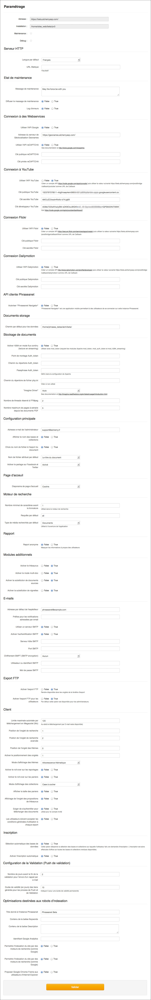

Administration de l'application
===============================
.. toctree::
    :maxdepth: 3

.. topic:: L'essentiel

    L'administration de l'application consiste à surveiller le fonctionnement
    de la solution et à apporter si nécessaire des modifications de paramétrage.

Tableau de bord
---------------

.. image:: ../../images/Administration-tableaudebord.jpg
    :align: center

**Accessible aux seuls administrateurs Phraseanet**, le tableau de bord permet
d'ajouter ou de supprimer des administrateurs Phraseanet.

Les administrateurs Phraseanet sont des utilisateurs dotés de pouvoirs de
paramétrage et de maintenance applicative.

Le tableau de bord offre une vue sur l'état de la configuration du système de
fichier, des exécutables, des extensions, des serveurs de caches et des
serveurs web qui entrent dans la mise en oeuvre de Phraseanet.

.. _Parametrage-applicatif:

Paramétrage
-----------

**Accessible aux seuls administrateurs Phraseanet**, l'écran Paramétrage
propose une interface graphique permettant de modifier des paramètres
d'installation et de configuration de l'instance Phraseanet.

Le jeu de formulaires permet :

* De modifier les adresses et les chemins de l'application ou de composants
  permettant sa mise en oeuvre
* De placer l'application en mode maintenance
* D'activer ou de désactiver des connectivités à des services web et
  plateformes de partage mis en oeuvre avec le :ref:`Bridge <Publier-Bridge>`.
* D'activer ou de désactiver des fonctionnalités et options de l'application

.. warning::

    La rubrique Paramétrage permet de modifier en profondeur les paramètres
    d'installation de l'application. L'administrateur sera très attentif aux
    modifications apportées dans les formulaires proposés.

Paramétrage du moteur de recherche
----------------------------------

Réservée aux administrateurs Phraseanet, cette rubrique permet de configurer le
moteur de recherche utilisé par l'instance au moyen d'une interface graphique.

.. seealso::

    :doc:`Se reporter à la page consacrée aux moteurs de recherche dans la documentation Administrateur <../../Admin/MoteurDeRecherche>`.

Utilisateurs connectés
----------------------

L'écran liste les sessions utilisateurs actives sur le système.
Il informe de l'application Phraseanet utilisée, de l'adresse IP, ainsi que de
la date et de l'heure de connexion au système.

.. image:: ../../images/Administration-utilisateurlive.jpg
    :align: center

Publications
------------

Accessible aux utilisateurs qui disposent des droits de gestion des
publications, la rubrique publications permet de gérer les flux Media RSS
diffusés à partir de l'application.

.. image:: ../../images/Administration-publications.jpg
    :align: center

L'écran liste les flux médias disponibles et permet d'en créer, d'en modifier
ou d'en supprimer.

.. _Creer-un-flux-de-publication:

Créer un flux de publication
****************************

Remplir le formulaire de création de flux en y apportant les informations
nécessaires.
L'étendue de la publication restreint la publication aux utilisateurs accédant
à une collection.
**Cocher la case Publique** pour lever les restrictions d'accès.

.. note::

  Les médias des publications publiques sont agrégés dans les animations
  proposées par défaut sur la page de connexion.

Modifier ou supprimer un flux
*****************************

* Cliquer sur le titre d'un flux pour y apporter une modification
* Pour supprimer un flux, cliquer sur le bouton **Supprimer**

.. _Edition-de-taches:

Gestionnaire de tâches
----------------------

**Accessible aux seuls administrateurs Phraseanet**, la rubrique permet de
gérer les tâches qui concourent au fonctionnement de l'application.

Les tâches sont listées dans un tableau indiquant leurs identifiants,
activités et noms.

Tâches standards
****************

La solution est livrée en standard avec un jeu de tâches pour l'exploitation :

* **Tâche d'indexation**
* **Création de sous définitions**
* **Ecriture de métadonnées**

Ces tâches sont créées à l'issue de
:doc:`l'installation de Phraseanet <../../Admin/Installation>`.

Démarrer (ou arrêter) une tâche
*******************************

Effectuer un clic droit sur le menu contextuel de la tâche pour :

* Démarrer ou arrêter une tâche
* Editer les paramètres d'une tâche (elle doit être préalablement arrêtée)

Ajouter des tâches supplémentaires
**********************************

Les administrateurs peuvent en ajouter d'autres tâches pour mettre en place des
automatismes de traitement sur les enregistrements d'une base :

* Sélectionner un des modèles de tâches disponibles dans le menu déroulant
  **Nouvelle tâche**.
* Editer les paramètres de la tâche dans la vue XML ou le formulaire graphique

.. image:: ../../images/Administration-editertache1.jpg
    :align: center

* Cliquer sur **Valider** pour enregistrer les modifications

Dans certains cas, une vue graphique simule l'exécution de la tâche.

* Lancer l'exécution de la tâche.

.. seealso::

    :doc:`Se reporter à la page consacrée au moteur de tâches<../../Admin/MoteurDeTaches>`.

Plugins
-------

La rubrique Plugins liste les extensions complémentaires installées sur
l'instance.
